# **Additional features**

-------------------------------------

??? example "Rename a Project"   

    ## Rename a Project

    To rename your project, right click on the project name from the **Test Plan** section and choose **Details** from the context menu option.

    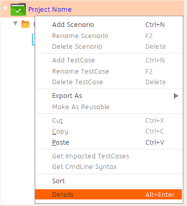

    The **Project Details** window opens and the following options are available in the window, as shown below.

    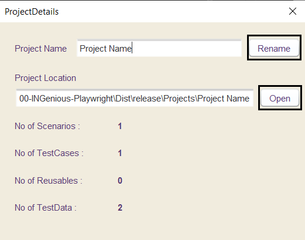

    To rename your project, give the new name in the **Project Name text box** and click on **Rename**. Your project will be renamed.

    The **Open** option opens the project location in your system.

    Right below these options, you have details on the total number of scenarios, test cases, reusable components and test data sheets present in the project.

-----

??? example   "Execute A Reusable For Specific Set Of Data"

    ## Execute A Reusable For Specific Set Of Data

    A reusable test case can be executed with a desired set of data by providing the sub iteration index in the Input column. It will fetch the data set from the data sheet with the desired index and use it within the test case. This is very useful when you want to execute the same reusable component, inside a single test case, with different set set of data passed each time.

    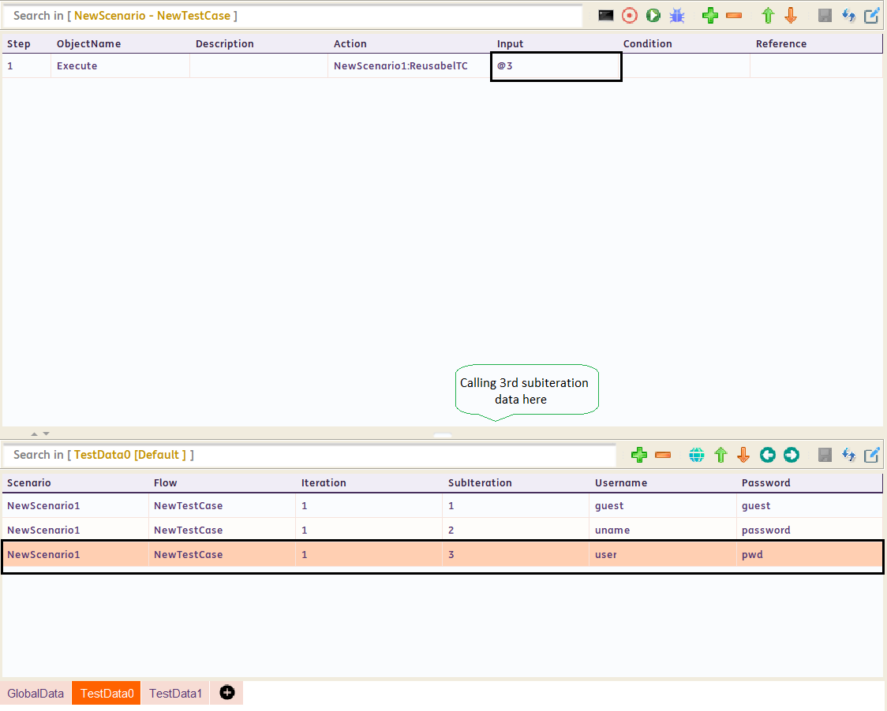

----

??? example "Looping"

    ## Looping

    === "**With Data**"

        **NOTE:** In Test Design panel, users are only given access to Iteration 1 and its various Subiterations

        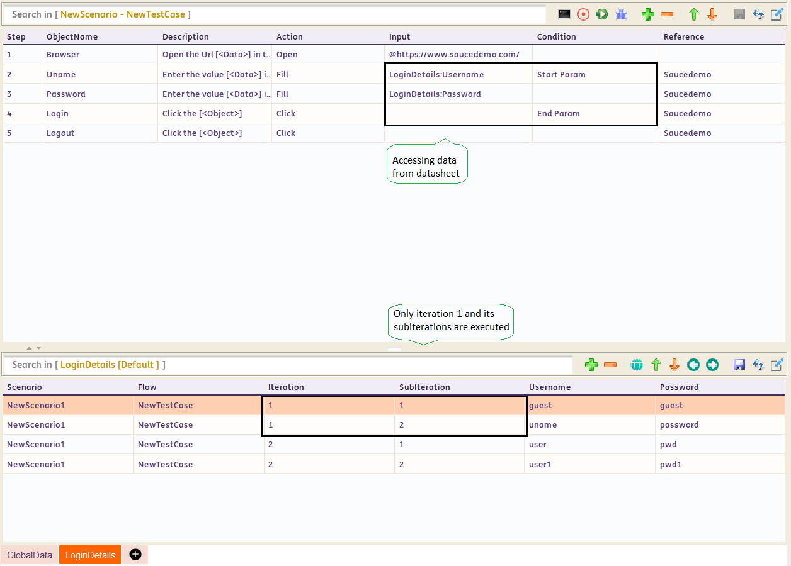

        * For the above image, Steps 2 to 4 will be executed 2 times (equal to the number of Sub iterations for Iteration 1)

        * For first iteration, data will be taken from Iteration 1 and Subiteration 1

        * For second iteration, data will be taken from Iteration 1 and Subiteration 2

        * In the above image, we have used **End Param**. This will execute Step 2 to 4, once and not twice.

        * To iterate through the entire Test Case for all the sub iterations of data in the data sheet, keep **Start Param** in the first step and **End Param** in the last step of your Test Case.

    === "**Without Data**"

        **Looping Without Test Datasheet**

        * To repeat few steps, use Start Loop and **End Loop:@n**.

        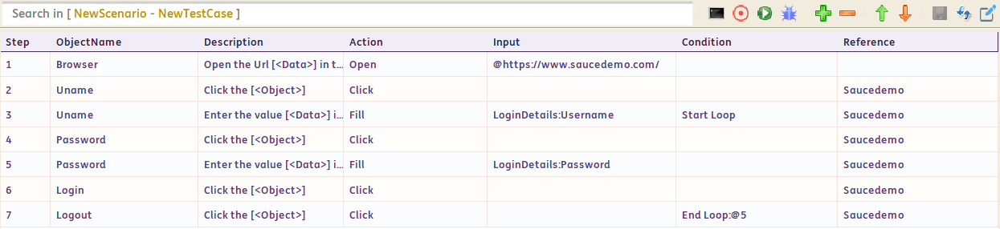

        * In the above image, Start Loop is at Step 3 and **End Loop:@5** is at Step 7. So, Step 3 to 7 will be repeated 5 times.


-------

??? example "Iterations And Subiterations In Test Execution Panel"

    ## Iterations And Subiterations In Test Execution Panel

    * **NOTE:** In the Test Execution panel, you are given access to all Iterations and their Sub iterations.

    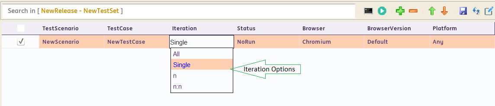

    * In the above image, there are some options given under the Iteration column

    * **All**: will Iterate through all your Iterations of your datasheet.

    * **Single**: will only Iterate through Iteration 1 of your datasheet.

    * **n:n** (Range): will Iterate through a range of iterations.

        > For example, if you use 2:5, then INGenious will only Iterate through Iteration 2 to Iteration 5 even if there are more iterations.

    * **n**: will allow you to Iterate a particular (nth) iteration in your datasheet.

        > For example, if you use 5, then INGenious iterate only the 5th iteration and all its sub iterations.

    > **Note:** Subiterations will work according to the definition of **Start Param** and **End Param** in the Test Design panel.

-----

??? example "Handle actions before and after a step"

    ## Handle actions before and after a step

    In some applications, there may be components which will originate at random ie. the origination of such components cannot be predicted. This section will describe how to handle such components.

    **Logic**

    Since the origin of some components cannot be predicted, check for the availability of the respective component before or after performing each step.

    **How To Do It?**

    * Open the Engine in **Eclipse IDE** (or any IDE supporting java development).

    * Navigate to **com.ing.engine.execution.run**.
    
    * The following actions will be available in this class **Annotation**

        * **`beforeStepExecution`**: Enter the code to handle the component here, if you want to perform the check **before** the execution of each step.

        * **`afterStepExecution`**: Enter the code to handle the component here, if you want to perform the check **after** the execution of each step.

----
??? example "How To Navigate between Test Data Sheets"

    ## How To Navigate between Test Data Sheets

    * Right click on any data sheet and choose the option **Search Test Data** from the context menu

    * In the **Go To Test Data** window, choose the test data sheet or the global data sheet to which you want to navigate

    * You will be navigated to the respective sheet after clicking on **[OK]**

----

??? example "How To Search in Data Sheets"

    ## How To Search in Data Sheets


    * To search for **values inside the cells**, simply enter the search string (or even partial string) in the [Search Bar], and the search results will immediately show in green

    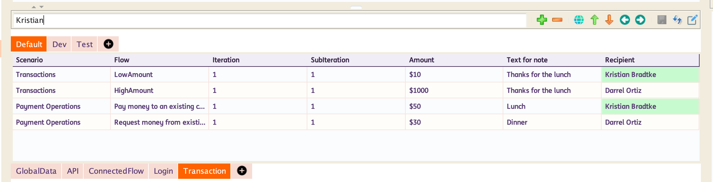


    * To search for **Columns using the Column Header**, simply enter the search string (or even partial string) with '@' as prefix in the [Search Bar], and the search results will immediately show in green

    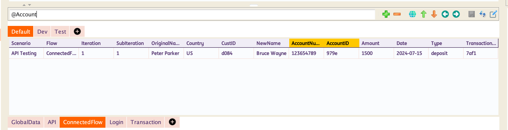

----

??? example "User Defined Variables"

    ## User Defined Variables

    User Defined variables can be created and defined by two ways as given below.

    * Using the actions **AddVar** and **AddGlobalVar**. **AddVar** action will let you define a variable whose scope is throughout the execution of your test case and is valid for all the sub-iterations of the iteration 1 of your test case. But **AddGlobalVar** action will let you define a variable whose scope is throughout the execution of your test set.

    * Navigate to **Configuration** :material-arrow-right: **Run Settings** tab and provide your variable name and value under **the Property Name** and **Value** columns respectively, as shown in the screenshot below. Click on **save** for saving your settings.

    These variables can now be used anywhere in your project.

    In addition to these, we have certain actions that take variables as input and will store the corresponding result in the variable provided.

----

??? example "How To Change Report Theme"

    ## How To Change Report Theme

    * Go to **Configuration** :material-arrow-right: **Options :material-arrow-right: **Theme**.

    * From the **Reporting theme**, select a theme of your choice.

    * You can also toggle between **Single** and **Group View**.

    * You can choose which columns need to be displayed in the report.

    * Show or hide columns in the report using the **show/hide columns** option. Check the respective column name checkbox to display that column or **uncheck** the respective column name checkbox to hide it.

    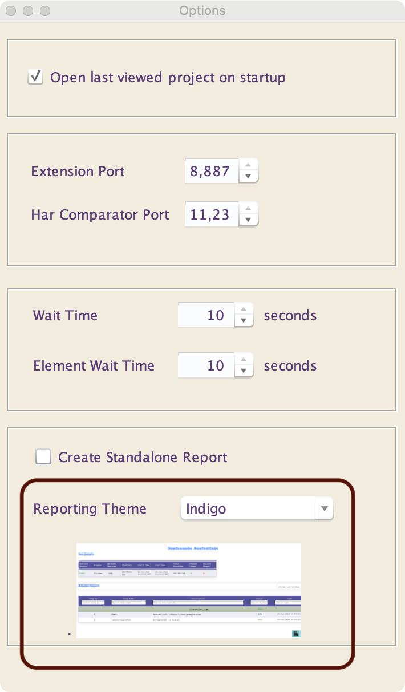

    **Filtering In Report**

    You can filter reports using **Global Search or Column Search**.

    **Sorting In Report**

    You can sort the reports using the **up/down** arrows beside each column name.

----

??? example "Generate Run Time Data"

    ## Generate Run Time Data

    There are options available in the **Input** column to perform functions like rounding off numbers, generating a random number, concatenating strings, other arithmetic calculations and etc.

    Follow the steps below to access those options.

    * Consider any action that requires **Input** column. For instance let us take the **Print** action. Instead of providing the URL directly, you can concatenate two strings that lead to the URL.


    | <div style="width:150px">**Function**</div>  | <div style="width:250px">**Syntax**</div> | **Description** |
    | --------------| ---------------- |-------------- |
    | [`=Round`](#)  | =Round(Decimal Number)      |Will **Round Off** the given decimal number |
    | [`=Pow`](#)    | =Pow(a,b)                   |Will return the value of **a^b** |
    | [`=Min`](#)    | =Min(a,b)                   |Will return the minimum number between **a** and **b** |
    | [`=Max`](#)    | =Max(a,b)                   |Will return the maximum number between **a** and **b** |
    | [`=Random`](#) | =Random(a)                  |Will return a random number of **"a"** digits |
    | [`=Round`](#)  | =Round(a,b)                 |Will return a random number between **"a"** and **"b"**|
    | [`=Date`](#)   | =Date("0", dd/MM/YYYY)      |Will return the **date** in the specified format |
    | [`=Date`](#)   | =Date("+n or -n", dd/MM/YYYY) |Will **add or subtract n days from the current date** and display it in the specified format |
    

    > **Note:** It is also possible to combine two relevant functions for optimum usage.| Example1: **=Concat(Diaphragm,=Round(360.45))** Result: **Diaphragm360** <br> Example2: **=Concat(James_,=Round(=Random(3)))** Result: **James_155**. 

----

??? example "Add Custom Functions For Run Time Data Generation"

    ## Add Custom Functions For Run Time Data Generation

    Navigate to :

    **com.ing.engine.util.data.fx;** :material-arrow-right: **Functions.java** add your custom function as shown below. This is an example of creating a **`Trim`** function which will accept a String input and will return a trimmed output.


    ```java
    public Object Trim(String... args) {
            String op = "";
            try {
                op = args[0].trim();
                
            } catch (Exception ex) {
                LOG.log(Level.SEVERE, ex.getMessage(), ex);
            }
            return op;
        }
    ```

----

??? example "Enabling/Disabling screenshots for Pass/Fail"

    ## Enabling/Disabling screenshots for Pass/Fail

    In the report, you will be able to view the screenshots for the steps whose Status is **PASS** or **FAIL**. However, you have the option to enable/disable the screenshots for such steps.

    * In the INGenious IDE, go to **Configurations** :material-arrow-right: **Run Settings**.

    * Under Screenshot section, you can check/uncheck the **Pass** or **Fail** checkboxes in order to enable/disable the screenshots in the report.

    * To enable/disable the screenshots for the entire page, check/uncheck the **Take Full Page Screenshot** checkbox.

    > **Note**: Give the status as **PASSNS** or **FAILNS** under the **Report.updateTestLog()** method for **PASS status without screenshot** or **FAIL status without screenshot** respectively.

----

??? example "Execution in debug mode"

    ## Execution in debug mode

    You can debug the errors in your test case by adding breakpoints to the desired test steps and running the test case in debug mode.

    * Select the steps for which you wish to add a breakpoint, right click and choose **Toggle Breakpoint**.

    * Right click the **Debug** button (situated next to the run button), select the browser of your choice and click the **Debug** button.

    * Once the execution starts, the debug toolbar will appear on top of the screen as shown below. The execution will pause at the step where the breakpoint has been added. You can then debug your test case accordingly.

    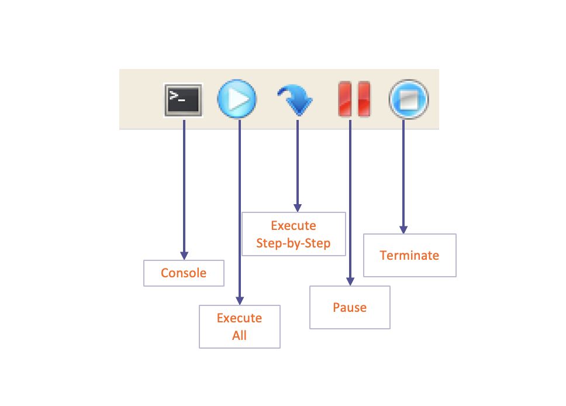

    * To view the console log, click the button.

    * To pause the execution of the test case, click the button. Once the execution has been paused, you can insert new succeeding steps in the test case or check the object properties using Object Heal and update them.

    * To resume the execution of the test case, click the button.

    * To move to the next step of the test case, click the button.

    * To stop the execution of the test case, click the button.


    > **Note**: In addition to adding breakpoints to the test steps, you can comment the selected test steps as well, by performing right click and choosing the option **Toggle Comments**.

----

??? example "Store Data From Previous Test Case"

    ## Store Data From Previous Test Case

    This action retrieves data from a previous test case execution and stores it either in a runtime variable or a target datasheet for use in the current test case.

    **When to use**

    Used in data-driven test automation where **test cases depend on the output data of previously executed test cases**. This enables chaining of test scenarios and dynamic data reuse.

    **Required Variables**   

    - `%PreviousScenario%` - The previous Test Case Scenario Name to fetch the data. If not set, by defaut it will use the current test case scenario name.   
    - `%PreviousTestCase%` - The previous Test Case Name to fetch the data. If not set, by defaut it will use the current test case name.     
    - `%PreviousIteration%` - The previous Test Case Iteration to fetch the data. If not set, by defaut it will use the current test case iteration.   
    - `%PreviousSubIteration%` - The previous Test Case Sub-Iteration to fetch the data. If not set, by defaut it will use the current test case sub-iteration.   

    **How to store Data from previous Test Case**

    - To store data from previous test case, make sure to set your required variables properly to your desired test case data or keep the default values.
    - You can use action **storeDataFromPreviousTestCaseData** that requires Input and Condition field
        - **Input** as the target Test Datasheet or Variable name where you want to store data. By default, it will be stored to test datasheet in your current scenario, current test case, current iteration and current sub-iteration.
        - and **Condition** as the source Test Datasheet name where to get the data based from values that was set to the requried variables. By default, if the required variables were not set, it will get the data from test datasheet in your current scenario, current test case, current iteration and current sub-iteration.
    - You can also reset the required variables to the current test case data using action **resetPreviousTestCaseDataVariables**.
        - This action will reset the values for the required variables:
            - `%PreviousScenario%`
            - `%PreviousTestCase%`
            - `%PreviousIteration%`
            - `%PreviousSubIteration%`

    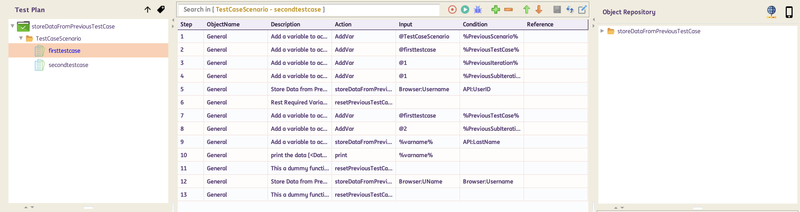

    - **Note**: Ensure that both Source and Target Test Datasheets have been created before using this action.

    Source Datasheet:
    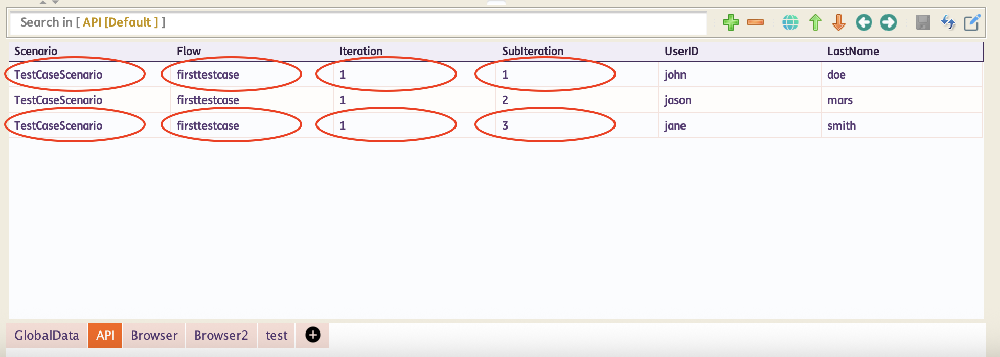

    Target Datasheet:
    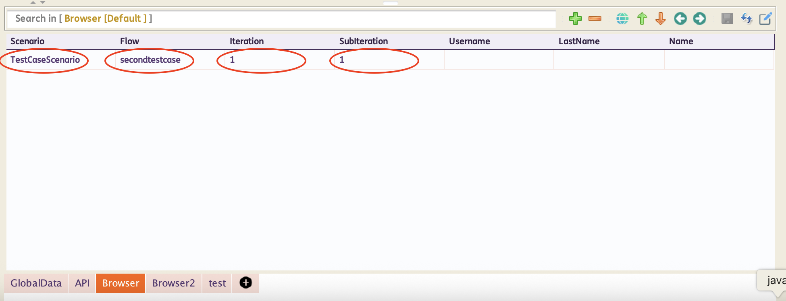

 ------   
