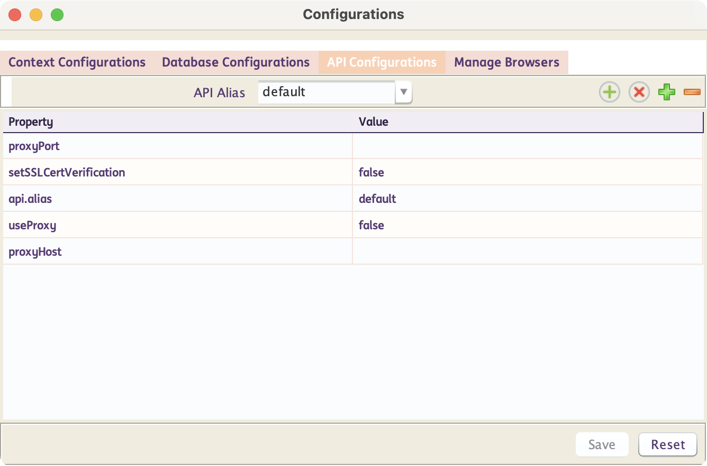
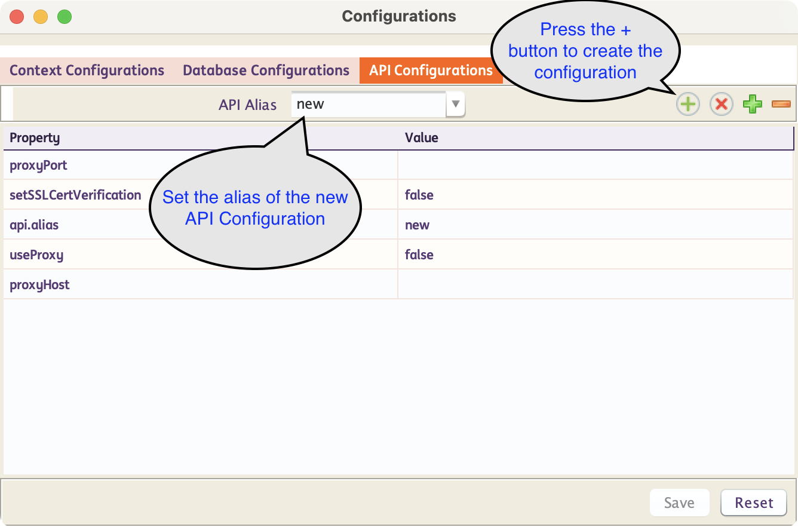
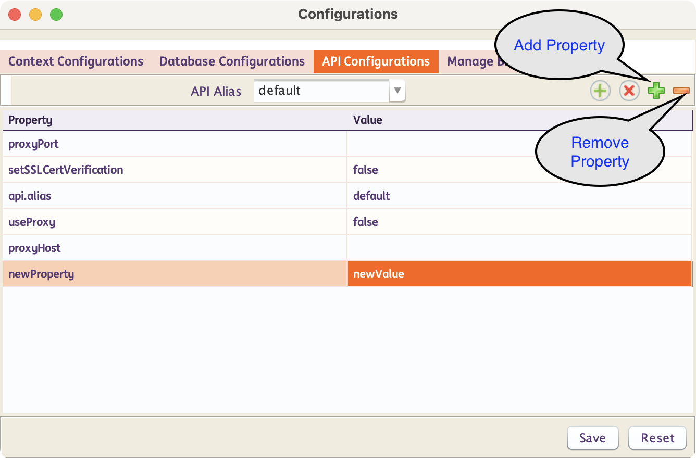
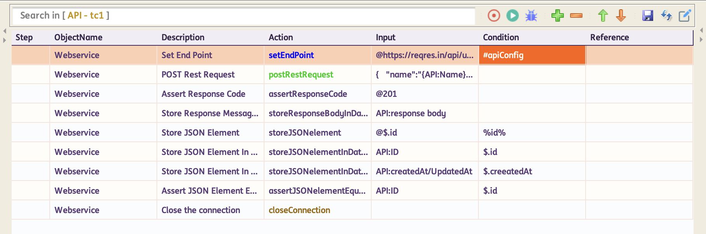
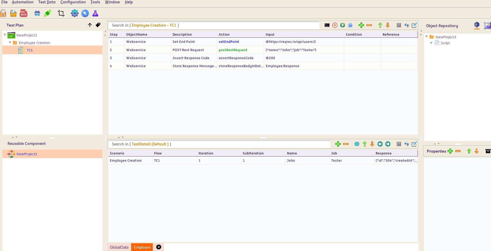
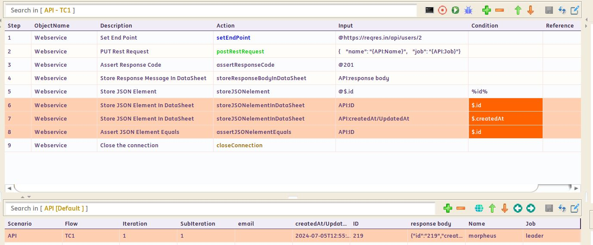

# **API Testing**
-----------------------------

!!! info "What is API Testing?"
    API testing is the process of confirming that an API is working as expected. An issue at an application's API layer can lead to user-facing errors or latency, which can erode customer trust, and negatively impact the business. This makes testing the APIs very important

-----------------------------------

!!! abstract "How does INGenious perform API Tests?"

    API Testing is one of the strong suites of the framework. It uses Java HTTP Client to fire requests, receive responses, validate the response status, response body and response tags.

    It also allows us to store response tags which can be used for subsequent API calls or GUI flows. **This makes API Testing and GUI Testing possible in a single flow coherently.**

-----------------------------------
## Set up API Configuration

* To configure an API configuration from INGenious, follow the steps below:

    - Click on the Configuration icon 
    - Under **API Configurations** you will see the `API Alias` as `default`. Change the values as per requirement.

        

-----------------------------------        

## Create New API Configuration

To create a new API configuration, follow the steps below :

* Click on the Configuration icon 

* Inside the **API Configurations** tab, Enter the `API Alias` and hit ++enter++ . Alternatively you can also click on the  icon.

     

* A new set of API configurations with default values will be added below.

-----------------------------------        

## User Added API Configuration Property

* INGenious allows users to add API properties thru the API Configurations window. 
!!! important "Handling and integration of these configurations on the backend is the responsibility of the user."
    


* Add a new property 
    1. Click the **Add Property** button .
    2. Add the **property key** (e.g., autoReconnect, timeout, sslMode).
    3. Provide the corresponding **property value**.
    4. Click **Save** to apply the changes.

* Remove a property
    1. Select the **property** you want to remove.
    2. Click the **Remove Property** button .
    3. Click **Save** to apply the changes.

-----------------------------------

## How to create an API Test Case?

* A request should contain a **`setEndPoint`** action. This action is always marked in <span style="color:Blue">**Blue.**</span> This is where you put the endpoint to which the request is supposed to be fired. This action comes with an editor for convenience of data set up.

* Optionally, specify the required API configuration by adding `#apiAliasName` in the *Condition* column. If omitted, the default configurations will be automatically loaded.

* You can have steps to add headers/authentication etc. (if required)

* A request should contain an **HTTP Method/Verb** (`Post`/`Put`/`Get`/`Delete`/`Patch`) . This action is always marked in <span style="color:Green">**Green.**</span> This also comes with an editor for convenience.

* You can have steps to validate/store response **status codes**, **specific tags** or even the **entire response body.**

* A request should contain a **`closeConnection`** action. This action is always marked in <span style="color:Brown">**Brown.**</span>

 

 The above is an example of a **`postRestRequest`** and then **`assertResponseCode`** followed by **`storeJSONelementInDataSheet`**


-------------------------------------


## Payload Data Parameterization


 Data Parameterization can be done using the built-in **editor.** If you mouse-hover on the **Input** column, corresponding to the **`Post`**/**`Put`** request steps as well as the **`setEndPoint`** step, an option to open up the Editor comes up.

 Inside this editor, we can paste the entire Payload and then parameterize the specific JSON/XML tags based on our needs.

 If we press ++ctrl+space++ the list of all available **DataSheets : ColumnNames** along with all **user-defined variables** show up. We can then select the appropriate item from where we want to parameterize.

 We need to press ++escape++ to close the editor

 
 

 -------------------------------------

## Assert/Store Response Tags

 We can access the Response Tags using **`xpath`** for XMLs and **`jsonPath`** for JSONs.

 The corresponding **`xpath`** or **`jsonPath`** for the tag, should be entered in the **Condition** column like as shown below :

 

??? note "Example for writing Xpath"

    ```xml
    <root xmlns:foo="http://www.foo.org/" xmlns:bar="http://www.bar.org">
        <actors>
            <actor id="1">Christian Bale</actor>
            <actor id="2">Liam Neeson</actor>
            <actor id="3">Michael Caine</actor>
        </actors>
    </root>
    ```

    XPath for retrieving **Liam Neeson** is `/root/actors/actor[2]/text()` or simply `//actor[2]/text()`

??? note "Example for writing JSONPath"

    **Example 1 :**

    ```json
    { 
    "name":"TestName",
    "salary":"12300",
    "age":"29"
    }
    ```

    JSON Path for retrieving **TestName** is `$.name` 

    **Example 2 :**

    ```json
    {
        "page": 2,
        "per_page": 6,
        "total": 12,
        "total_pages": 2,
        "data": [
            {
                "id": 7,
                "email": "michael.lawson@xyz.com",
                "first_name": "Michael",
                "last_name": "Lawson"
            },
            {
                "id": 8,
                "email": "lindsay.ferguson@xyz.com",
                "first_name": "Lindsay",
                "last_name": "Ferguson"
            },
            {
                "id": 9,
                "email": "tobias.funke@xyz.com",
                "first_name": "Tobias",
                "last_name": "Funke"
            },
            {
                "id": 10,
                "email": "byron.fields@xyz.com",
                "first_name": "Byron",
                "last_name": "Fields"
            },
            {
                "id": 11,
                "email": "george.edwards@xyz.com",
                "first_name": "George",
                "last_name": "Edwards"
            },
            {
                "id": 12,
                "email": "rachel.howell@xyz.com",
                "first_name": "Rachel",
                "last_name": "Howell"
            }
        ],
        "additional": {
            "url": "https://xyz.com",
            "text": "Happy Testing!"
        }
    }
    ```

    JSON Path for retrieving **byron.fields@ing.com** is `$.data[3].email` [Index starts with 0]

>To learn more about JSONPath visit this [GitHub](https://github.com/json-path/JsonPath) page.

-------------------------------------


[Actions](apiActions/webservice.md){ .md-button }