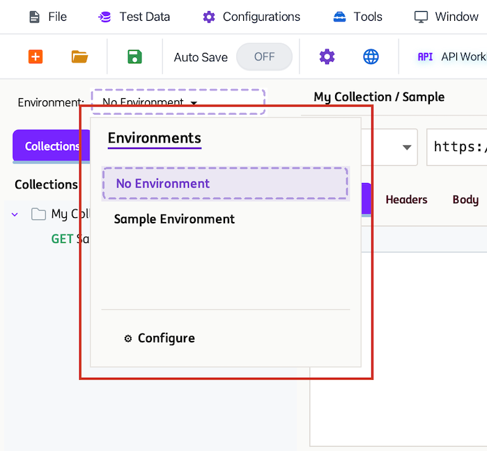
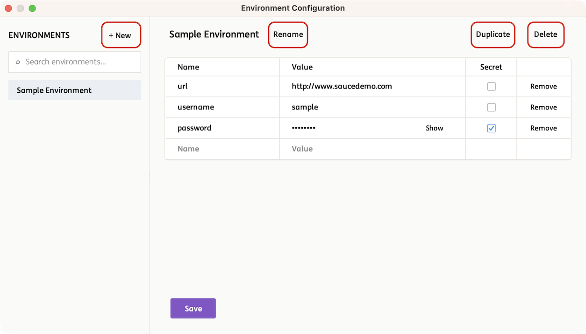
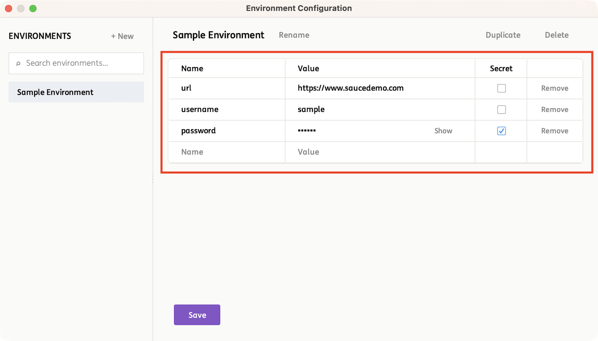
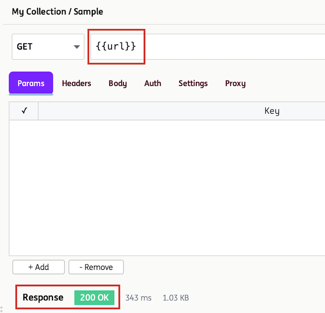
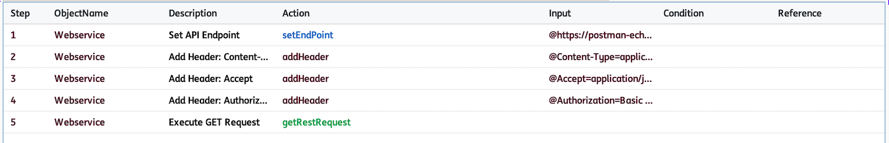

# **API Workbench**

!!! info 
    The API Workbench is an integrated tool within INGenious that allows users to design, test, and validate APIs in a streamlined and user-friendly interface—similar to tools like Postman. It enables teams to easily create API requests (GET, POST, PUT, DELETE, etc.), manage headers and parameters, and inspect responses in real time.

## How to use the API Workbench:

The API Workbench can be accessed via the Menu Ribbon:

{ width="60%" }

Once selected, you will be navigated to API Workbench window. See example below:


!!! tip ""
    The numbered areas highlighted in the image above are explained in the sections below. Use the tabs to explore the purpose and functionality of each part of the API Workbench.

=== ":one: Collection/Requests Pane"
      This is where the Collections and Requests are created and organized. Every `Collection` in the INGenious IDE , is a JSON file in the backend.

      To see this, you can navigate to the location of your tool, then `Projects` :material-arrow-right: `Your Project` :material-arrow-right: `api` :material-arrow-right: `collections`

      

      If you click on the `+`, this will allow you to create a new collection.

      { width="30%" }

      If you select a Collection or Request and **Right Click**, you will have some interesting and handy options to work with:

      **Collection level**
      
      { width="75%" }

      **Request level**
      
      { width="75%" }
  
=== ":two: Workbench Pane"
      This section allows you to select and configure the API request you want to execute.
      
      

      It supports multiple HTTP methods commonly used for interacting with web services:

      * **GET** – Retrieve data from a server
      * **POST** – Create new resources
      * **PUT** – Update or replace existing resources
      * **PATCH** – Partially update existing resources
      * **DELETE** – Remove resources
      * **HEAD** – Retrieve response headers without the body
      * **OPTIONS** – Discover supported operations and communication options for an endpoint
      
      Several tabs are provided for configuration:

      * **Params** – Define query parameters that are appended to the request URL. Useful for filtering, searching, or passing dynamic values to the API.
      * **Headers** – Add key-value pairs to the request header, such as content type, authorization tokens, or custom metadata required by the API.
      * **Body** – Specify the request payload sent to the server, typically used with POST, PUT, or PATCH requests to create or update data.
      * **Auth** – Configure authentication details (e.g., API keys, tokens, or basic auth) required to securely access the API.
      * **Settings** – Customize request behavior, such as timeouts, redirects, or other advanced configuration options.
      * **Proxy** – Configure HTTP proxy settings for the current request.

      You may also **convert the configured API request into a test case**, capturing all request details for quick integration into your test suite.

      

      **Importing cURL Commands**
      
      The API Workbench supports importing requests directly from a cURL command.

      Simply paste a valid cURL command into the **Request URL Bar** and the Workbench will automatically parse and populate the request configuration, including:

      * HTTP Method
      * Endpoint URL
      * Query Parameters
      * Headers
      * Authentication Settings
      * Request Body

      **Example**

      ```bash
      curl -X POST "https://postman-echo.com/post" \
      -H "Content-Type: application/json" \
      -H "Authorization: Bearer test-token" \
      -d '{"name":"John Doe"}'
      ```

      After importing, the API Workbench automatically populates:

      * Method: `POST`
      * URL: `https://postman-echo.com/post`
      * Headers tab
      * Auth tab (when applicable)
      * Body tab with the request payload

      This allows existing cURL commands to be quickly converted into editable API requests without manually configuring each request setting.

      API Workbench supports importing cURL commands that contain commonly used browser-generated headers such as `Host` and `Connection`.

      Some client-managed headers such as `Content-Length` and `Accept-Encoding` are automatically handled by INGenious and may not appear exactly as defined in the original cURL command.

=== ":three: Response Body Pane"

      This section displays the API response content in a formatted (Pretty) or raw view, allowing you to easily inspect, copy, and analyze returned data for validation and troubleshooting.

      **Creating Assertions from Response Data**

      After executing a request, you can right-click directly on JSON or XML response content to quickly create assertions.

      Depending on the selected value, API Workbench automatically identifies the corresponding JSONPath or XPath and provides assertion options such as:

      * Assert path exists
      * Assert value equals
      * Assert value contains
      * Assert value starts with
      * Assert value ends with
      * Assert value matches a regular expression
      * Assert value is greater than
      * Assert value is less than
      * Assert path does not exist

      The detected JSONPath or XPath is displayed in the context menu and can be copied to the clipboard for reuse.

      Once an assertion is selected, it is automatically added to the current API request and saved.

      When the request is executed again, the assertion results are displayed in the **Test Results** tab.

      Assertions created from the Response Body Pane are also preserved when converting an API request into an INGenious test case.

=== ":four: API Environments"

      API Environments allow you to store reusable variables for different testing contexts such as Development, QA, Staging, or Production. This enables the same API request to be reused across multiple environments without manually changing values such as URLs, tokens, usernames, passwords, proxy settings, or certificate paths.

      The **Environment Dropdown** allows you to switch between environments. To open the **Environment Configuration Window** click **Configure**.

      

      The Environment Configuration Window displays all available environments and provides several actions:

      * **+ New** – Create a new environment.
      * **Rename** – Change the name of the selected environment.
      * **Duplicate** – Create a copy of the selected environment, including all configured variables.
      * **Delete** – Remove the selected environment.

      

      **Environment Variable Configuration**

      Variables are configured by entering a **Name** and **Value**. The **Secret** option can be enabled for sensitive information such as passwords, tokens, and API keys. Secret values are masked in the UI and are not displayed in plain text. After adding or updating variables, click **Save** to persist the environment configuration.

      

      Variables can be referenced throughout API requests using double curly braces:

      ```text
      {{variableName}}
      ```

      For example:

      ```text
      {{baseUrl}}/users
      ```

      

      When a request is executed, all referenced variables are automatically resolved using the currently selected environment. Switching to a different environment allows the same request to be executed against a different set of values without modifying the request itself. If a referenced variable does not exist in the active environment, the request execution may fail or use the unresolved placeholder value.

      **Best Practice**

      Store environment-specific values such as URLs, credentials, API keys, and tokens as environment variables instead of hardcoding them in requests. This improves maintainability and portability.

=== ":five: Convert API Request to Test Case"

      API requests can be converted directly into INGenious test cases, allowing API validations to be incorporated into automated test suites with minimal effort.

      During conversion, all configured request details are preserved, including:

      * Endpoint URL and query parameters
      * Request headers
      * Authentication settings (Basic Auth, Bearer Token, and API Keys)
      * Proxy settings
      * Request body
      * Assertions

      **Variables**

      If the request contains environment variables (for example `{{baseUrl}}` or `{{token}}`), the values are resolved using the **currently active environment** during conversion. Literal values that do not reference environment variables are copied directly into the generated test case.

      The original API request is not modified. Variable placeholders are retained in the collection, while the generated test case receives the resolved values.

      **Proxy**

      When an API request uses a proxy, INGenious prompts you to choose how the proxy configuration should be stored during test case conversion.
      
      * Save the proxy settings to the default API configuration.
      * Create a new API configuration specifically for the proxy settings.
      * Cancel the conversion.

      Once converted, the generated test case automatically uses the selected API configuration when executing the request.

      **Assertions**

      Assertions configured in API Workbench, including those created by right-clicking JSON or XML response data, are automatically included when the request is converted into a test case.

      Response paths and expected values are preserved, allowing the same validations to be reused during automated test execution.

      **Converted Test Case Example (Basic Authentication)**

      

      The generated test case performs the same API call as the API Workbench request and can be executed within INGenious to validate the expected response and assertions.