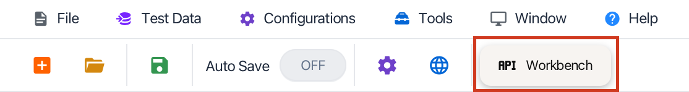
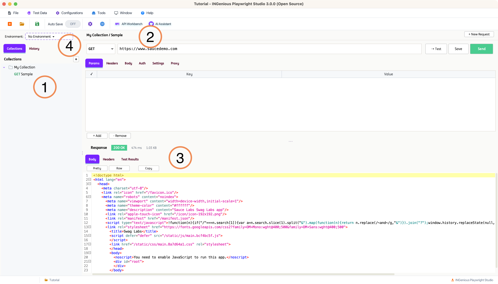
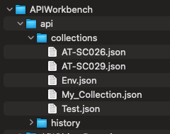
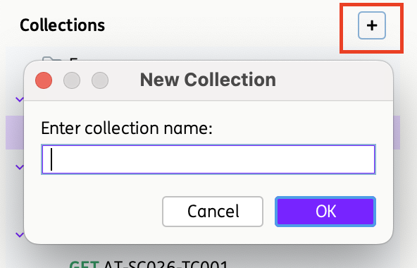
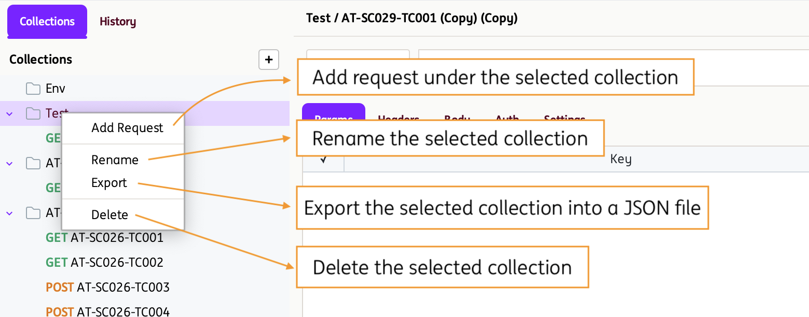
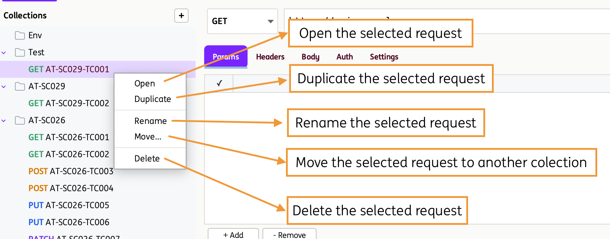
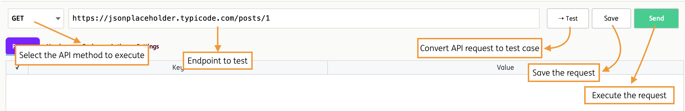

# **API Workbench**

!!! info 
    The API Workbench is an integrated tool within INGenious that allows users to design, test, and validate APIs in a streamlined and user-friendly interface—similar to tools like Postman. It enables teams to easily create API requests (GET, POST, PUT, DELETE, etc.), manage headers and parameters, and inspect responses in real time.

## How to use the API Workbench:

The API Workbench can be accessed via the Menu Ribbon:

{ width="60%" }

Once selected, you will be navigated to API Workbench window. See example below:

=== ":one: Collection/Requests Pane"
      This is where the Collections and Requests are created and organized. Every `Collection` in the INGenious IDE , is a JSON file in the backend.

      To see this, you can navigate to the location of your tool, then `Projects` :material-arrow-right: `Your Project` :material-arrow-right: `api` :material-arrow-right: `collections`

      

      If you click on the `+`, this will allow you to create a new collection.

      { width="30%" }

      If you select a Collection or Request and **Right Click**, you will have some interesting and handy options to work with:

      **Collection level**
      
      { width="75%" }

      **Request level**
      
      { width="75%" }
  
=== ":two: Workbench Pane"
       This section allows you to select and configure the API request you want to execute.
       
       

       It supports multiple HTTP methods commonly used for interacting with web services:

       * **GET** – Retrieve data from a server
       * **POST** – Create new resources
       * **PUT** – Update or replace existing resources
       * **PATCH** – Partially update existing resources
       * **DELETE** – Remove resources
       * **HEAD** – Retrieve response headers without the body
       * **OPTIONS** – Discover supported operations and communication options for an endpoint
       
       Several tabs are provided for configuration:

       * **Params** – Define query parameters that are appended to the request URL. Useful for filtering, searching, or passing dynamic values to the API.
       * **Headers** – Add key-value pairs to the request header, such as content type, authorization tokens, or custom metadata required by the API.
       * **Body** – Specify the request payload sent to the server, typically used with POST, PUT, or PATCH requests to create or update data.
       * **Auth** – Configure authentication details (e.g., API keys, tokens, or basic auth) required to securely access the API.
       * **Settings** – Customize request behavior, such as timeouts, redirects, or other advanced configuration options.

       You may also **convert the configured API request into a test case**, capturing all request details for quick integration into your test suite.

       

=== ":three: Response Body Pane"

      This is section displays the API response content in a formatted (Pretty) or raw view, allowing you to easily inspect, copy, and analyze returned data for validation and troubleshooting.