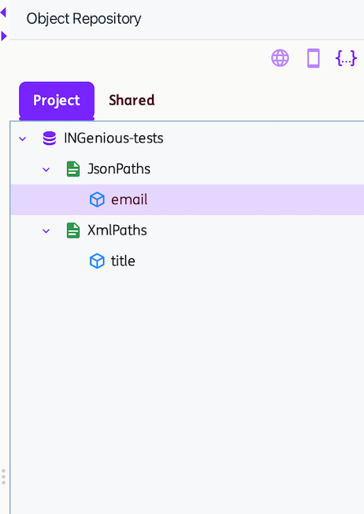
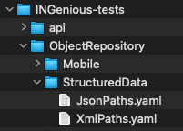
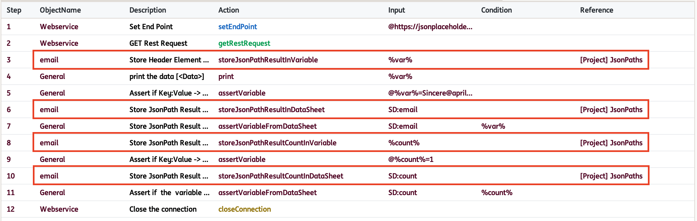
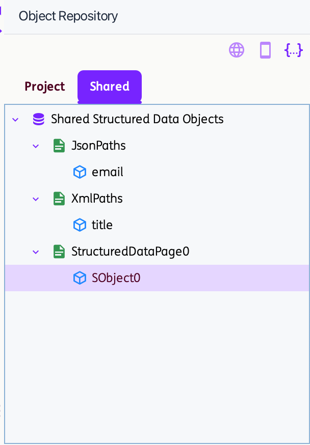
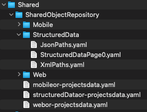
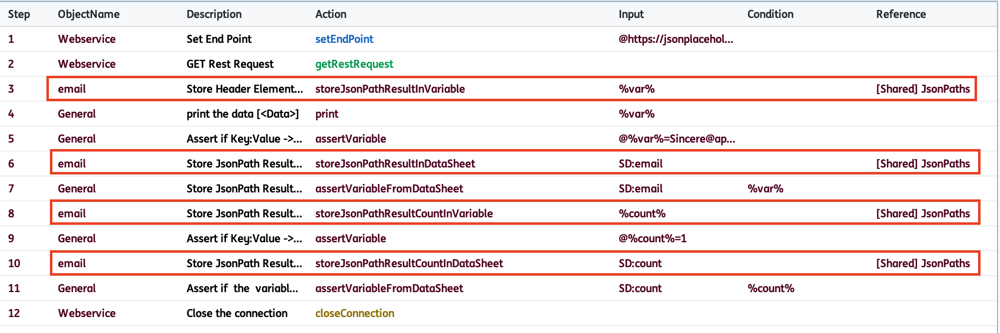
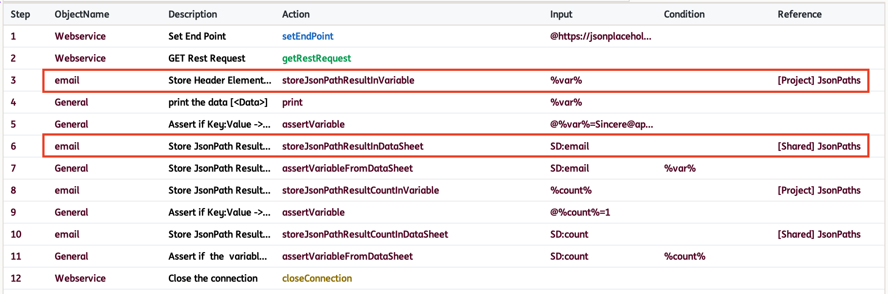
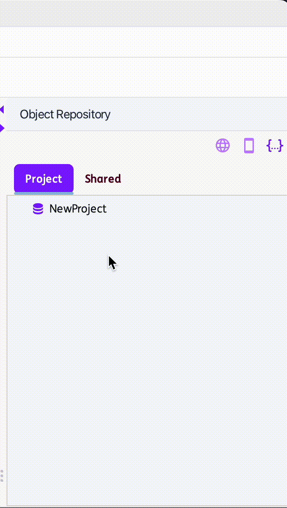
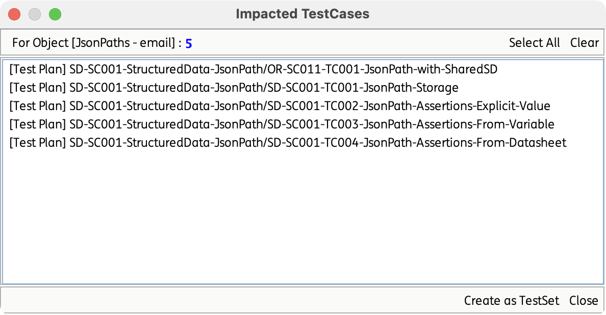

# **Structured Data Objects Repository**

!!! info 
    The Structured Data Object Repository (SD OR) in INGenious offers a centralized, scalable, and easy-to-maintain solution for managing structured data used in automated testing. Instead of distributing data across test scripts or embedding it directly within automation code, the repository enables teams to define, store, and reuse structured data from a single, reliable source of truth.

!!! abstract "Key Benefits:"
    * **Centralized data management** – All structured data is stored in a single, well-organized repository.
    * **Reduced duplication** – Structured data definitions can be reused across multiple test suites and frameworks.
    * **Maintainability** – Update a structured data definition once, and the changes are reflected everywhere.
    * **Consistent naming and structure** – Standardized definitions promote cleaner, more reliable automation design.

## Object Repository Structure
    
Structured Data OR follows the structure below:

    ```
    ├── ProjectName
    │   ├── PageName1
    │   │   └── ObjectName1
    │   └── PageName2
    │       ├── ObjectName1
    │       └── ObjectName2
    ```

* A single project can include multiple Pages, and each Page can hold multiple Objects.
* Page names must be unique within the project.
* Object names must be unique within their respective page. 
* An object must contain only one of the following attributes (either JsonPath or XPath, not both):

    | **Attribute**      | **Description** | **Example Value** |
    |--------------------|------------------|--------------------|
    | **JsonPath**       | Specifies the path used to locate and extract a value from a JSON structure. | $.email |
    | **Xpath**          | Defines a path expression used to navigate and locate elements within XML. | //title/text() |

## Project and Shared Structured Data OR

INGenious supports the same two‑repository model for Structured Data OR as it does for Web OR:

* **Project Structured Data OR**

    Contains objects that **can be used within the project** and managed from the `Project` tab within the OR panel.

    { width="28%" }

    A YAML file is automatically generated for each page at the time of page creation. This file contains the objects within the page along with their corresponding attributes and is stored in the project’s directory `<ProjectName>\ObjectRepository\StructuredData\`.

    

    When a Project Structured Data Object (PSDO) is used in a test step, the identifier **[Project] PageName** will show as its reference.

    

* **Shared Structured Data OR**

    Contains objects that **can be used across different projects** and are managed from the `Shared` tab within the OR panel.

    { width="28%" }
    
    Similar to Project StructuredDataOR, a YAML file is automatically generated for each page—either upon page creation under `Shared` or when pages or objects are moved from `Project` to `Shared`. This file contains the page’s objects and their corresponding attributes and is stored in the `Shared\SharedObjectRepository\StructuredData` directory. The `structuredDataor-projectsdata.yaml` file maintains the list of projects that use the Shared Structured Data Objects.

    

    When a Shared Structured Data Object (SSDO) is used in a test step, the identifier **[Shared] PageName** will show as its reference.

    


## How to use Project and Shared Structured Data OR

* Pages and Objects can be added directly within the Project and Shared repositories using the `Add Page` or `Add Object` options.

* Objects from Project and Shared Structured Data OR can be used in a single Test Scenario.

    For example:
    

* Pages and Objects created under the `Project` tab can moved using the `Move to Shared` option. When an entire Page is moved, all Objects under that Page—including their attributes—are moved. When moving a single Object, only that Object and its corresponding Page are moved. *Note that existing test steps using the Project‑level Structured Data Object (PSDO) are automatically updated to use the Shared Structured Data Object (SSDO) within the project.*

    { width="30%" }

* Pages and Objects may share the same names across the Project and Shared repositories. However, names must remain unique within each individual repository.

    

* Pages and Objects in both the Project and Shared repositories can be renamed using the `Rename Page` or `Rename Object` options. After renaming, any existing test steps in the current project that previously referenced an SSDO using the old name will be updated automatically.

* Pages and Objects in both the Project and Shared repositories can be deleted using the `Delete Page` or `Delete Object` options. However, once deleted, any existing test steps that previously referenced an SSDO or PSDO will still attempt to use the removed Page or Object, which may result in errors during test execution.

* To view all test cases that reference an Object within the project, use the `Get Impacted Cases` option. This feature is available for both Project and Shared repositories.

    { width="50%" }

    *Suggestion: Before renaming or deleting an object, please use the `Get Impacted TestCases` option for checking.*
