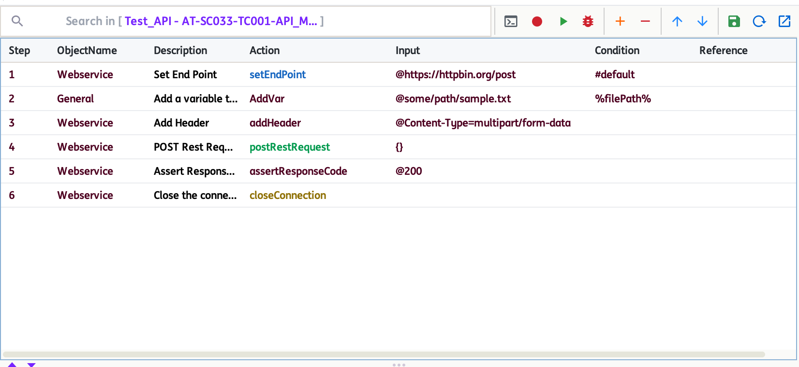
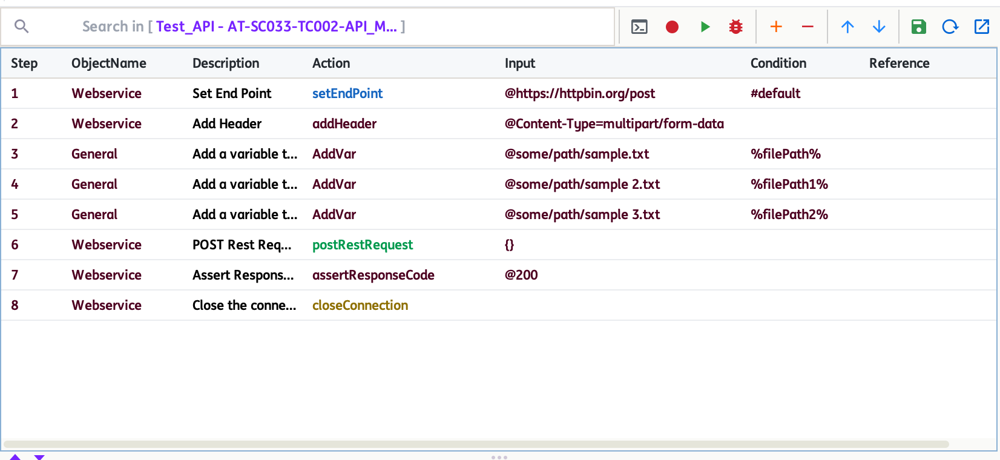

# **API Multipart File Upload**
-----------------------------

!!! info "Multipart File Upload"
    This feature allows you to upload one or more files in a single multipart request using the Webservice object. The `postRestRequest` action automatically detects variables representing file paths and includes them as multipart file parts in the request.

-----------------------------------

!!! abstract "When to use"

    Use this when your test case needs to send one or more files to an API endpoint that supports multipart file uploads (e.g., document management, batch image upload, etc.).

-----------------------------------

!!! abstract "Required Variables"

    - `%filePath%`, `%filePath1%`, `%filePath2%`, ... : Each variable should contain the absolute path to a file you want to upload. You can define as many as needed for your scenario.

-----------------------------------
## How to use multipart file upload

1. Set the endpoint using `setEndPoint`.
2. Add the header `Content-Type=multipart/form-data` using `addHeader`.
3. Use `AddVar` to define each file path variable (e.g., `%filePath%`, `%filePath2%`).
4. You can also use action `addUrlParam` (Input - `@key=value`) to add each text field to combine both files and text data in a single request.
5. Call `postRestRequest` with `{}` as input. The engine will automatically include all file path variables as multipart file parts.
6. Assert the response code and close the connection as usual.

=== "Single File Upload"

    

=== "Multiple File Upload"

    

??? note "Notes"

    - Each file path variable must point to an existing file on your system.  
    - Ensure the endpoint supports multipart file uploads.

-------------------------------------

[Actions](apiActions/webservice.md){ .md-button }