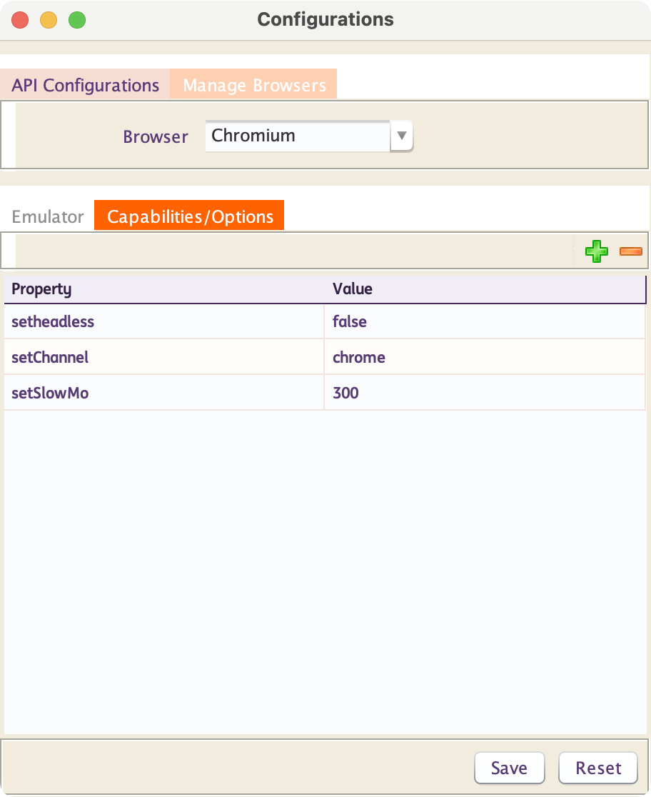

# **Browser-Context/Page Configurations**

??? note "Headless, SlowMo and other Browser Context Options"

    ### Browser Context Options

    The following options can be set while creating a Browser Context :

    |
Options
     |Description|
    |-------------|---------------|
    |`setHeadless`|By default, this is `true`. If you set it as `false`, you will see the browsers opening up during execution|
    |`startMaximized`|By default, this is `false`. If you set it as `true`, you will see the browsers opening up as maximized|
    |`setSlowMo`|This is slow down the execution by **N** milliseconds per operation|
    |`setChannel`|Browser distribution channel. Supported values are **chrome**, **chrome-beta**, **chrome-dev**, **chrome-canary**, **msedge**, **msedge-beta**, **msedge-dev**, **msedge-canary**.|
    |`setChromiumSandbox`|Enable Chromium sandboxing. Defaults to `false`.|
    |`setDevtools`|**Chromium-only**. Whether to auto-open a Developer Tools panel for each tab. If this option is `true`, the headless option will be set `false`.|
    |`setDownloadsPath`|If specified, accepted downloads are downloaded into this directory. Otherwise, temporary directory is created and is deleted when browser is closed. In either case, the downloads are deleted when the browser context they were created in is closed.|
    |`setExecutablePath`|Path to a browser executable to run instead of the bundled one. If executablePath is a relative path, then it is resolved relative to the current working directory. Note that Playwright only works with the bundled Chromium, Firefox or WebKit, use at your own risk.
    |`setTimeout`|Maximum time in **milliseconds** to wait for the browser instance to start. Defaults to `30000` (30 seconds). Pass `0` to disable timeout.|
    |`setProxy`|Proxy to be used for all requests. HTTP and SOCKS proxies are supported, for example `http://myproxy.com:3128` or `socks5://myproxy.com:3128`. Short form `myproxy.com:3128` is considered an HTTP proxy.|
    |`--disable-notifications`|By default, browser Web Notifications and Push APIs are enabled. If added as browser option, it will disable the Web Notifications and the Push APIs of the browser.|
    |`--disable-extensions`|By default, browser extensions are enabled. If added as browser option, it will disable browser extensions.|
    |`--disable-popup-blocking`|By default, browser's built-in pop-up blocker is enabled. If added as browser option, it will disable the browser's built-in pop-up blocker.|
    |`--no-sandbox`|If added as browser option, the sandbox will be disabled for all process types that are normally sandboxed. Meant to be used as a browser-level switch for testing purposes only.|
    |`--disable-dev-shm-usage`|You can use this browser option to work-around the issues related to /dev/shm shared memory partition. A temporary directory will always be used to create anonymous shared memory files.|
    |`--ignore-certificate-errors`|You can use this browser option to bypass SSL/TLS certificate validation errors. When this option is enabled, the browser will not display warnings or block access to websites that have invalid, expired, self-signed, or otherwise untrusted SSL/TLS certificates.|
    |`--window-size`|You can use this browser option to set the initial width and height of the browser window size: `--window-size=<width>,<height>`.|
    |`--incognito`|You can use this browser option to allow private browsing, preventing the browser from saving history, cookies, and site data for that session.|
    |`--lang=en-US`|You can use this browser option to laucnh browser with a specific language for its user interface: `--lang=<language_code>`.|
    
    In **INGenious Playwright Studio** you can specify all of these in the **Configuration** Window like this :

    

-------------------------------------------------------------

??? note "Emulation"

    ### Emulation

    Playwright can emulate various devices by specifying the following options when creating a context :

    * `setDeviceScaleFactor` 
    * `setHasTouch` 
    * `setIsMobile` 
    * `setScreenSize` 
    * `setUserAgent` 
    * `setViewportSize`  

    In **INGenious Playwright Studio** you can specify all of these in the **Configuration** Window like this :

    

    The complete list of Playwright supported device configurations can be found [here](https://github.com/microsoft/playwright/blob/main/packages/playwright-core/src/server/deviceDescriptorsSource.json)

-------------------------------------------

??? note "Locale and Timezone"

    ### Locale and Timezone 

    Emulate the user Locale and Timezone which can be set globally for all tests in the config and then overridden for particular tests.

    * `setLocale` 
    * `setTimezoneId` 

    In **INGenious Playwright Studio** you can specify all of these in the **Configuration** Window like this :

    

-------------------------------------------