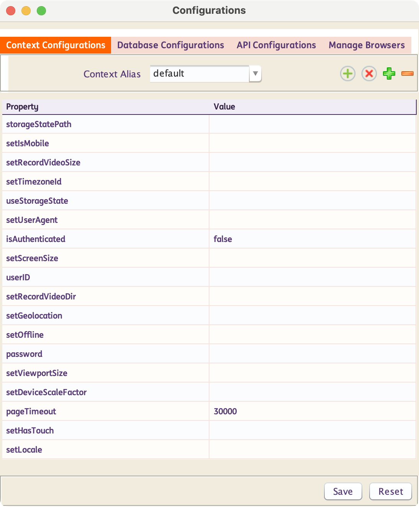
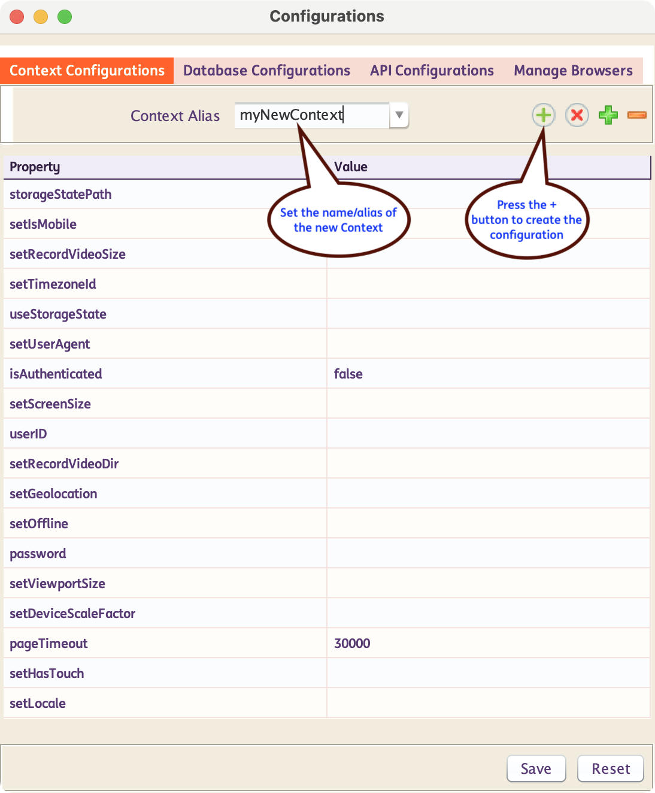
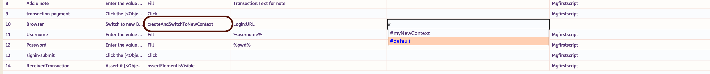
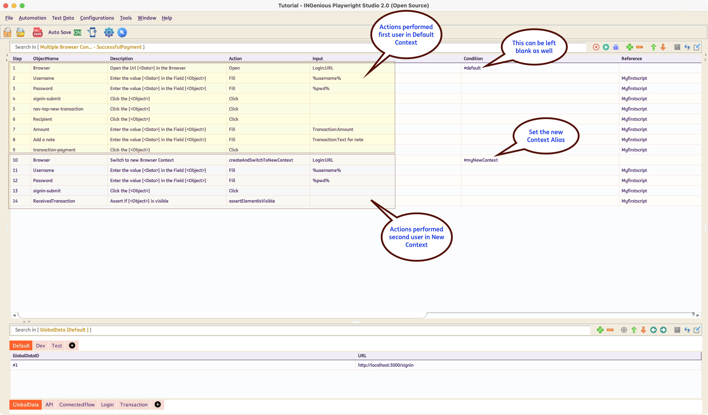

# **Working with Multiple Browser Contexts**

!!! info 
    Playwright allows creating isolated non-persistent browser contexts. Non-persistent browser contexts don't write any browsing data to disk. These can be regarded as separate `incognito` browser sessions

## Default Context Options

By default, the first context of the browser test, will always use the options, as listed in the the `default` settings.

To modify these settings or options, follow the steps below :

* Click on the Browser Configuration icon 

* Inside the **Context Configurations** tab, you will see the `Context Alias` as `default`. Change the values as per requirement.
  
     

## Create New Context Options

To create a new context configuration, follow the steps below :

* Click on the Browser Configuration icon 

* Inside the **Context Configurations** tab, Enter the `Context Alias` and hit ++enter++ . Alternatively you can also click on the  icon.

     

-----------

## Use the Context Options in Tests

In Test Cases, when you use the action `createAndSwitchToNewContext`, in the condition column, all the available **Context Aliases** start to show up. Select the one that you want to use.
     

A complete test case with multiple browser context would possibly look like this :

