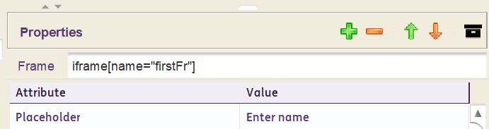
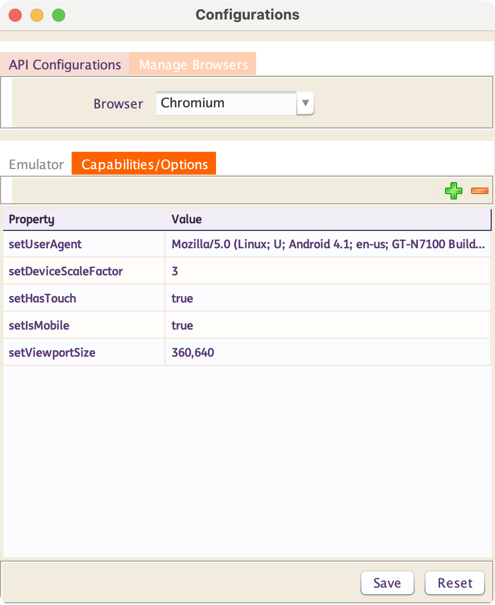

# **Locator Strategy** 
-------------------------------------------

!!! info
    INGenious uses the built-in locator strategy exposed by Playwright and provides an easy interface to configure them

-------------------------------------------

??? note "Role"

    ### **Locate by Role**

    Consider this DOM example :

    

    You can locate each element by its implicit role:

    === ":one: Heading"

        ```java
        page.getByRole(AriaRole.HEADING,new Page.GetByRoleOptions().setName("Sign up"))
        ```
        In **INGenious Playwright Studio**, you will add it as this :

        

    === ":two: Subscribe checkbox"

        ```java
        page.getByRole(AriaRole.CHECKBOX,new Page.GetByRoleOptions().setName("Subscribe"))
        ```
        In **INGenious Playwright Studio**, you will add it as this :

        

    === ":three: Submit Button"

        ```java
        page.getByRole(AriaRole.BUTTON,new Page.GetByRoleOptions().setName("Submit"))
        ```
        In **INGenious Playwright Studio**, you will add it as this :

        

        * `Exact` Option

        Sometimes you may have texts or names with partial matches in the DOM. For example :

        - A `Button` with text `Submit`
        - A `Button` with text `Submit Your Application`

        In this case, to identify the first one, you can use the following:

        ```java
        page.getByRole(AriaRole.BUTTON,new Page.GetByRoleOptions().setName("Submit").setExact(true))
        ```
        In **INGenious Playwright Studio**, you will add it as this :

        


--------------------------------------------------------------------------------------

??? note "Label"

    ### **Locate by Label**


    Consider this DOM example :

    

    You can locate the element by the label text:

    * Password Input Box

    ```java
    page.getByLabel("Password")
    ```
    In **INGenious Playwright Studio**, you will add it as this :

    

    * `Exact` Option

    Sometimes you may have texts or Labels with partial matches in the DOM. For example :

    - A `Label` with text `Address`
    - A `Label` with text `Secondary Address`

    In this case, to identify the first one, you can use the following:

    ```java
    page.getByLabel("Address",new Page.GetByLabelOptions().setExact(true))
    ```
    In **INGenious Playwright Studio**, you will add it as this :

    


--------------------------------------------------------------

??? note "Placeholder"

    ### Locate by Placeholder

    Consider this DOM example :

    

    You can locate the element by the placeholder text:

    * Input Box

    ```java
    page.getByPlaceholder("name@example.com")
    ```
    In **INGenious Playwright Studio**, you will add it as this :

    

    * `Exact` Option

    Sometimes you may have placeholder with partial matches in the DOM. For example :

    - A `Placeholder` with text `Email`
    - A `Placeholder` with text `Secondary Email`

    In this case, to identify the first one, you can use the following:

    ```java
    page.getByPlaceholder("Email", new Page.GetByPlaceholderOptions().setExact(true))
    ```
    In **INGenious Playwright Studio**, you will add it as this :

    


-------------------------------------------

??? note "Text"

    ### Locate by Text

    Consider this DOM example :

    

    You can locate the element by the text it contains:

    * Span

    ```java
    page.getByText("Welcome, John")
    ```
    In **INGenious Playwright Studio**, you will add it as this :

    

    * `Exact` Option

    Sometimes you may have texts with partial matches in the DOM. For example :

    - A `header` with text `Welcome`
    - A `span` with text `Welcome, John`

    In this case, to identify the first one, you can use the following:

    ```java
    page.getByText("Welcome", new Page.GetByTextOptions().setExact(true))
    ```
    In **INGenious Playwright Studio**, you will add it as this :

    


-------------------------------------------

??? note "Alt Text"

    ### Locate by Alt Text

    Consider this DOM example :

    

    You can locate the element by the alt text:

    * Image

    ```java
    page.getByAltText("playwright logo")
    ```
    In **INGenious Playwright Studio**, you will add it as this :

    

    * `Exact` Option

    Sometimes you may have alt texts with partial matches in the DOM. For example :

    - An `img` with alt test `ING`
    - An `img` with alt text `ING Lion`

    In this case, to identify the first one, you can use the following:

    ```java
    page.getByAltText("ING", new Page.GetByAltTextOptions().setExact(true));
    ```
    In **INGenious Playwright Studio**, you will add it as this :

    


-----------------------------------------------------------

??? note "Title"

    ### Locate by Title


    Consider this DOM example :

    

    You can locate the element by the title :

    * Image

    ```java
    page.getByTitle("Issues count")
    ```
    In **INGenious Playwright Studio**, you will add it as this :

    

    * `Exact` Option

    Sometimes you may have titles with partial matches in the DOM. For example :

    - A `span` with title `Payments`
    - An `span` with title `Domestic Payments`

    In this case, to identify the first one, you can use the following:

    ```java
    page.getByTitle("Payments", new Page.GetByTitleOptions().setExact(true))
    ```
    In **INGenious Playwright Studio**, you will add it as this :

    


-------------------------------------------

??? note "Test Id"

    ### Locate by Test Id

    Consider this DOM example :

    

    You can locate the element by the title :

    * Button

    ```java
    page.getByTestId("directions")
    ```
    In **INGenious Playwright Studio**, you will add it as this :

    


-------------------------------------------

??? note "Text"

    ### Locate by XPath or CSS


    * For CSS :

    In **INGenious Playwright Studio**, you will add it as this :

    

    * For Xpath :

    In **INGenious Playwright Studio**, you will add it as this :

    


-------------------------------------------

??? note "Piercing Shadow DOM"

    ### Locate in Shadow DOM

    All locators in Playwright by default work with elements in Shadow DOM. The exceptions are:

    * Locating by **XPath** does not pierce shadow roots.
    * Closed-mode shadow roots are not supported.

    Consider the following example with a custom web component:

    ```html
    <x-details role=button aria-expanded=true aria-controls=inner-details>
    <div>Title</div>
    #shadow-root
        <div id=inner-details>Details</div>
    </x-details>
    ```
    You can locate in the same way as if the shadow root was not present at all.

    ```java
    page.getByText("Details")
    ```

    In **INGenious Playwright Studio**, you will add it as this :

    


-------------------------------------------

??? note "Frames"

    ### Locate in Frames

    All locators in Playwright by default work with elements inside a frame/iframe. But first you need to let the page locate the `frame` using the `framelocator` function.

    You can do that in this way : 

    ```java
    page.frameLocator("iframe[name='firstFr']").getByPlaceholder("Enter name")
    ```

    In **INGenious Playwright Studio**, you will add it as this :

    

    If there are nested frames, then just add the frame locators separated by semicolon, in the Frame box :

    


-------------------------------------------

## Auto-waiting

Playwright performs a range of actionability checks on the elements before making actions to ensure these actions behave as expected. It auto-waits for all the relevant checks to pass and only then performs the requested action. If the required checks do not pass within the given `timeout`, action fails with the `TimeoutError`.

For example, for `click()` action, Playwright will ensure that:

* locator resolves to an exactly one element
* element is Visible
* element is Stable, as in not animating or completed animation
* element Receives Events, as in not obscured by other elements
* element is Enabled

Here is the complete list of actionability checks performed for each action:

Action|Visible|	Stable|	Receives Events	|Enabled|	Editable|
------|-------|-------|-----------------|-------|---------|
**Check**|	:white_check_mark:|	:white_check_mark:|	:white_check_mark:|	:white_check_mark:|	-|
**Click**|	:white_check_mark:|	:white_check_mark:|	:white_check_mark:|	:white_check_mark:|	-|
**Double Click**|	:white_check_mark:|	:white_check_mark:|	:white_check_mark:|	:white_check_mark:|	-|
**setChecked**|	:white_check_mark:|	:white_check_mark:|	:white_check_mark:|	:white_check_mark:|	-|
**Tap**	|	:white_check_mark:|	:white_check_mark:|	:white_check_mark:|	:white_check_mark:|	-|
**Uncheck**	|	:white_check_mark:|	:white_check_mark:|	:white_check_mark:|	:white_check_mark:|	-|
**Hover**	|:white_check_mark:|	:white_check_mark:|	:white_check_mark:|	-|	-|
**dragTo**	|:white_check_mark:|	:white_check_mark:|	:white_check_mark:|	-|	-|
**Screenshot**	|:white_check_mark:|	:white_check_mark:|	-|	-	|-|
**Fill**	|:white_check_mark:|	-|	-|	:white_check_mark:|	:white_check_mark:|
**Clear**	|:white_check_mark:|	-|	-|	:white_check_mark:|	:white_check_mark:|
**selectOption**	|:white_check_mark:|	-	|-	|:white_check_mark:|	-|
**selectText**	|:white_check_mark:|	-|	-|	-|	-|
**scrollIntoViewIfNeeded**|	-|	:white_check_mark:|	-|	-|	-|
**Blur**	|-|	-|	-|	-|	-|
**dispatchEvent**	|-|	-|	-|	-|	-|
**Focus**	|-|	-|	-|	-|	-|
**Press**|-|	-|	-|	-|	-|
**pressSequentially**	|-|	-|	-|	-|	-|
**setInputFiles**	|-|	-|	-|	-|	-|

----------------------------------------------------------------------------------------------------------------------------------------------------------------------------
## Browser-Context/Page Configurations

??? note "Headless, SlowMo and other Browser Context Options"

    ### Browser Context Options

    The following options can be set while creating a Browser Context :

    |<div style="width:250px">Options</div>     |Description|
    |-------------|---------------|
    |`setHeadless`|By default, this is `true`. If you set it as `false`, you will see the browsers opening up during execution|
    |`setSlowMo`|This is slow down the execution by **N milliseconds per operation|
    |`setChannel`|Browser distribution channel. Supported values are **chrome**, **chrome-beta**, **chrome-dev**, **chrome-canary**, **msedge**, **msedge-beta**, **msedge-dev**, **msedge-canary**.|
    |`setChromiumSandbox`|Enable Chromium sandboxing. Defaults to `false`.|
    |`setDevtools`|**Chromium-only**. Whether to auto-open a Developer Tools panel for each tab. If this option is `true`, the headless option will be set `false`.|
    |`setDownloadsPath`|If specified, accepted downloads are downloaded into this directory. Otherwise, temporary directory is created and is deleted when browser is closed. In either case, the downloads are deleted when the browser context they were created in is closed.|
    |`setExecutablePath`|Path to a browser executable to run instead of the bundled one. If executablePath is a relative path, then it is resolved relative to the current working directory. Note that Playwright only works with the bundled Chromium, Firefox or WebKit, use at your own risk.
    |`setTimeout`|Maximum time in **milliseconds** to wait for the browser instance to start. Defaults to `30000` (30 seconds). Pass `0` to disable timeout.|
    |`setProxy`|Proxy to be used for all requests. HTTP and SOCKS proxies are supported, for example `http://myproxy.com:3128` or `socks5://myproxy.com:3128`. Short form `myproxy.com:3128` is considered an HTTP proxy.|
    
    In **INGenious Playwright Studio** you can specify all of these in the **Configuration** Window like this :

    


-------------------------------------------------------------

??? note "Emulation"

    ### Emulation

    Playwright can emulate various devices by specifying the following options when creating a context :

    * `setDeviceScaleFactor` 
    * `setHasTouch` 
    * `setIsMobile` 
    * `setScreenSize` 
    * `setUserAgent` 
    * `setViewportSize`  

    In **INGenious Playwright Studio** you can specify all of these in the **Configuration** Window like this :

    

    The complete list of Playwright supported device configurations can be found [here](https://github.com/microsoft/playwright/blob/main/packages/playwright-core/src/server/deviceDescriptorsSource.json)


-------------------------------------------

??? note "Locale and Timezone"

    ### Locale and Timezone 


    Emulate the user Locale and Timezone which can be set globally for all tests in the config and then overridden for particular tests.

    * `setLocale` 
    * `setTimezoneId` 

    In **INGenious Playwright Studio** you can specify all of these in the **Configuration** Window like this :

    


-------------------------------------------