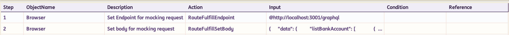

# **Mocking with INGenious Playwright Studio** 
-------------------------------------------


!!! info "When to use Mocking?"

    When working with following situations :

    * third party API's 
    * systems where the data gets refreshed
    * systems which are under development and are often unavailable

    it is better to mock the API call rather than hit the API especially when they are API's that you do not control. You might also want to mock an API when in development mode and the API hasn't been written yet. Mocking the API allows you to finish developing your component or app and write the tests and then when the API is ready you can just swap out the mock for the real API call.

With Playwright you don't need any additional libraries like *Wiremock* to mock an API call. You can use the [`page.route`](#) method to intercept the API call and return a mock response. This means that instead of hitting the real API the browser will return the mocked response.

In the example below, we are intercepting an API call to [`http://localhost:3001/graphql`](#) and returning the following mocked response :

```json
{
    "data": {
        "listBankAccount": [
            {
                "id": "pgl34JtnfhX",
                "uuid": "0939b3fe-02da-46f4-a3a6-f06f0fc49f75",
                "userId": "uBmeaz5pX",
                "bankName": "ING Bank",
                "accountNumber": "7774132232",
                "routingNumber": "996645387",
                "isDeleted": false,
                "createdAt": "2023-03-28T21:55:07.857Z",
                "modifiedAt": "2024-03-07T20:50:34.541Z"
            }
        ]
    }
}
```
 by using the fulfill method, method, which fulfills a route's request with a given response.


In INGenious Playwright Studio, the steps will look like this :

 

 The data in the payload can be parameterized from datasheets as well.

 >>The built-in mocking actions can be found [here](../playwrightActions/fulfill.md)

-------------------------------- 

**The following video will help you to understand mocking better**

<video width="700" height="400"  controls>
  <source src="../../videos/MockYourWebAPIs.mp4" type="video/mp4">
</video>
