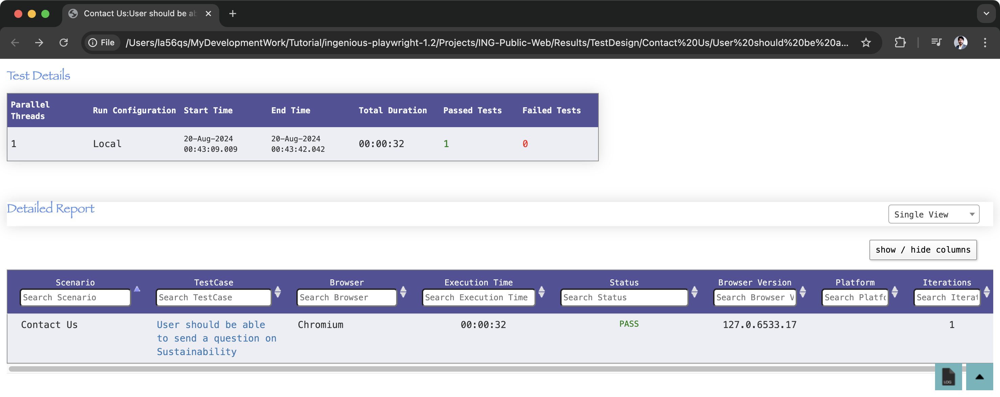
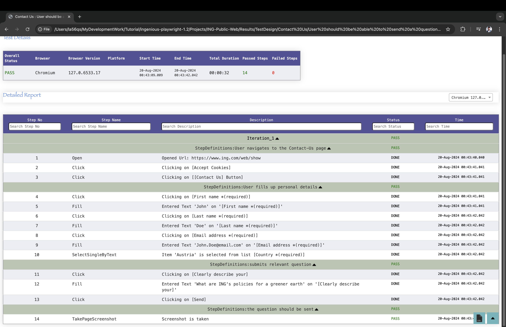
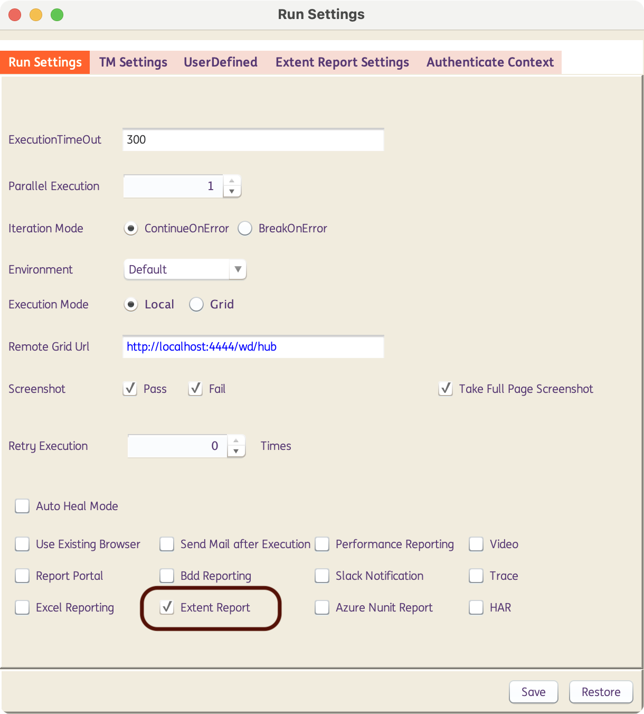
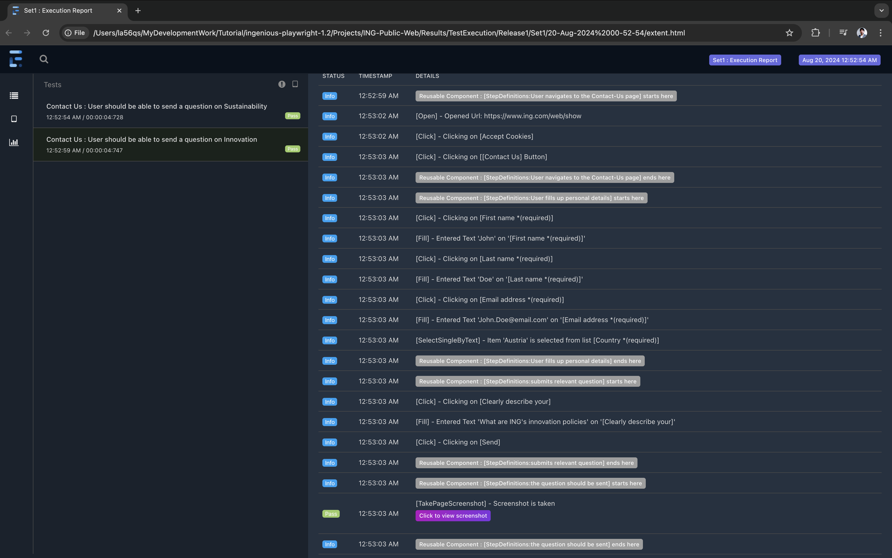
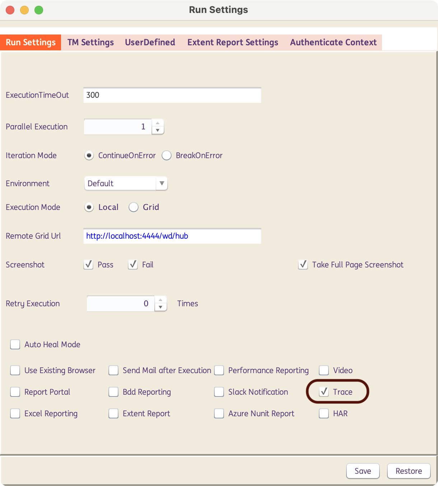
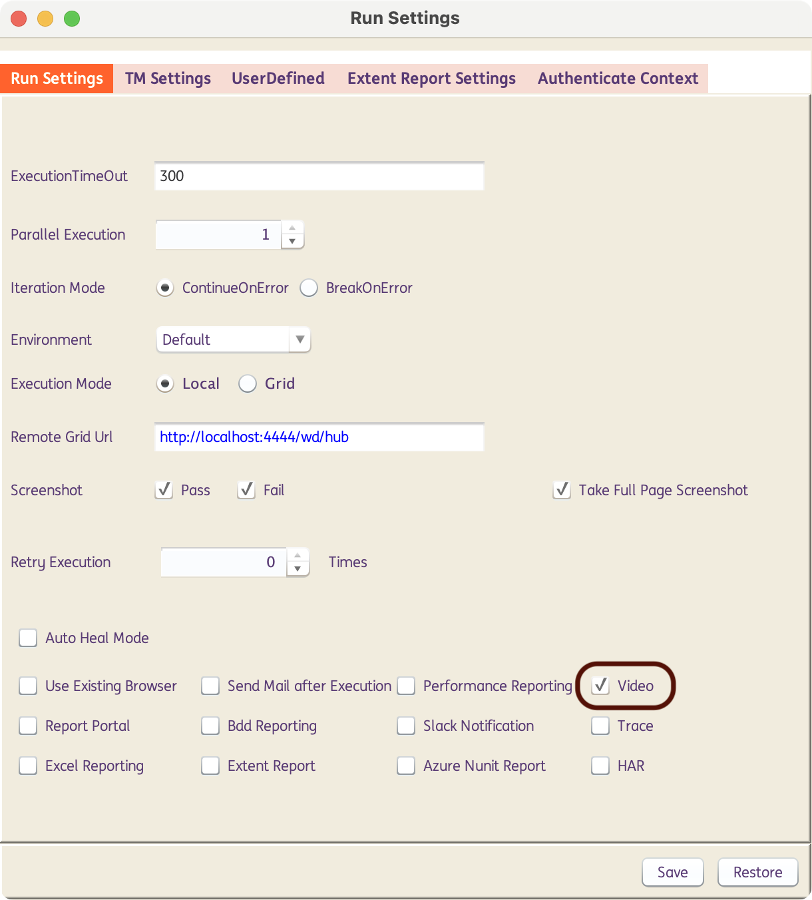
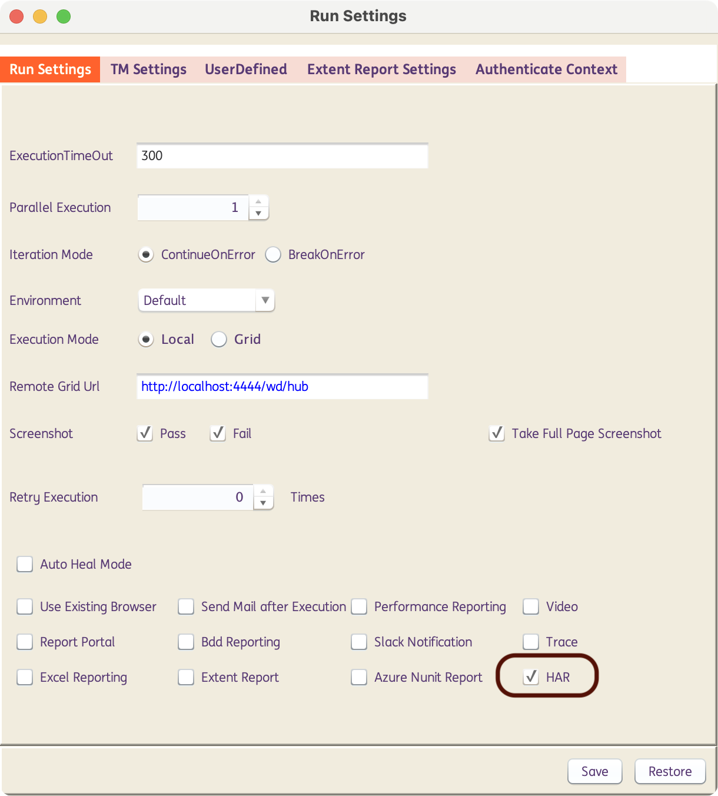

# **Playwright | Report Analysis** 
-------------------------------------------

??? example "Built-in HTML report"

    ## Built-in HTML report

    INGenious has a powerful built-in HTML Report that gets generated after every test execution.

    

    If we click on any of the test cases, it will show a detailed step-wise report like this : 

    

-------

??? example "Built-in Extent report"

    ## Built-in Extent report

    INGenious has built-in Extent Report that gets generated after every test execution when this checkbox is ticked :

    

    If we run the tests **only from the Execution Pane**, a detailed step-wise report will show up, like this : 

    

-------

!!! info "Additional Reporting and Debugging Capabilities"

    The following are the **built-in capabilities** within the framework to perform report analysis for Playwright-Java tests, in addition to the already available reporting in INGenious

--------------------------------------------

??? example "Tracing"

    ## Tracing


    From INGenious you can generate traces for all playwright tests that are being executed. You can do this from the **Run Settings**

    

    When you do this, the traces are saved in the `Results` location of the corresponding tests.

    Traces are a great way for debugging your tests. You can open the saved trace using the following options :

    * On your browser on `trace.playwright.dev` [**This is not recommended in ING as your tests contain details about you ING applications**]
    * Using Playwright CLI . Make sure to add the full path to where your `trace.zip` file is located. This should include the full path to your `trace.zip` file.

    ```{.shell .copy}
    mvn exec:java -e -D exec.mainClass=com.microsoft.playwright.CLI -D exec.args="show-trace <full/path/to/trace.zip>"
    ```

 

??? example "Videos"

    ## Videos

    From INGenious you can generate videos for all playwright tests that are being executed. You can do this from the **Run Settings**

    

    When you do this, the videos are saved in the `Results` location of the corresponding tests.


??? example "HAR files"
    ## HAR files

    From INGenious you can generate **HAR (Http Archive)** files for all playwright tests that are being executed. You can do this from the **Run Settings**

    

    When you do this, the HAR files are saved in the `Results` location of the corresponding tests.


