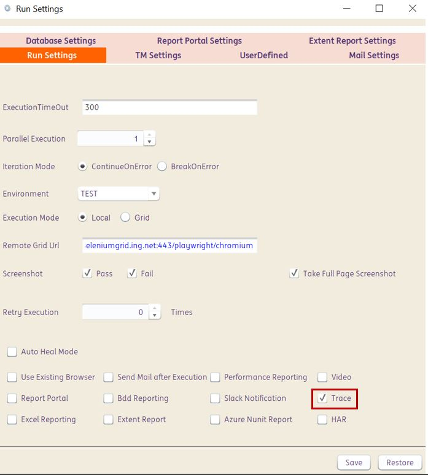
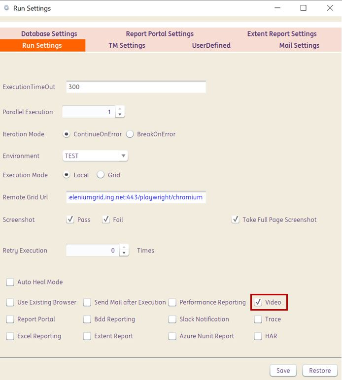
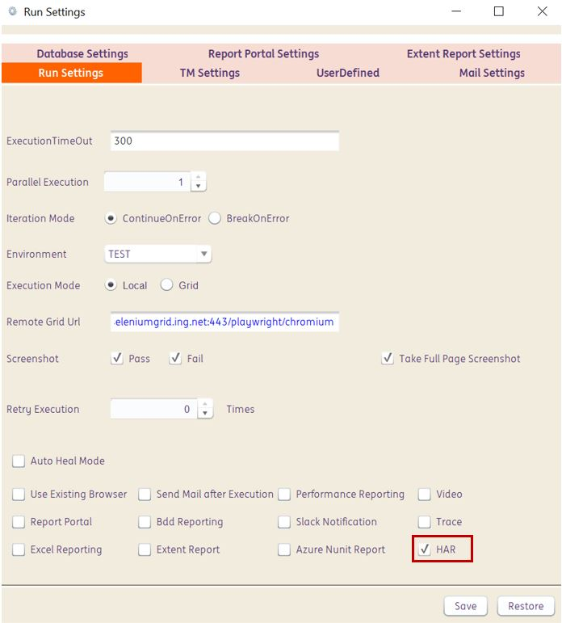

# **Playwright | Report Analysis** 
-------------------------------------------

<span style="color:Green">The following are the **built-in capabilities** within the framework to perform report analysis for Playwright-Java tests, in addition to the already available reporting in INGenious</span>

--------------------------------------------

## Tracing


<summary>How it works</summary>

From INGenious you can generate traces for all playwright tests that are being executed. You can do this from the **Run Settings** :

 

When you do this, the traces are saved in the `Results` location of the corresponding tests.

Traces are a great way for debugging your tests. You can open the saved trace using the following options :

* On your browser on `trace.playwright.dev` [**This is not recommended in ING as your tests contain details about you ING applications**]
* Using Playwright CLI . Make sure to add the full path to where your `trace.zip` file is located. This should include the full path to your `trace.zip` file.

```shell
mvn exec:java -e -D exec.mainClass=com.microsoft.playwright.CLI -D exec.args="show-trace <full/path/to/trace.zip>"
```

 


## Videos


<summary>How it works</summary>

From INGenious you can generate videos for all playwright tests that are being executed. You can do this from the **Run Settings** :

 

When you do this, the videos are saved in the `Results` location of the corresponding tests.


## HAR files


<summary>How it works</summary>

From INGenious you can generate **HAR (Http Archive)** files for all playwright tests that are being executed. You can do this from the **Run Settings** :

 

When you do this, the HAR files are saved in the `Results` location of the corresponding tests.


