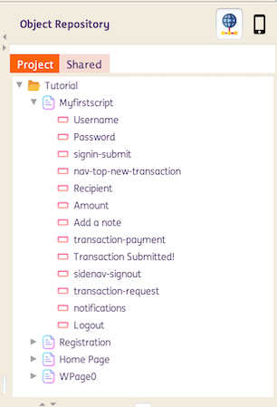
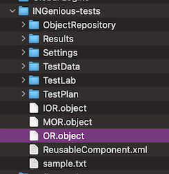
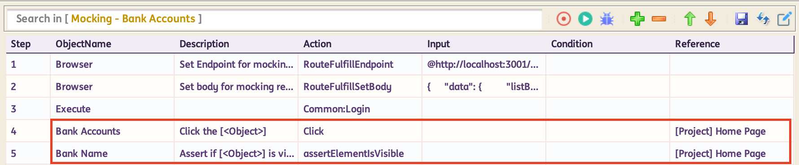
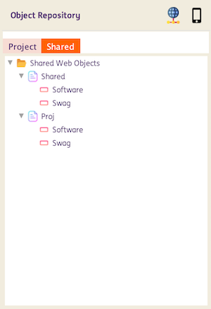
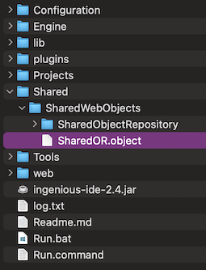
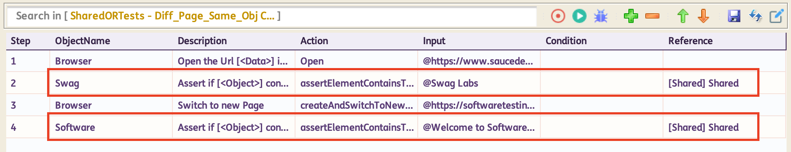
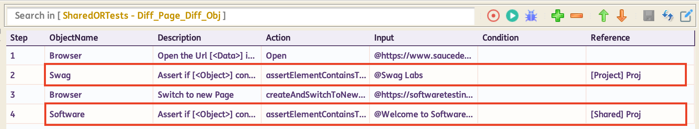
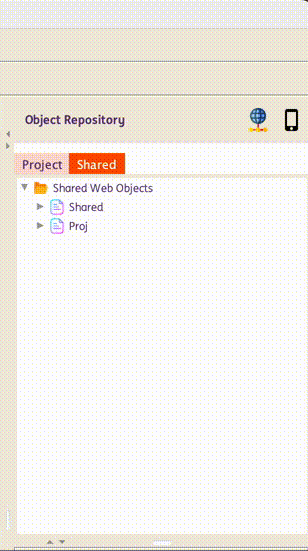
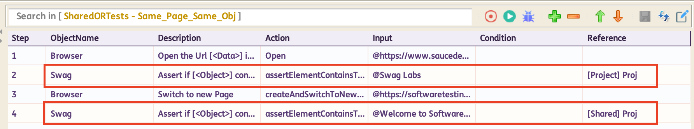
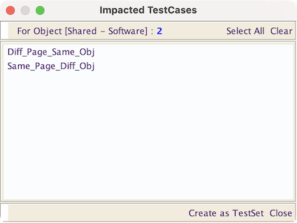

# **Web Objects Repository**

!!! info 
    The Web Object Repository (Web OR) in INGenious provides a centralized, maintainable, and scalable way to manage UI elements used across your automated tests. Instead of scattering selectors throughout test code or embedding them directly in automation scripts, the repository allows teams to define, store, and reuse web elements from a single source of truth.

!!! abstract "Key Benefits:"
    * **Centralized element management** – All web objects live in one organized repository.
    * **Reduced duplication** – Reuse element definitions across test suites and frameworks.
    * **Improved maintainability** – Update a selector once and apply the change everywhere.
    * **Consistent naming and structure** – Standardized element definitions promote cleaner automation design.

## Object Repository Structure
    
Object repository follows the structure below:

    ```
    ├── ProjectName
    │   └── PageName1
    │       └── ObjectName1
    │   └── PageName2
    │       └── ObjectName1
    │       └── ObjectName2
    ```

* A single project can include multiple Pages, and each Page can hold multiple Objects.
* Page name must be unique within the project.
* Object name must be unique within its page. 
* An object consists of the following attributes that define how it can be identified and interacted with:

    | **Attribute**      | **Description** | **Example Value** |
    |--------------------|------------------|--------------------|
    | **Role**           | Defines the semantic role of the element, often based on [ARIA roles](https://developer.mozilla.org/en-US/docs/Web/Accessibility/ARIA/Reference/Roles). | button |
    | **Text**           | Visible text displayed by the element. | Submit |
    | **Label**          | The associated label or ARIA label of the element. | Email Address |
    | **Placeholder**    | Placeholder text shown inside an input field. | Enter your email |
    | **XPath**          | XPath expression used to locate the element in the DOM. | //input[@id='email'] |
    | **CSS**            | CSS selector used to target the element. | #login-button |
    | **AltText**        | Alternative text for an image or element. | Company Logo |
    | **Title**          | The title attribute of the element. | View Details |
    | **TestID**         | A stable identifier intended for automated testing. | data-testid="username-input" |
    | **ChainedLocator** | Locator that finds the element relative to a parent or nested element. | Parent: div.user-form → Child: input[type='password'] |

## Project and Shared Web OR

There are two types of Web OR that you may use:

* **Project Web OR**

    Contains objects that **can be used within the project** and managed from the `Project` tab within the OR panel.

    

    An `OR.object` file is automatically generated whenever a project containing Objects is saved. It stores the Page and Object attributes in XML format and is located inside the respective project directory.

    

    When a Project Web Object (PWO) is used in a test step, the identifier **[Project] PageName** will show as its reference.

    

* **Shared Web OR**

    Contains objects that **can be used across different projects** and managed from the `Shared` tab within the OR panel.

    
    
    A `SharedOR.object` file is automatically generated whenever a project saves Objects created under `Shared` or when Objects are copied from the `Project` into `Shared`. Like `OR.object`, it stores Page and Object attributes in XML format and is located in the `Shared\SharedWebObjects\` directory.

    

    When a Shared Web Object (SWO) is used in a test step, the identifier **[Shared] PageName** will show as its reference.

    


## How to use Project and Shared Web OR

* Pages and Objects can be added directly within the Project and Shared repositories using the `Add Page` or `Add Object` options.

* Objects from Project and Shared Web OR can be used in a single Test Scenario.

    For example:
    

* Pages and Objects created under the `Project` tab can be copied to the `Shared` section by using the `Copy to Shared` option. When an entire Page is copied, all Objects under that Page—including their attributes—are copied. When copying a single Object, only that Object and its corresponding Page are copied. *Note that existing test steps using the Project‑level Web Object (PWO) will not be automatically updated to use the Shared Web Object (SWO).*

    

* Pages and Objects may share the same names across the Project and Shared repositories. However, names must remain unique within each individual repository.

    

* Pages and Objects in both the Project and Shared repositories can be renamed using the `Rename Page` or `Rename Object` options. However, after renaming, any existing test steps that previously referenced an SWO will continue to use its old name, which may result in errors during test execution.

* Pages and Objects in both the Project and Shared repositories can be deleted using the `Delete Page` or `Delete Object` options. However, once deleted, any existing test steps that previously referenced an SWO or PWO will still attempt to use the removed Page or Object, which may result in errors during test execution.

* To view all test cases that reference an Object, use the `Get Impacted Cases` option. This feature is available for both Project and Shared repositories.

    