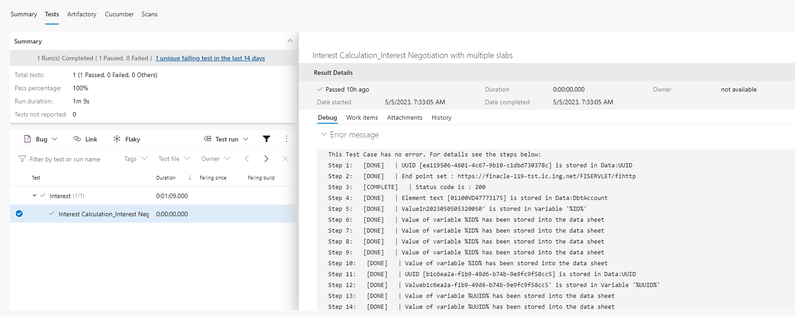
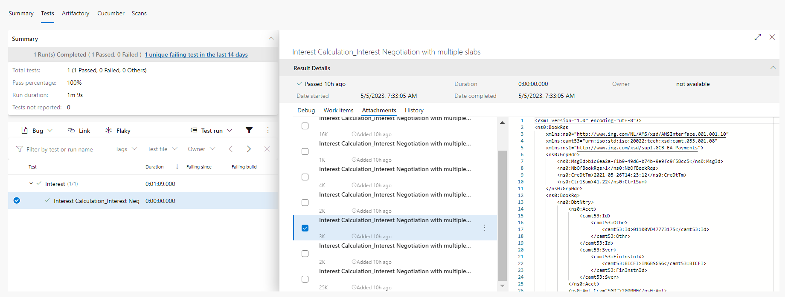
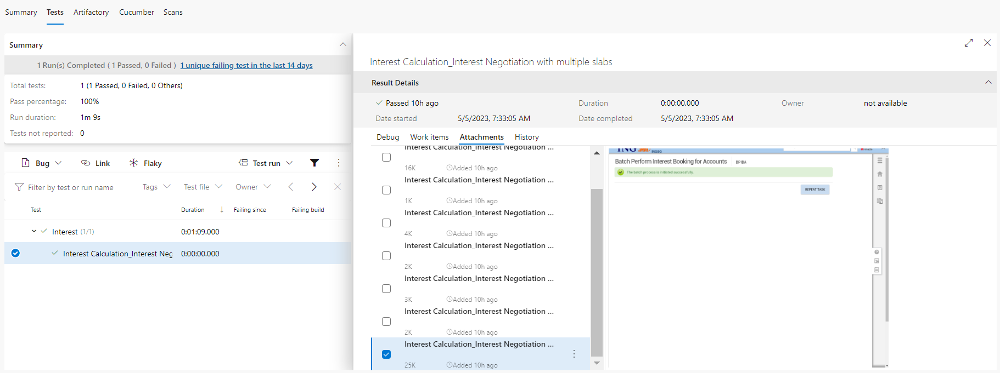
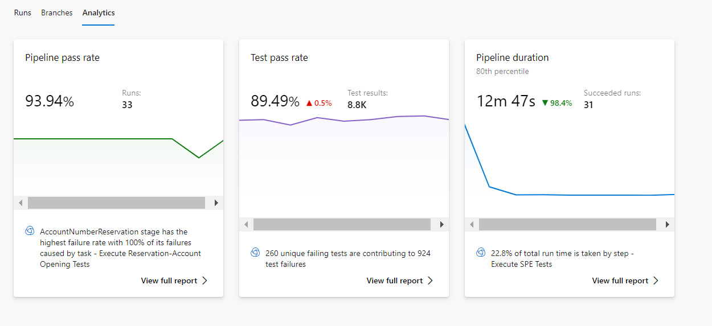

# Continuous Integration

## **Azure DevOps Integration**  

-----------------------------------
Integration with Azure DevOps involves the following points :

* **Check-in the tests into Azure Repository**. Here we need to understand which are the files that need to go into Azure Repo.
* Execution of tests via **Azure DevOps Pipeline**.
* Viewing of **Test Results** (Pass, Fail, Logs, Screenshots etc.) in Azure DevOps itself
* **Analysis** of Historical Results via Azure Analytics
* Feed test results automatically to **Azure DevOps Test Plans** [Optional]

 

-------------------------------------

## **Azure DevOps Repository**

### Libraries pulled from Azure feeds.

Please follow [this link](https://theforge.ing.net/product/42426/documentation/7.240322.2/manual/irg/governors/irgfeedgovernor.html#howto-irg-feedgovernor) to know how to create a feed.

A basic incoming feed json for IRG can be found [here](https://dev.azure.com/ingcdaas/IngOne/_git/P03278-EngineeringSamples?path=%2Fresources%2Fazure-artifacts.json)

The following is the content of a `.gitignore` file. The `lib/*.jar` is important here. These `jars` should be pulled from your Maven feed instead of pushing them to Repositories.

```gitignore
Extensions/
logs/
Projects/*/Results/*/
Projects/*/*/Results/*/
web/
recent.items
log.txt
Tools/
lib/*.jar
```

Every file other than the above should go into your repository.

----------------------------------------------

## **Azure DevOps Pipeline**

### Libraries pulled in from Azure feeds.

The `yaml` file content should be as shown below.

```yaml
pool:
  name: 'CDaaSLinux'
    
stages :
  - stage: TestExecution
    jobs :
     - job :  TestExecution
       steps:    
          - checkout:  self
            fetchDepth: 1
            clean: true  

          # This is to set Java 11
          - script: |
              echo "##vso[task.setvariable variable=JAVA_HOME]$(JAVA_HOME_11_X64)"
              echo "##vso[task.setvariable variable=PATH]$(JAVA_HOME_11_X64)/bin:$(PATH)"
            displayName: "Set java version to 11"  
          
          # This is to set Permissions
          - task: CmdLine@2
            inputs:
              script: 'chmod -R 755 ./'
            displayName: 'Set Permissions'       
            
          # Maven Authentication  
          - task: MavenAuthenticate@0
            inputs:
              artifactsFeeds: 'PXXXXX-incoming-maven' # This is the name of your incoming Maven feed

         # Maven Initialize  
          - task: Maven@4
            inputs:
              mavenPomFile: '$(System.DefaultWorkingDirectory)/Engine/pom.xml'
              goals: 'initialize'
              options: '-s $(System.DefaultWorkingDirectory)/settings.xml -gs $(HOME)/.m2/settings.xml -Dmaven.wagon.http.ssl.insecure=true' #settings.xml content is given below
              publishJUnitResults: false
              javaHomeOption: 'JDKVersion'
              jdkVersionOption: '1.11'
              mavenVersionOption: 'Default'
              mavenOptions: '-Xmx3072m -Dmaven.test.failure.ignore=true'
              mavenAuthenticateFeed: false
              effectivePomSkip: false
              sonarQubeRunAnalysis: false
            displayName: 'Maven Initialize'

         # Maven Install  
          - task: Maven@4
            inputs:
              mavenPomFile: '$(System.DefaultWorkingDirectory)/Engine/pom.xml'
              goals: 'install'
              options: '-s $(System.DefaultWorkingDirectory)/settings.xml -gs $(HOME)/.m2/settings.xml -Dmaven.wagon.http.ssl.insecure=true' #settings.xml content is given below
              publishJUnitResults: false
              javaHomeOption: 'JDKVersion'
              jdkVersionOption: '1.11'
              mavenVersionOption: 'Default'
              mavenOptions: '-Xmx3072m -Dmaven.test.failure.ignore=true'
              mavenAuthenticateFeed: false
              effectivePomSkip: false
              sonarQubeRunAnalysis: false
            displayName: 'Install Libraries'

          # Use this task only if you are running INGenious Playwright Studio Tests. For non-playwright tests, this is not required.
          - task: CmdLine@2
            displayName: 'Install playwright system dependencies'
            inputs:
              script: |
                nohup dnf install libdrm mesa-libgbm libxshmfence -y &
            continueOnError: true

         # This is to trigger execution
          - task: CmdLine@2
            inputs:
              script: './Run.command -run -project_location "Projects/<your_project_name>" -release "<your_release_name>" -testset "<your_testset_name>" -setEnv "run.AzureReport=true"'
              workingDirectory: '$(System.DefaultWorkingDirectory)'
            displayName: 'Execute Tests'
            
          # This is to publish test results  
          - task: PublishTestResults@2
            inputs:
              testResultsFormat: 'NUnit'
              testResultsFiles: 'Projects/<your_project_name>/Results/TestExecution/<your_release_name>/<your_testset_name>/Latest/azure.xml'
              testRunTitle: 'Test Results'
```

**Please also make sure the following are also taken care of :**

1. There is a `settings.xml` in the root location of your repository which has the following content . Make sure you add you incoming Maven feed 

```xml

<settings xmlns="http://maven.apache.org/SETTINGS/1.0.0"xmlns:xsi="http://www.w3.org/2001/XMLSchema-instance" xsi:schemaLocation="http://maven.apache.org/SETTINGS/1.0.0 https://maven.apache.org/xsd/settings-1.0.0.xsd">
   <mirrors>
        <mirror>
            <id>PXXXXX-incoming-maven</id>
            <url>https://pkgs.dev.azure.com/INGCDaaS/IngOne/_packaging/PXXXXX-incoming-maven/maven/v1</url>
            <mirrorOf>external:*,!central,!confluent</mirrorOf>
        </mirror>
    </mirrors>
	<proxies>
        <proxy>
            <active>true</active>
            <protocol>http</protocol>
            <host>giba-proxy.wps.ing.net</host>
            <port>8090</port>
            <nonProxyHosts>*.ing.net|*.intranet</nonProxyHosts>
        </proxy>
    </proxies>
</settings>


```
2. In the `Engine\pom.xml` ensure that the following section is present :

```xml
        <distributionManagement>
            <repository>
                  <id>PXXXXX-incoming-maven</id>
                  <url>https://pkgs.dev.azure.com/INGCDaaS/IngOne/_packaging/PXXXXX-incoming-maven/maven/v1</url>
            </repository>
        </distributionManagement>

        <repositories>
            <repository>
                  <id>PXXXXX-incoming-maven</id>
                  <url>https://pkgs.dev.azure.com/INGCDaaS/IngOne/_packaging/PXXXXX-incoming-maven/maven/v1</url>
                <releases>
                    <enabled>true</enabled>
                </releases>
                <snapshots>
                    <enabled>true</enabled>
                </snapshots>
            </repository>
        </repositories>

        <pluginRepositories>
            <pluginRepository>
              <id>PXXXXX-incoming-maven</id>
              <url>https://pkgs.dev.azure.com/INGCDaaS/IngOne/_packaging/PXXXXX-incoming-maven/maven/v1</url>
            <releases>
                <enabled>true</enabled>
            </releases>
            <snapshots>
            <enabled>true</enabled>
            </snapshots>
            </pluginRepository>
        </pluginRepositories>

```

-------------------------------------

## **Test Results**

To view the Test Results we need to navigate to the **`Tests`** tab of the Azure DevOps Pipeline.

 

If we click on the **`Tests`** we will see the detailed steps of execution under **Debug** Window.

  

If we have **`API Tests`** we will see the request/response payloads in the  **Attachment** Window.  

  

If we have **`Browser Tests`** we will see the screenshots in the  **Attachment** Window. 

  

 -------------------------------------

## **Pipeline Analytics** 

If we click on the `Pipeline Name` and navigate to the **`Analytics`** tab of the Azure DevOps Pipeline, we will see the report like this :

  

We can use this feature to determine the health of the pipeline and analysis of historical test reports.

 -------------------------------------

!!! info "Remote Execution Integrations"

    |Lambda Test | BrowserStack| SauceLabs | Selenium Grid |
    |---|---|---|---|
    |  |  |  |  | 
