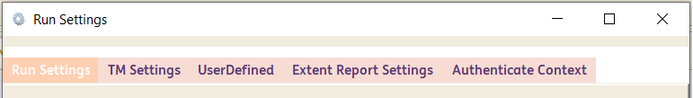
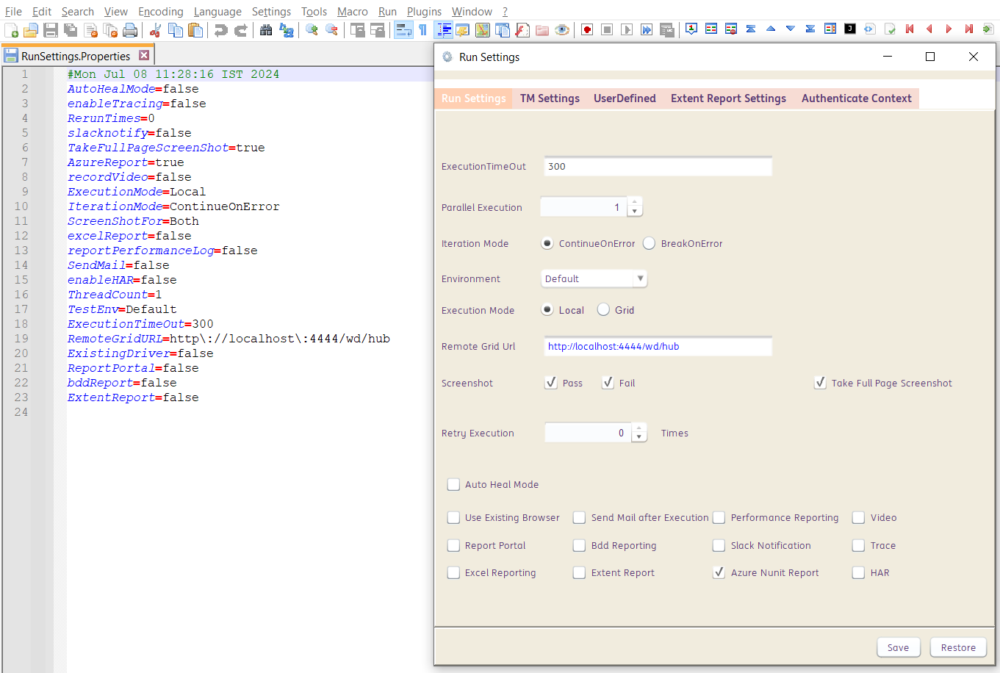
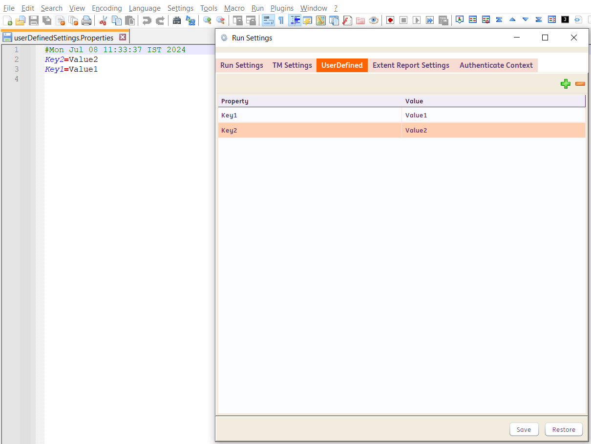
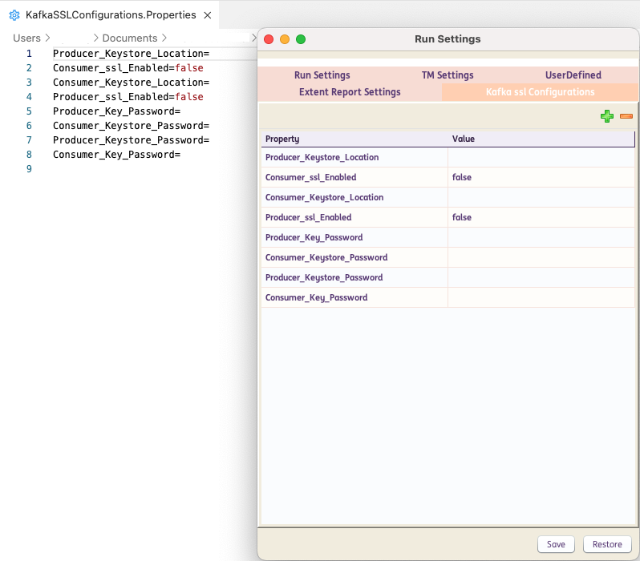

# **Command Line Interface**  
---------------------- 

!!! note "CLI"
    INGenious has a rich set of command line options for execution with parameters, retrieving execution details, setting variables, change settings etc.


### CLI Options

|<div style="color:#349651;width:100px">Options</div>|<div style="color:#AB0066;width:400px">Output</div>
|-------------------------------|---------------------------
|[`-v`](#),[`-version`](#)              |Display current build details
|[`-run`](#)                         |Run with the given details
|[`-rerun`](#)                       |Rerun the last execution
|[`-project_location`](#) <arg>      |Project Location for Execution
|[`-scenario`](#) <arg>              |Scenario Name
|[`-testcase`](#) <arg>              |Testcase Name
|[`-browser`](#) <arg>               |Browser Name (Not applicable for Testset Execution)
|[`-release`](#) <arg>               |Release Name
|[`-testset`](#) <arg>               |Testset Name
|[`-tags`](#) <arg>                  |Tags of Test Cases to be exceuted
|[`-bDate`](#)                       |Display current build date
|[`-bTime`](#)                       |Display current build time
|[`-bVersion`](#)                    |Display current build version
|[`-dont_launch_report`](#)          |Disables launching summary report after execution
|[`-help`](#)                        |Help
|[`-hi`](#)                          |Says Hello!
|[`-t`](#)                           |Display Current Time
|[`-latest_exe`](#) <arg>            |Returns the given property value for the latest execution
|[`-latest_exe_loc`](#)              |Returns the results folder for the latest execution
|[`-latest_exe_status`](#)           |Returns the status for the latest execution
|[`-latest_exe_data_loc`](#)         |Returns the Report data location for the latest execution
|[`-latest_exe_data_raw`](#)         |Returns the Report data for the latest execution
|[`-latest_exe_log_loc`](#)          |Returns the log file location for the latest execution
|[`-latest_exe_log_raw`](#)          |Returns the log file for the latest execution
|[`-latest_exe_perf_status`](#) <arg>|Returns the page load performance results for latest execution
|[`-latest_exe_perf_report`](#) <arg>|Returns the page load performance report for latest execution
|[`-checkPagePerf`](#) <arg>         |Returns the page load performance results after Run
|[`-setVar`](#) <arg>                |Create/Set user defined variable [[`-setVar "var=value"]`](#)
|[`-setEnv`](#) <arg>                |Create/Set Env settings <override>
|[`-standalone_report`](#)           |Create Standalone Report instead of Relative one

---------------------------

### Examples 

:octicons-check-24: **Single Test Case Execution**

=== "Windows"

    ```{ .powershell .copy }
    Run.bat -run -project_location "Projects\Demo" -scenario "NewScenario" -testcase "NewTestCase" -browser "Chrome"
    ```

=== "Mac/Linux"
    ```{ .shell .copy }
    ./Run.command -run -project_location "Projects\Demo" -scenario "NewScenario" -testcase "NewTestCase" -browser "Chrome"
    ```

---------------------- 

:material-check-all: **Test Set Execution**


=== "Windows"

    ```{ .powershell .copy }
    Run.bat -run -project_location "Projects\Demo" -release "NewRelease" -testset "NewTestSet"
    ```

=== "Mac/Linux"
    ```{ .shell .copy }
    ./Run.command -run -project_location "Projects\Demo" -release "NewRelease" -testset "NewTestSet"
    ```

---------------------- 

:octicons-tag-16: **Test Set Execution with specific tags**

=== "Windows"

    ```{ .powershell .copy }
    Run.bat -run -project_location "Projects\Demo" -release "NewRelease" -testset "NewTestSet" -tags "@smoke"
    ```

=== "Mac/Linux"
    ```{ .shell .copy }
    ./Run.command -run -project_location "Projects\Demo" -release "NewRelease" -testset "NewTestSet" -tags "@smoke"
    ```

---------------------- 

:octicons-gear-24: **Test Set Execution with Updated Environment Settings**

=== "Windows"

    ```{ .powershell .copy }
    Run.bat -run -project_location "Projects\Demo" -release "NewRelease" -testset "NewTestSet" -setEnv "run.TestEnv=Acceptance"
    ```

=== "Mac/Linux"
    ```{ .shell .copy }
    ./Run.command -run -project_location "Projects\Demo" -release "NewRelease" -testset "NewTestSet" -setEnv "run.TestEnv=Acceptance"
    ```
In the above example, the test set will be forced to be executed on `Acceptance` Environment

---------------------- 

### Override Settings

**`-setEnv`** is a very powerful command to override all the environment settings and userdefined variables.
This can override the values in all of these settings :



Lets look at the `Run Settings` for a Test Set. If we enter into the project location and navigate to the following location :

`Settings\TestExecution\`<`ReleaseName`>`\`<`TestSetName`> 

We will find the `RunSettings.Properties` and the `TestMgmtSettings.Properties` files.

The `RunSettings.Properties` holds all the corresponding settings that we enter via the UI of the framework.



Any of these properties can be overriden by **`-setEnv`**. 

For Example: `-setEnv "run.TakeFullPageScreenShot=False"`

Similarly, if we go to the **project location** and navigate to `Settings\` directory, the `userDefinedSettings.Properties` holds all the corresponding data that we enter via the UI of the framework.



We can use by **`-setEnv`** to override these values too.

For Example: `-setEnv "user.Key1=NewValue1"`

Similarly, if we go to the **project location** and navigate to `Settings\` directory, the `KafkaSSLConfigurations.Properties` holds all the corresponding data that we enter via the UI of the framework.



We can use by **`-setEnv`** to override these values too.

For Example: `-setEnv "kafkaSSl.Producer_Key_Password=P@ssw0rd"`

For the following settings, **`-setEnv`** can be used as follows :

|Settings|option|
|--------|-------|
|Global Settings| -setEnv "`exe`.SettingName=Value"|
Run Settings | -setEnv "`run`.SettingName=Value"|
User Defined Settings | -setEnv "`user`.SettingName=Value"|
Kafka SSL Configurations | -setEnv "`kafkaSSl`.SettingName=Value"|
Driver Settings | -setEnv "`driver`.SettingName=Value"|
Test Management Settings | -setEnv "`tm`.SettingName=Value"|
Browser Capability Settings | -setEnv "`capability`.`browserName`.SettingName=Value"|
Browser Context Settings |-setEnv "`context`.`aliasName`.SettingName=Value"|
Database Settings | -setEnv "'`db`.`aliasName`.SettingName=Value"|

Examples :

```{ .shell .copy }
-setEnv "capability.chromium.setheadless=false"` 
```
```{ .shell .copy }
-setEnv "context.test.password=Value"
```

Multiple settings can be altered via a single command as well :

```{ .shell .copy }
-setEnv "run.var=value;exe.var=value;user.var=value"
```

