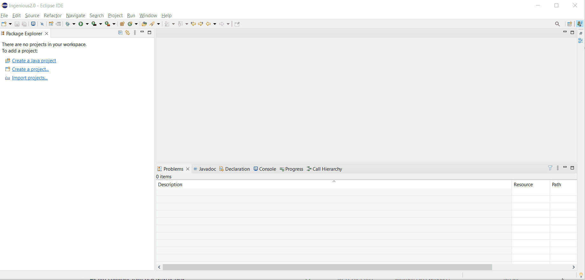
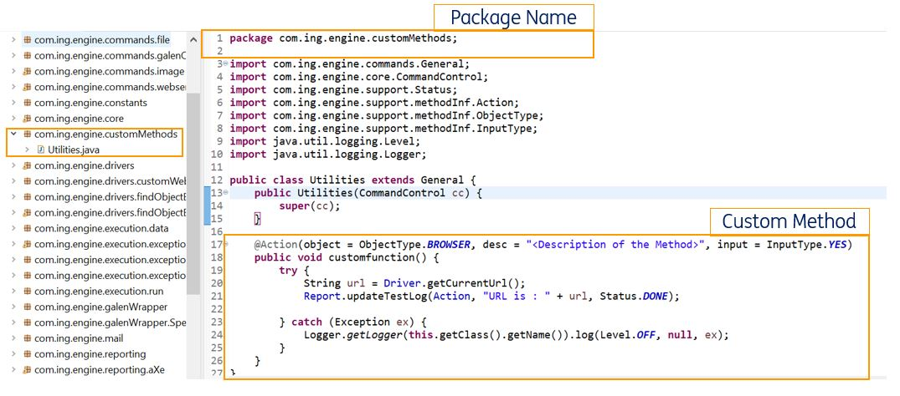
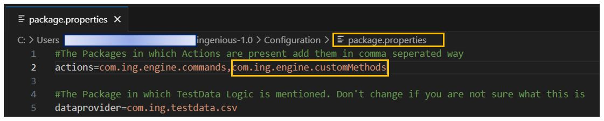
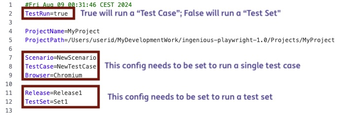
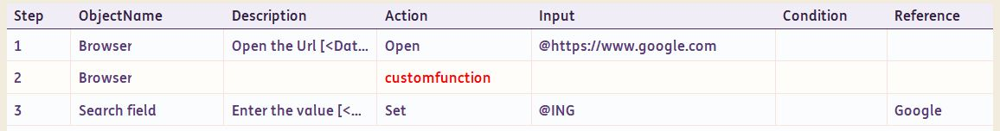
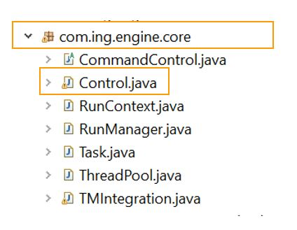

# Engine  
 -------------------------------------------

!!! abstract "Engine"
    The **Engine is the heart** of the framework. This is where all the actions are defined. The **Engine** project is available in the ==root location of INGenious== can be imported into any IDE that supports Java. This gives users the flexibility to alter the code of the existing actions or add additional custom actions. 
    After making modifications to the engine, the users can compile the engine using [`mvn install`](#) to be used from INGenious IDE.


### Import Engine in Eclipse

- [x] Pre-requisites :
    - [ ] Navigate inside the **Engine** directory where you will find the [`pom.xml`](#)
    - [ ] Open command prompt/terminal at this location and execute the following commands :
        -  [`mvn initialize`](#)
        -  [`mvn clean install`](#)

- [x] Open **Eclipse IDE**

- [x] Import project using **`File`** > **`Import`** > **`Maven`** > **`Existing Maven Projects`**

- [x] Locate the **Engine** folder in your system. This location is inside the directory where INGenious is present

After performing the above steps, you can see the Project imported in your IDE. 

>>The process is exactly the same for IntelliJ or any other IDE.



----------

### Where to write custom method?

Create a custom package in the **Engine** under **src** and create your **.java** files containing the custom methods in it. **This is the best practice to add your custom method.** In this way, you can always keep track of all your customizations.


------------

Learn how to create customizations here  [Custom functions](customfunction.md){ .md-button } 


----------

### Test/Debug customization from Engine

It is a best practice to run or debug your flow from the Engine, before building the `jar`. In case of any errors or exceptions, you can redesign your flow and finally build the jar once the errors have been fixed.

Follow the steps below to execute test case from the Engine.


- [x] Open Eclipse **IDE**

- [X] If you have your custom method in a separate `package`, then follow the steps below to add your package name to the **package.properties** file available in the **Configuration** folder inside the root location of INGenious.

Let's take the example below. Let's assume the custom function is added like this :



- [X] Navigate to the location where the framework is installed >> Go to **`Configuration`** folder >> Inside **`package.properties`** add the package name like this :




- [x] In the same **`Configuration`** folder >> Open the **`Global Settings.properties`** file and provide the details as shown in the image below:




- [x] Add the custom method name in the test case as shown below. It will show in <span style="color:Red">**Red**</span> in the UI of the framework, but thats expected as you have not yet built a JAR file. You are only testing the custom method.



- [x] In the Eclipse IDE,run the **control.java** file from the **com.ing.engine.core** package.



- [x] You can also keep break points wherever required and debug the test case after triggering the execution form the **control.java** file.

-------------------------

:material-checkbox-multiple-marked-circle: **Building the jar file**

=== "From Eclipse"

    Right click on the project :arrow_right:  [`Run As`](#)  :arrow_right:  [`Maven Install`](#)

=== "From Command Prompt"

    * Navigate to **Engine** directory where pom is located 
    * Open command prompt and execute  ```mvn clean install```

This will build the jar with updated code.

