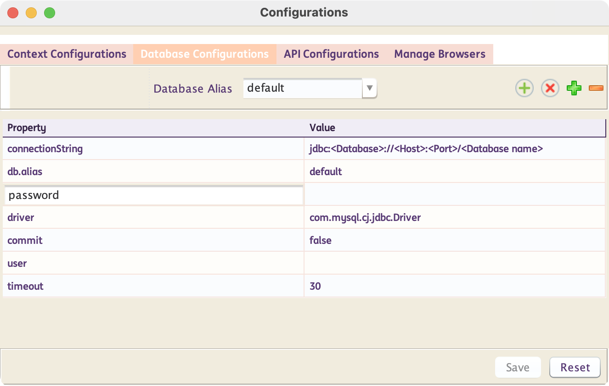
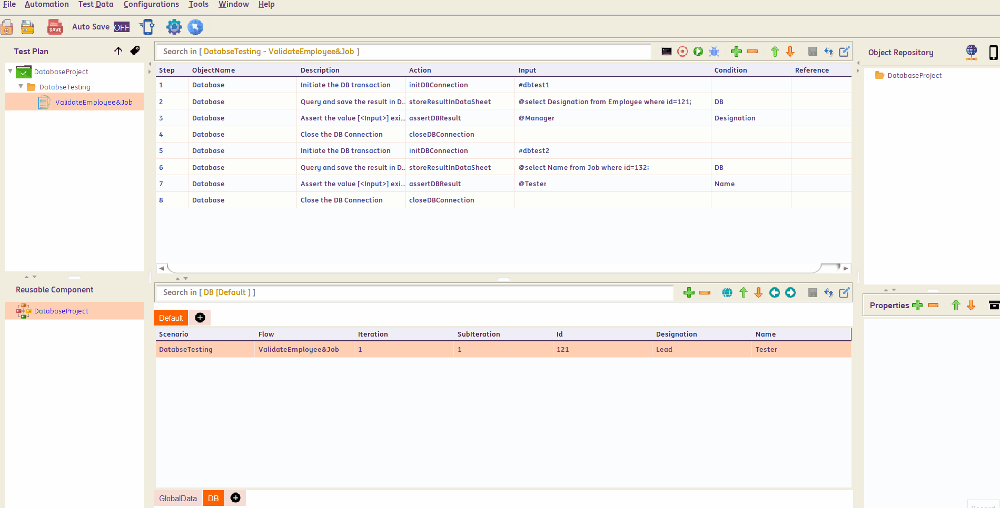

# **Database Testing**
-----------------------------

!!! info "What is Database Testing?"

    Database testing involves validating the integrity, accuracy, and reliability of data stored in a database. It ensures that the database performs as expected under various conditions and that data is correctly stored, retrieved, and manipulated


!!! abstract "How does INGenious perform Database Testing?"
    INGenious uses `JDBC` to interact with databases and perform automated testing against it. INGenious creates an abstraction layer on top of most of the actions and capabilities, making it easy for even non-technical people to write automated tests.

    Most database actions are pre-built inside INGenious. So the users can simply select them from the INGenious IDE making test design fast and easy.


-----------------------------------

## Set up Database Connection

* Add maven dependency in pom.xml for database driver which you are going to use.

- If you are using **mysql** you need to add below dependency 

     ```xml
        <dependency>
            <groupId>com.mysql</groupId>
            <artifactId>mysql-connector-j</artifactId>
            <version>LATEST</version>
        </dependency>
     ```


* To connect to specific database from framework we need to provide values in **Database Settings** under **Run Settings** of INGenious.



**In Java if you were to manually connect, you would invariably use the following :**

```java
Class.forName("com.mysql.cj.jdbc.Driver");
Connection con = DriverManager.getConnection("jdbc:mysql://localhost:3306/productDB", "My_DB_UserName", "My_DB_Password");
```

## Query Editor

After the above setting is done, you can proceed with your first steps as shown below.

 

Data Parameterization can be done using the built-in **editor.** If you mouse-hover on the **Input** column, corresponding to the **`DB`** steps, an option to open up the Editor comes up.

 Inside this editor, we can write the `Query` and then parameterize it based on our needs.

 If we press <span style="color:Red">**[ctrl] + [SPACE]**</span>, the list of all available **DataSheets : ColumnNames** along with all **user-defined variables** show up. We can then select the appropriate item from where we want to parameterize.

 We need to press <span style="color:Red">**[esc]**</span> to close the editor

 
 <span style="color:Red">*The above image is a gif, running in a loop</span> 


Make sure to check out the following topics :

[Database Actions](dbActions.md){ .md-button } 