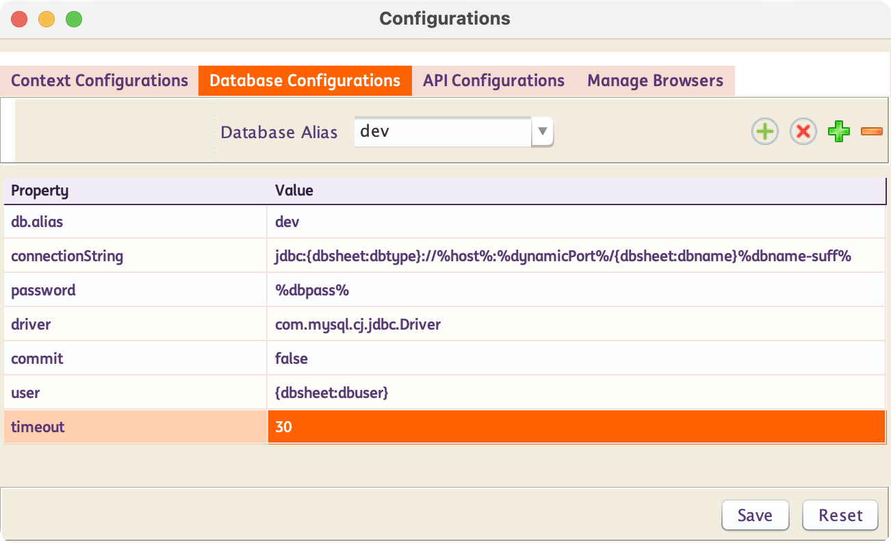
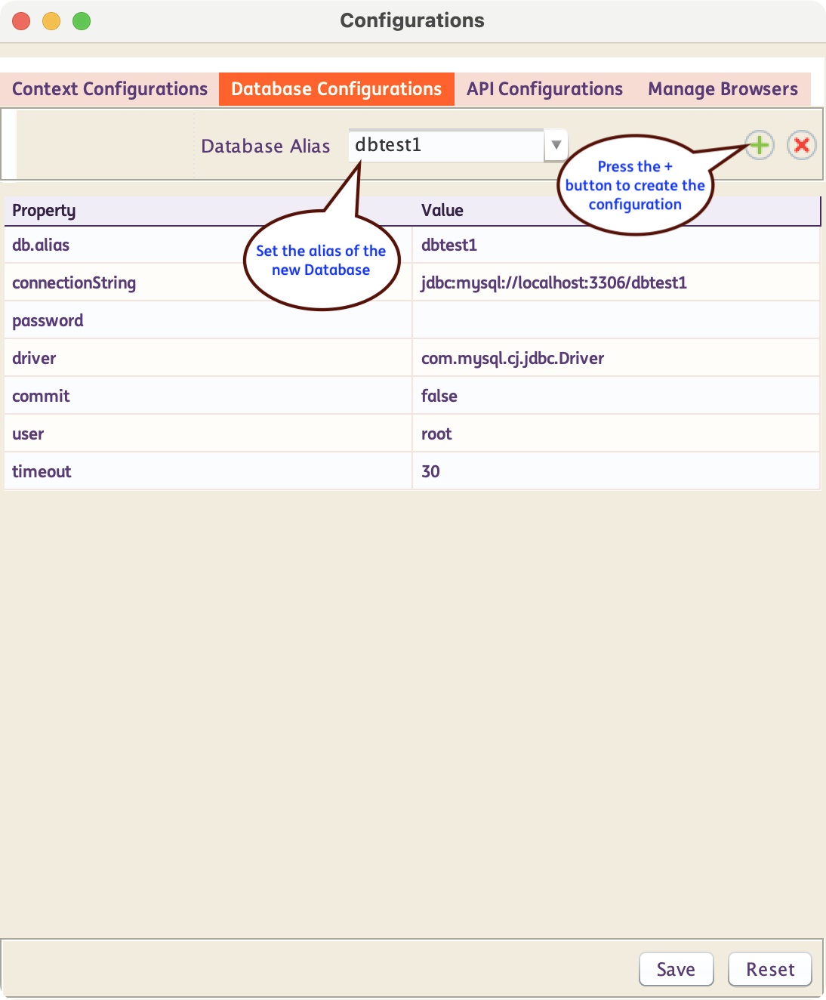
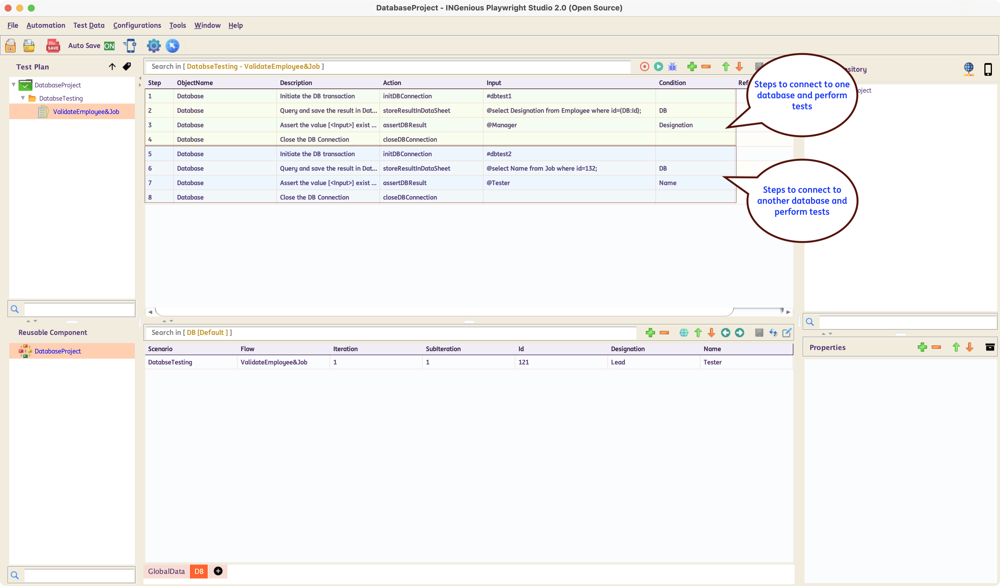

# **Database Testing**
-----------------------------

!!! info "What is Database Testing?"

    Database testing involves validating the integrity, accuracy, and reliability of data stored in a database. It ensures that the database performs as expected under various conditions and that data is correctly stored, retrieved, and manipulated


!!! abstract "How does INGenious perform Database Testing?"
    INGenious uses `JDBC` to interact with databases and perform automated testing against it. INGenious creates an abstraction layer on top of most of the actions and capabilities, making it easy for even non-technical people to write automated tests.

    Most database actions are pre-built inside INGenious. So the users can simply select them from the INGenious IDE making test design fast and easy.


-----------------------------------

## Set up Database Connection

* Add maven dependency in pom.xml for database driver which you are going to use. For example, if you are using **mysql** you need to add the following dependency :

     ```xml
        <dependency>
            <groupId>com.mysql</groupId>
            <artifactId>mysql-connector-j</artifactId>
            <version>LATEST</version>
        </dependency>
     ```


* To configure a database connection from INGenious, follow the steps below :

    - Click on the Configuration icon 
    - Under **Database Configurations** you will see the `Database Alias` as `default`. Change the values as per requirement..

        

    - There are two ways to provide the property values:
        1. Hardcoded values – These are values explicitly defined within the configuration. They remain constant and do not change across environments.
        1. Dynamic values – Construct the property using runtime variables, user-defined variables, and datasheet values or a combination of these. This approach allows for flexibility and adaptability across environments. 

        For example: 
        
        - The username might be sourced from a datasheet variable. 
        - The password could be defined as a runtime variable. 
        - The connection string might be a combination of both, allowing dynamic resolution based on context.
        
        

-----------------------------------        

## Create New Database Configuration

To create a new database configuration, follow the steps below :

* Click on the Configuration icon 

* Inside the **Database Configurations** tab, Enter the `Database Alias` and hit ++enter++ . Alternatively you can also click on the  icon.

     


**In Java if you were to manually connect, you would invariably use the following :**

```java
Class.forName("com.mysql.cj.jdbc.Driver");
Connection con = DriverManager.getConnection("jdbc:mysql://localhost:3306/productDB", "My_DB_UserName", "My_DB_Password");
```

-----------------------------------

## Write your first Database Test

* At the beginning, there should be the **`initDBConnection`** step to conect to a database. This requires the Database Alias (which you configured following the steps above) in the **Condition** column. 

* Then there should be steps to execute the **SQL Statements** like **`executeSelectQuery`**, **`executeDMLQuery`**, **`storeResultInDataSheet`**, **`storeResultInVariable`**

* The steps above, come with an editor which makes parameterization of data in the SQL statments very easy. [See the section below]

* Eventually there should be steps to validate/store result-set  **specific columns** or the **entire result.**

* A Database test case should contain a **`closeDBConnection`** action at the end for clean-up.

 

 The above is an example of a Database Testcase.


-----------------------------------

## Query Parameterization


Parameterization of the SQL statements can be done using the built-in **editor.** If you mouse-hover on the **Input** column, corresponding to the **`Query`** steps, an option to open up the Editor comes up.

The list of **`Query`** steps is as follows :

- **`executeSelectQuery`**
- **`executeDMLQuery`**
- **`storeResultInDataSheet`**
- **`storeResultInVariable`**

 Inside this editor, we can write the **SQL statement** and then parameterize the the `table names`, `column names`, `where` clause etc. based on our needs.

 If we press ++ctrl+space++ the list of all available **DataSheets : ColumnNames** along with all **user-defined variables** show up. We can then select the appropriate item from where we want to parameterize.

 We need to press ++escape++ to close the editor

 
 

-----------------------------------

Make sure to check out the following topics :

[Database Actions](dbActions.md){ .md-button } 