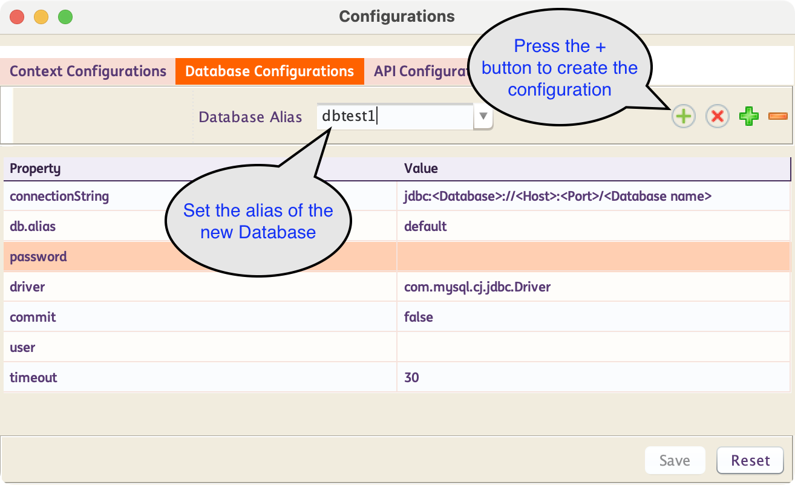
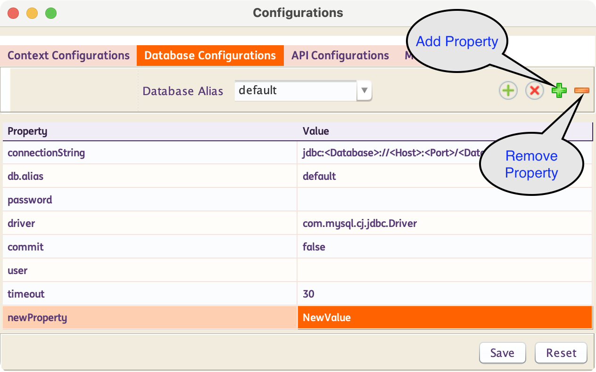
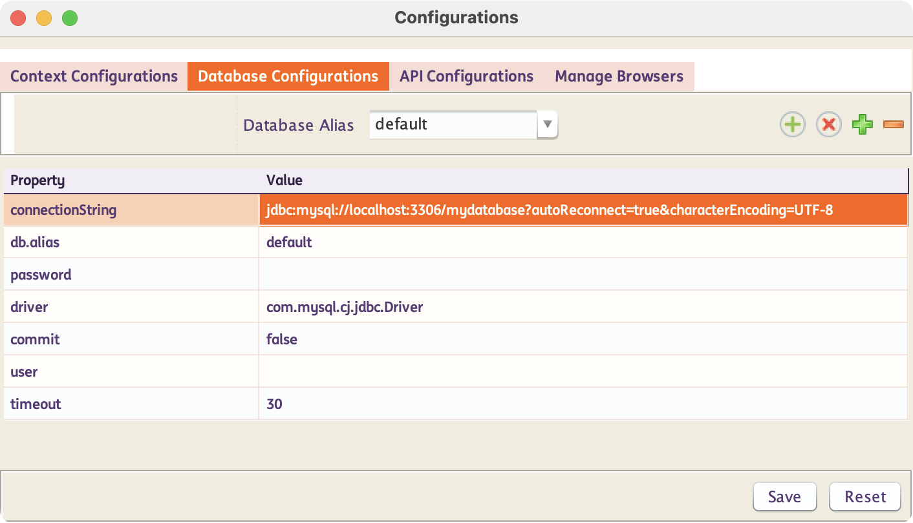
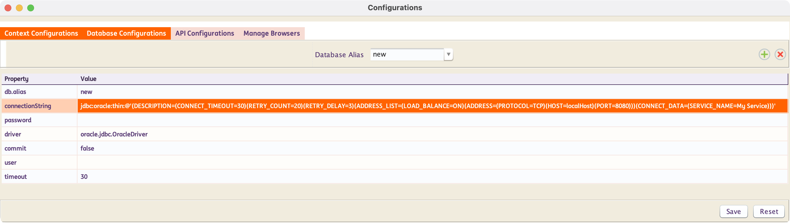

# **Database Testing**
-----------------------------

!!! info "What is Database Testing?"

    Database testing involves validating the integrity, accuracy, and reliability of data stored in a database. It ensures that the database performs as expected under various conditions and that data is correctly stored, retrieved, and manipulated


!!! abstract "How does INGenious perform Database Testing?"
    INGenious uses `JDBC` to interact with databases and perform automated testing against it. INGenious creates an abstraction layer on top of most of the actions and capabilities, making it easy for even non-technical people to write automated tests.

    Most database actions are pre-built inside INGenious. So the users can simply select them from the INGenious IDE making test design fast and easy.


-----------------------------------

## Set up Database Connection

* Include the appropriate database dependency in the pom.xml file. 
> **Note:** By default, **MySQL** and **Oracle** dependencies are already included.* 

* To configure a database connection from INGenious, follow the steps below:

    - Click on the Configuration icon 
    - Under **Database Configurations** you will see the `Database Alias` as `default`. Change the values as per requirement.

        

    - There are two ways to provide the property values:
        1. Hardcoded values – These are values explicitly defined within the configuration. They remain constant and do not change across environments.
        1. Dynamic values – These values can be defined using runtime variables, user-defined variables, datasheet entries, or any combination of these sources. This approach allows for flexibility and adaptability across environments. 

        For example: 
        
        - The username might be sourced from a datasheet variable. 
        - The password could be defined as a runtime variable. 
        - The connection string might be a combination of both, allowing dynamic resolution based on context.
        
        

-----------------------------------        

## Create New Database Configuration

To create a new database configuration, follow the steps below :

* Click on the Configuration icon 

* Inside the **Database Configurations** tab, Enter the `Database Alias` and hit ++enter++ . Alternatively you can also click on the  icon.

     


**In Java if you were to manually connect, you would invariably use the following :**

```java
Class.forName("com.mysql.cj.jdbc.Driver");
Connection con = DriverManager.getConnection("jdbc:mysql://localhost:3306/productDB", "My_DB_UserName", "My_DB_Password");
```

-----------------------------------        

## User Added Database Configuration Property

* INGenious allows users to add database properties thru the Database Configurations window. This give users flexibility in connecting to their preferred data sources. 
!!! important "Handling and integration of these configurations on the backend is the responsibility of the user."
    


* Add a new property 
    1. Click the **Add Property** button .
    2. Add the **property key** (e.g., autoReconnect, timeout, sslMode).
    3. Provide the corresponding **property value**.
    4. Click **Save** to apply the changes.

* Remove a property
    1. Select the **property** you want to remove.
    2. Click the **Remove Property** button .
    3. Click **Save** to apply the changes.

-----------------------------------        

## Additional Database Configuration Property

Below are examples of Database configuration implementations.

* You can add your database configuration by including the necessary settings directly in the JDBC connection string, allowing you to manage parameters such as session variables at the time of connection.

    > **Note:** Please consult your database documentations for details. 

=== "Mysql Example"
    MySQL JDBC connection string format
    ```java
    jdbc:mysql://[hostname:port]/[database]?[properties]
    ```

    Example of MySQL JDBC connection string  
    ```java
    jdbc:mysql://localhost:3306/mydatabase?autoReconnect=true&characterEncoding=UTF-8
    ```
    
    

=== "Oracle Example"
    Oracle JDBC connection string format
    ```java
    jdbc:oracle:thin:@'(DESCRIPTION=(RETRY_COUNT=<Your retry count>)(RETRY_DELAY=<Your retry delay>)(ADDRESS_LIST=(LOAD_BALANCE=ON)(ADDRESS=(PROTOCOL=TCP)(HOST=<Your hostName>)(PORT=<Your Port Name>)))(CONNECT_DATA=(SERVICE_NAME=<Your service name>)))'
    ```

    Example of Oracle JDBC connection string  
    ```java
    jdbc:oracle:thin:@'(DESCRIPTION=(RETRY_COUNT=20)(RETRY_DELAY=3)(ADDRESS_LIST=(LOAD_BALANCE=ON)(ADDRESS=(PROTOCOL=TCP)(HOST=localHost)(PORT=8080)))(CONNECT_DATA=(SERVICE_NAME=My Service)))'
    ```

    
    
-----------------------------------

## Write your first Database Test

* At the beginning, there should be the **`initDBConnection`** step to conect to a database. This requires the Database Alias (which you configured following the steps above) in the **Condition** column. 

* Then there should be steps to execute the **SQL Statements** like **`executeSelectQuery`**, **`executeDMLQuery`**, **`storeResultInDataSheet`**, **`storeResultInVariable`**

* The steps above, come with an editor which makes parameterization of data in the SQL statments very easy. [See the section below]

* Eventually there should be steps to validate/store result-set  **specific columns** or the **entire result.**

* A Database test case should contain a **`closeDBConnection`** action at the end for clean-up.

 

 The above is an example of a Database Testcase.

-----------------------------------

## Query Parameterization


Parameterization of the SQL statements can be done using the built-in **editor.** If you mouse-hover on the **Input** column, corresponding to the **`Query`** steps, an option to open up the Editor comes up.

The list of **`Query`** steps is as follows :

- **`executeSelectQuery`**
- **`executeDMLQuery`**
- **`storeResultInDataSheet`**
- **`storeResultInVariable`**

 Inside this editor, we can write the **SQL statement** and then parameterize the the `table names`, `column names`, `where` clause etc. based on our needs.

 If we press ++ctrl+space++ the list of all available **DataSheets : ColumnNames** along with all **user-defined variables** show up. We can then select the appropriate item from where we want to parameterize.

 We need to press ++escape++ to close the editor

 
 

-----------------------------------

Make sure to check out the following topics :

[Database Actions](dbActions.md){ .md-button } 

<!-- Here is our example configuration `groupConcatMaxLen` with the value of 100000 and we are going to set it as a session variable. 
    

    In the example below, we are setting the value of the session variable `group_concat_max_len`.
    Line 58 retrieves and resolves the value of the `groupConcatMaxLen` configuration property. This value is then appended to the JDBC connection string, ensuring the session variable is set when the connection is established. We printed the value to verify the resulting connection string. Lines 79-83 further confirm that the session variable has been set by querying and displaying its value from the database. 

    This is a code snippet from the `verifyDbConnection` method of the `General` class in the `com.ing.engine.commands.database` package.
    

    Here you can verify that connection string result and the session variable value.
     -->
