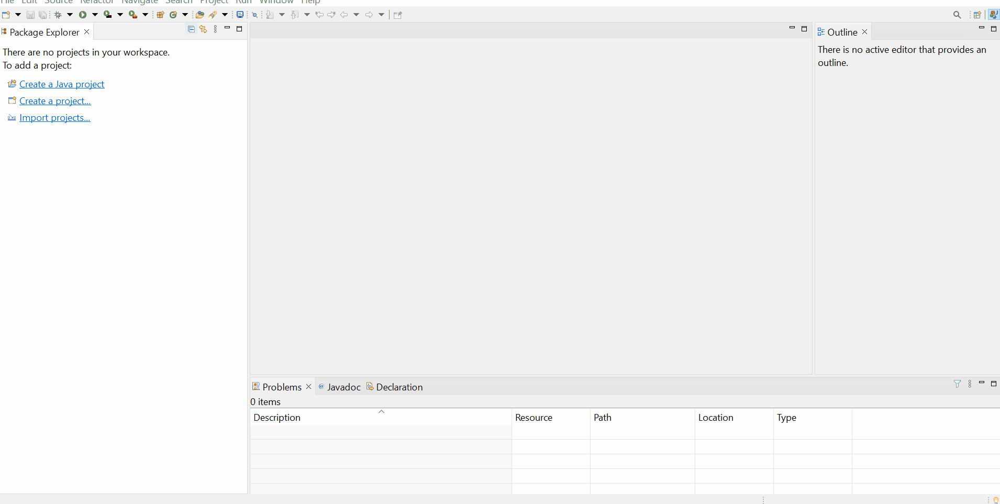
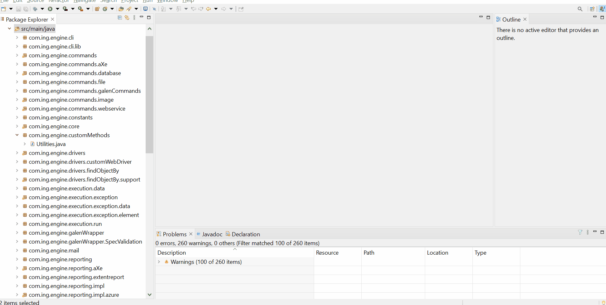
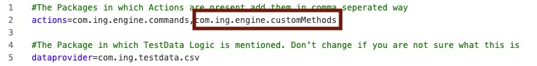

# **Engine**  
---------------------- 

The **Engine is the heart** of the framework. This is where the methods corresponding to all the available actions are defined and this folder (`location of your framework\Engine`) can be imported into any IDE that supports Java. This gives users the flexibility to alter the code of the existing actions or add additional custom actions. 

After making modifications to the engine, the users can compile the engine and export it as a JAR file to be used from the UI of the framework.

**Note:** **Java 11** is mapped to Eclipse IDE's workspace settings in order to enable a seamless import of **engine and custom method project**. Make sure the Eclipse Java compiler is also set to `11` 

### How to open the Engine in Eclipse?

- Open **Eclipse IDE**

- Import project using **`File`** :material-arrow-right: **`Import`** :material-arrow-right: **`General`** :material-arrow-right: **`Existing Projects into Workspace`**

- Locate the **Engine** project in your system by clicking on **[Browse]**. This location is usually inside the directory where the framework is present

- After performing the above steps, you can see the entire **project structure**

If you see **Build Path** errors after importing the engine, then you can fix this by removing all the libraries and readding them.

**Step 1 :** Remove All the libraries
- Right Click on the Project Name
- Select Build Path :material-arrow-right: Configure Build Path
- Under the *Libraries* Tab, select all jar files under *Classpath*
- Click on [Remove] Button

**Step 2 :** Re-Add All the libraries
- Select Classpath from the same location as above
- Click on [Add External JARs] Button
- Navigate to the location where the framework is installed
- Select and add, all libraries under the `lib` folder
- Click [Apply and Close] Button

----------

### Where to write your custom method(s)?

Create a custom package in the **Engine** under **src** and place all your **.java** files containing the custom methods in it. **This is the best practice to add your custom method.**

----------

### How to use your custom method(s) in the UI of the framework?

You can create your custom method in the Engine (as explained in the above section) and **export the Engine as a Jar file** for the changes to be visible in the UI of the framework.

Follow the steps below to export and  replace the **engine.jar** in the `lib` folder under the  installation location. 

- Select the  **src/main/java**  and **src/main/resources** folder of **Engine** project

- Right Click and choose **Export** option
	
- Select **`Java`** :material-arrow-right:**`jar`** option and click **[Next]**
	
- Click on **[Browse]** and select the path as **&lt;installation location&gt;\lib\ingenious-engine.jar**

- Click on **[Finish]** :material-arrow-right: **[OK]** to complete the overwriting of the engine.jar

- Restart the framework to load the updated jar with new methods
	

----------
### How to test your custom method(s) by running/debugging a test case from Engine?

It is a best practice to run or debug your flow from the Engine, before exporting the jar. In case of any errors or exceptions, you can redesign your flow and finally export the jar once the errors have been fixed.

Follow the steps below to execute test case from the Engine.

- Open Eclipse **IDE**

- If you have your custom method in a separate `package`, then follow the steps below to add your package name to the **package.properties** file available in the **Configuration** folder inside the installation location of the framework

For example, if your custom method is added like this :

Navigate to the location where the framework is installed :material-arrow-right: Go to **`Configuration`** folder :material-arrow-right: Inside **`package.properties`** add the package name like this :

- In the same **`Configuration`** folder :material-arrow-right: Open the **`Global Settings.properties`** file and provide the details as shown in the image below:

- For executing the test case with your custom method:

Add the custom method name in the test case as shown below. It will show in **Red** in the UI of the framework, but thats expected as you have not yet built a JAR file. You are only testing the custom method.

Run the **control.java** file from the **com.ing.engine.core** package.

- You can also keep break points wherever required and debug the test case after triggering the execution form the **control.java** file.

