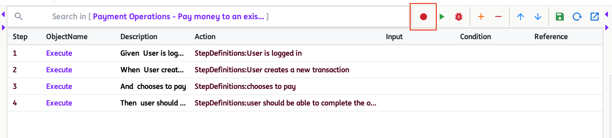
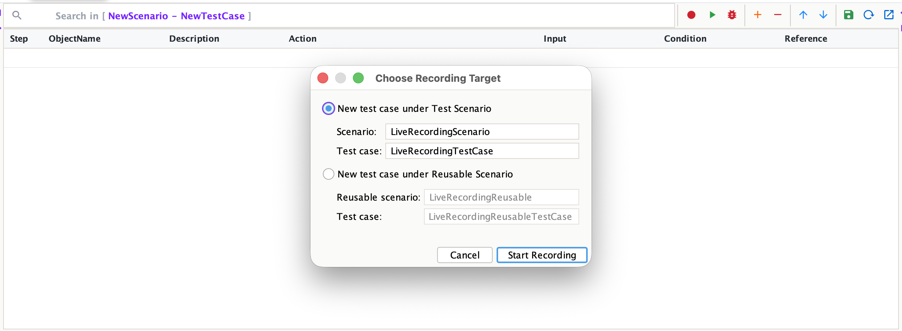
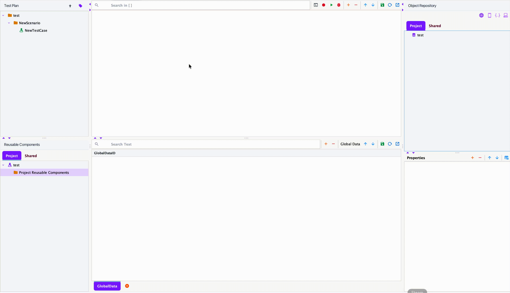
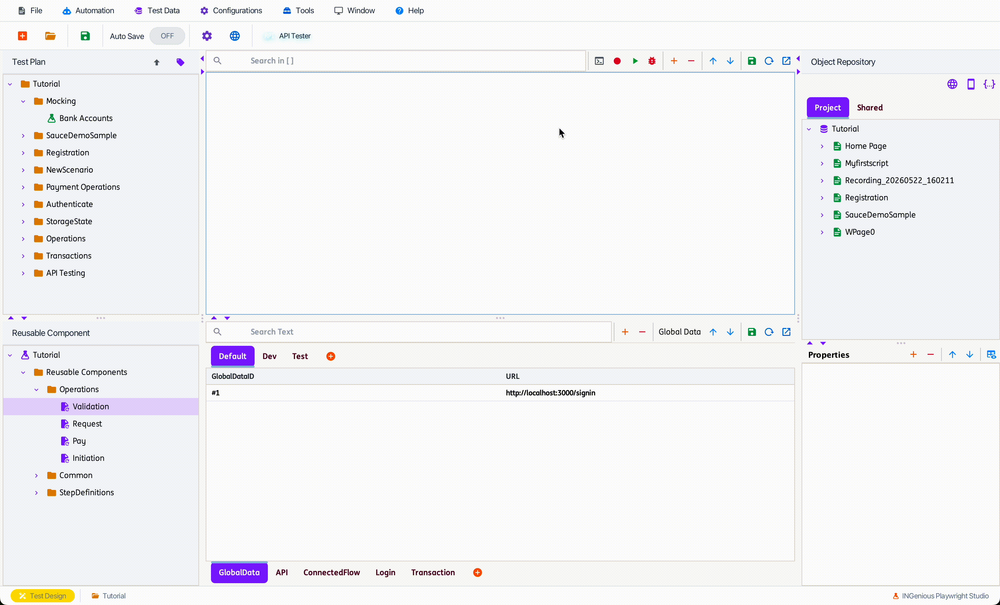

# **Let's Get Rolling**

## **Prerequisites**
-------
#### Hardware Requirements

 * RAM: Min. 2GB (preferably 4GB)
 * Operating System: Windows (32/64 bit)/ MAC OS/Linux

!!! info

    The framework is built using Java. Hence it will work on any Operating System which supports Java

#### Software Requirements

 * Java 17 or above
 * For customizations and contributions:
    * Maven [Installation guide can be found [here](https://maven.apache.org/install.html)]
    * Any IDE which supports Java Development (eg. Eclipse, Netbeans, IntelliJ etc.)

## **Installation**
-----------------------
* **Step 1** : Download :material-download:

    * Click [**here**](https://github.com/ing-bank/INGenious/releases) to download the latest release version

* **Step 2** : Extract the zip, into a directory of your choice.

!!! note

    The framework as such does not require any "installation" process. Simple extraction of the zip file is enough    

* **Step 3** : Launch :material-rocket-launch:

=== "Windows"

    Double click on the [`ingenious.bat`](#) in the framework location

=== "Mac or Ubuntu"

    1. Open Terminal in the installation location and then type 
    ```{ .shell .copy }
    chmod +x ingenious.command
    ```
    2. Then double click on the [`ingenious.command`](#)
    3. If you see **It's Downloaded From Internet** warning then enter the following command in terminal: 
     ```{ .shell .copy }
     xattr -d -r com.apple.quarantine "/path/to/the framework"
     ```

-----------------------

## **Quick Start with Recording** - <span style="color:#FF6200">**Live Playwright Recorder (CodeGen)**</span>  

As you interact with the browser, each action is captured and added to the Test Case editor in real time.

### Steps for recording

 * Launch **INGenious Playwright Studio**

 * Click on the **Record** icon in the Test Case toolbar

   

 * The **Choose Recording Target** dialog appears. Pick where the recording should be saved:

    * **New test case under Test Scenario** — provide a **Scenario** name (defaults to `LiveRecordingScenario`) and a **Test case** name (defaults to `LiveRecordingTestCase`)
    * **New test case under Reusable Scenario** — provide a **Reusable scenario** name (defaults to `LiveRecordingReusable`) and a **Test case** name (defaults to `LiveRecordingReusableTestCase`)
    * Click **Start Recording** to begin recording, or **Cancel** to close the dialog.

    

 * A loader will show up while the Playwright recorder is being loaded

!!! warning 
    
    **On first use**, Playwright downloads the required browser binaries. If the network connection is slow, the recorder may time out during setup.
    Several dialog boxes may appear during setup. Click **OK** to continue. Once the recorder opens successfully, **close it and start a new recording session**.

 * INGenious creates/opens the target scenario and test case, then launches the **Playwright Inspector** together with a **Chromium** browser window.

 * Once the recorder is ready, INGenious automatically hides the recording console and minimizes the Playwright Inspector window. This leaves the Chromium browser in focus so you can immediately begin interacting with the Playwright recorder.


 * Every action you perform is streamed live into the **Test Case editor** as you go:

    * Each recorded step is inserted into the step grid immediately and highlighted in **green**, so you can see exactly what was just captured
    * Any web object you interact with is automatically added to the **Object Repository**, under a page named after your test case
    * A running log of captured steps (e.g. `Step 3 captured: Click on 'Login' [Login_button]`) is shown in the recording console

 * When recording is complete, click the same toolbar icon again. The icon now displays **Stop Recording**. Clicking it ends the recording session. This closes the Chromium browser, stops the Playwright recording process, and saves the recorded steps to the test case.

    

!!! tip

    You can also close the Chromium browser window directly instead of clicking **Stop Recording**. INGenious detects this and finalizes the recording automatically.. Using **Stop Recording** is recommended.

 * Your recording is now available as a fully populated **Scenario** (or **Reusable Scenario**) and **Test Case**. All relevant test steps, web objects, and test data are automatically created and ready for execution or further editing.

 ---

#### Import a recording file manually

If you have a Playwright codegen recording saved as a file (for example, exported from outside INGenious), you can still import it manually instead of recording live:

 * From **INGenious Playwright Studio**, navigate to **Tools** :material-arrow-right: **Import Playwright Recording** :material-arrow-right: **Import Playwright Recording**.

 * Locate the recording file (`.txt` or `.java`) and click [OK].

 * The file is immediately rendered as **Scenario** and **Test Case**. All the relevant **test steps** with all the **web objects** and **test data** are imported.

 * All the objects are loaded in the **Object Repository**.

 

 Before you begin, its important that you [Know the Framework](knowyourframework.md){ .md-button }

 