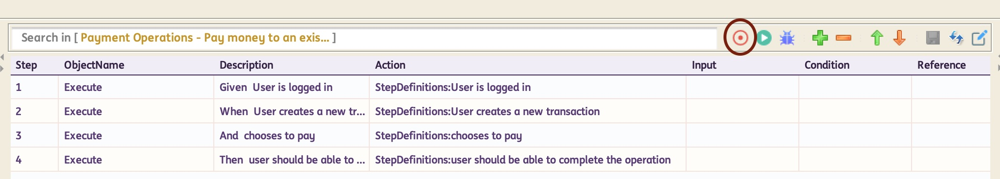

# **Let's Get Rolling**

## **Prerequisites**
-------
#### Hardware Requirements

 * RAM: Min. 2GB (preferably 4GB)
 * Operating System: Windows (32/64 bit)/ MAC OS/Linux

!!! info

    The framework is built using Java. Hence it will work on any Operating System which supports Java

#### Software Requirements

 * Java 11 or above
 * Maven [Installation guide can be found [here](https://maven.apache.org/install.html)]
 * For customizations, any IDE which supports Java Development (eg. Eclipse, Netbeans, IntelliJ etc.)

## **Installation**
-----------------------
* **Step 1** : Download :material-download:

    * Click [**here**](https://github.com/ing-bank/INGenious/releases/download/v2.2/ingenious-playwright-2.2-setup.zip) to directly download the latest version

* **Step 2** : Extract the zip, into a directory of your choice.

!!! note

    The framework as such does not require any "installation" process. Simple extraction of the zip file is enough    

* **Step 3** : Launch :material-rocket-launch:

=== "Windows"

    Double click on the [`Run.bat`](#) in the framework location

=== "Mac or Ubuntu"

    1. Open Terminal in the installation location and then type 
    ```{ .shell .copy }
    chmod +x Run.command
    ```
    2. Then double click on the [`Run.command`](#)
    3. If you see **It's Downloaded From Internet** warning then enter the following command in terminal: 
     ```{ .shell .copy }
     xattr -d -r com.apple.quarantine "/path/to/the framework"
     ```

-----------------------

## **Quick Start with Recording** - <span style="color:#FF6200">**Playwright Recorder (CodeGen)**</span>  

!!! note

    Make sure Maven is installed in the system. INGenious internally uses Playwright codegen.

### Steps for recording

 * Launch **INGenious Playwright Studio**

 * Click on the **Recorder** icon

   

   Internally this will call the following `mvn` command : `mvn exec:java -f engine/pom.xml -e -D exec.mainClass=com.microsoft.playwright.CLI -D exec.args=codegen`
 
 * Playwright logs will be shown during the playwright-recorder's loading process

!!! warning 
    
    If a new version of Playwright is available, this step will try to download that first. So the recorder can time out if the network speed is slow.

    **Pay attention to the logs!!**

 * The **Playwright Inspector** will launch along with **Chromium** browser

 * Enter the URL of the Application Under Test (AUT) in the **Chromium** browser and perform the actions you want to perform on the application

 * You will see the steps getting recorded in the **Playwright Inspector**. Make sure to select the **Java Library** as the Target.

 * After recording, use the **Copy button in the Playwright Inspector** to manually copy the recorded steps. This action will save the recorded steps as `recording.txt` file under `Projects/ProjectName/Recording`.
 
 * A notification will appear upon successful copy of the recorded steps.

#### Import recording from Playwright Recorder

 * Once the recorded steps have been succesfully copied, close the Playwright Recorder.

 * A prompt will appear asking whether to proceed with the import. Select Yes.

 * Specify a **Test Scenario Name** or use the default **NewScenario**. The provided name will be used to rename the `recording.txt` file.

 * Once completed, the recording will be imported and displayed as a **Scenario** and **Test Case** . All relevant **test steps**, along with associated **web objects** and **test data**, will be included. The objects will be loaded into the **Object Repository**.

 

 ---

#### Import from `.txt` file

 * After recording, use the **Copy button in the Playwright Inspector** to manually copy the recorded steps. This action will save the recorded steps as `recording.txt` file under `Projects/ProjectName/Recording`.

 * Once the recorded steps have been succesfully copied, close the Playwright Recorder.

 * A prompt will appear asking whether to proceed with the import. Select No.

 * From **INGenious Playwright Studio**, navigate to **Tools** :material-arrow-right: **Import Playwright Recording** :material-arrow-right: **Import Playwright Recording**.

 * Locate the **recording.txt file** under `Projects/ProjectName/Recording` and click [OK].

 * The file is immediately rendered as **Scenario** and **Test Case**. All the relevant **test steps** with all the **web objects** and **test data** are imported.

 * All the objects are loaded in the **Object Repository**.

 

 Before you begin, its important that you [Know the Framework](knowyourframework.md){ .md-button }

 