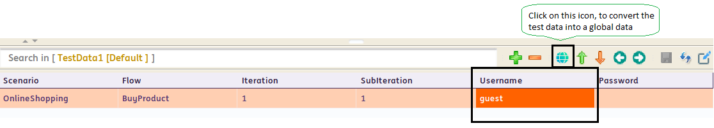
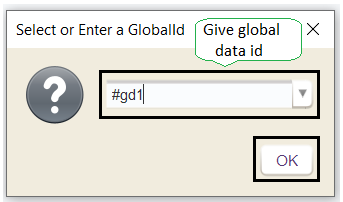
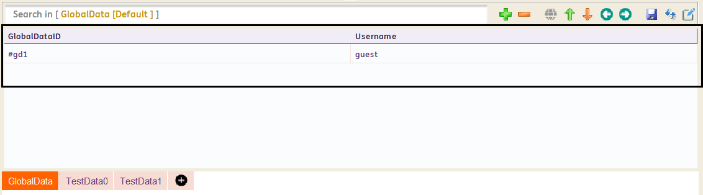
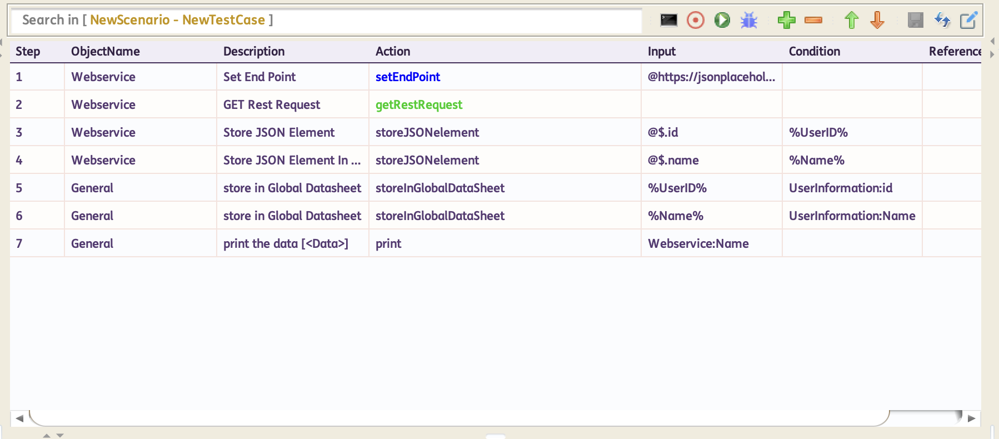
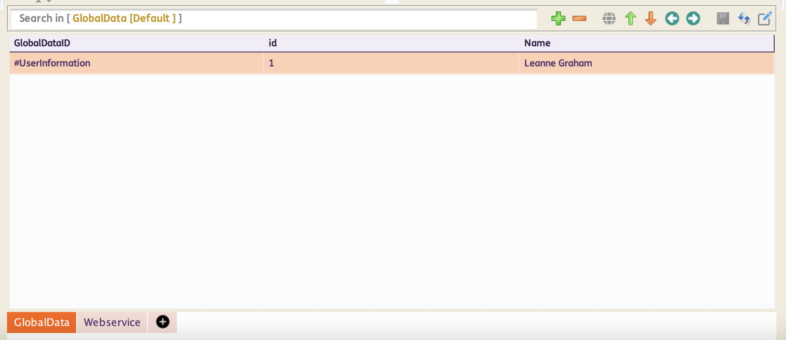
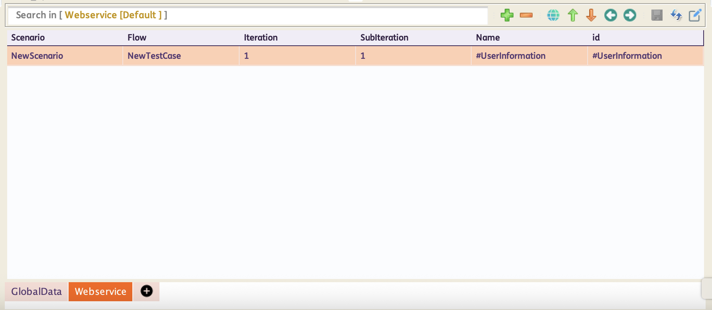
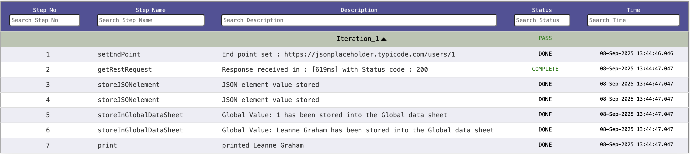

# **Global Datasheets**

!!! info "Overview"
    In INGenious, **Global Data** plays a crucial role in enabling **data reusability**, **maintainability**, and **scalability** across test automation projects. For every project created in INGenious, a **default Global Data Sheet** is automatically generated. This sheet acts as a centralized repository for data values that are commonly used across multiple test cases, scenarios, and environments.

!!! info "What is Global Data?"
    **Global Data** refers to test data that is **shared across multiple test cases or scenarios** within a project. Instead of duplicating the same data in multiple test data sheets, Global Data allows you to define it once and reference it wherever needed.

    **Key Benefits:**   
    - **Reusability**: Use the same data across different test cases and environments.   
    - **Maintainability**: Update data in one place without modifying multiple sheets.   
    - **Consistency**: Ensures uniformity of data across the test suite.   
    - **Scalability**: Easily extend test coverage without redundant data entry.   

!!! info "What is a Global Data Sheet?"
    The **Global Data Sheet** is a special data sheet generated by default in every INGenious project. It stores all globally referenced data values using unique **Global Data IDs**.

    **Reusability Scope:**.  
    - Across **multiple test cases**   
    - Across **multiple test scenarios**   
    - Across **multiple environments**

---

## How to Implement Global Data in INGenious

There are **two primary methods** to implement and manage Global Data in your test automation framework:

### Method 1: Promote Existing Data to Global

1. **Identify** the data column that is common across multiple data sheets.
2. **Select** the data value.
3. **Click** on the **Global Data icon** (as shown in the tool UI).

    

4. **Assign** a unique **Global Data ID** in the prompted window.

    

5. The value is now stored in the **Global Data Sheet** and can be referenced using the Global Data ID in any test data sheet.

    

> This method is ideal for converting frequently used static values into global references.

---

### Method 2: Generate Global Data Dynamically in Test Scripts

1. Use the **`storeInGlobalDataSheet`** action in your test script to dynamically generate and store a value.
2. Assign a **Global Data ID** to the value.
3. Reference this Global Data ID across multiple test data sheets by mapping it to the relevant columns.

> This method is useful for dynamically generated data like tokens, timestamps, or user IDs that need to be reused later in the test flow.


## **storeInGlobalDataSheet**

**Description**: This function is used to store a value into the Global Data Sheet during test execution. It allows dynamic data to be saved and reused across multiple test cases and scenarios.

**Input Format** : The value to be stored  

**Condition Format**: `GlobalDataID:ColumnName`


=== "Usage"

    | ObjectName | Action | Input        | Condition | Reference |  |
    |------------|--------|--------------|-----------|-----------|--|
    | General    | :green_circle: `datasheet` | @`Value` | `GlobalID:ColumnName` | | <span style="color:#349651">:arrow_left: *Hardcoded Input*</span> |
    | General    | :green_circle: `datasheet` | `Sheet:Column`(`containing value`) | `GlobalID:ColumnName` | | <span style="color:#559BD1">:arrow_left: *Input from Datasheet*</span> |
    | General    | :green_circle: `datasheet` | `%dynamicVar%`(`containing value`) | `GlobalID:ColumnName` | | <span style="color:#AB0066">:arrow_left: *Input from variable*</span> |

=== "Corresponding Code"


    ```java
    @Action(object = ObjectType.GENERAL, desc = "store in Global Datasheet", input = InputType.YES, condition = InputType.YES)
    public void storeInGlobalDataSheet() {
        if (Condition != null) {

            String globalDataID = Condition.split(":")[0];
            String globalcolumnName = Condition.split(":")[1];
            userData.putGlobalData("#"+globalDataID, globalcolumnName, Data);
            Report.updateTestLog(Action,
                    "Global Value: " + Data + " has been stored into " + "the Global data sheet", Status.DONE);
        } else {
            Report.updateTestLog(Action, "Incorrect input format", Status.DEBUG);
            System.out.println("Incorrect input format " + Condition);
        }
    }

    ```

=== "Examples"

    Below is a sample Test Case and generated report on how to use **storeInGlobalDataSheet** action

    **Sample Test Case:**

    

    **Sample Global Datasheet:**

    

    **Sample Test Datasheet:**

    

    **Sample Report:**

    
    
---

## Referencing Global Data

Once a value is stored in the Global Data Sheet:

- Use the **Global Data ID** in any test data sheet.
- The framework will automatically resolve the reference during test execution.

---

## Best Practices

- Use **clear and descriptive Global Data IDs**.
- **Avoid hardcoding values** in multiple sheets — promote them to global.
- Regularly **review and clean up** unused global data entries.
- Use **naming conventions** to distinguish between static and dynamic global data.

---

