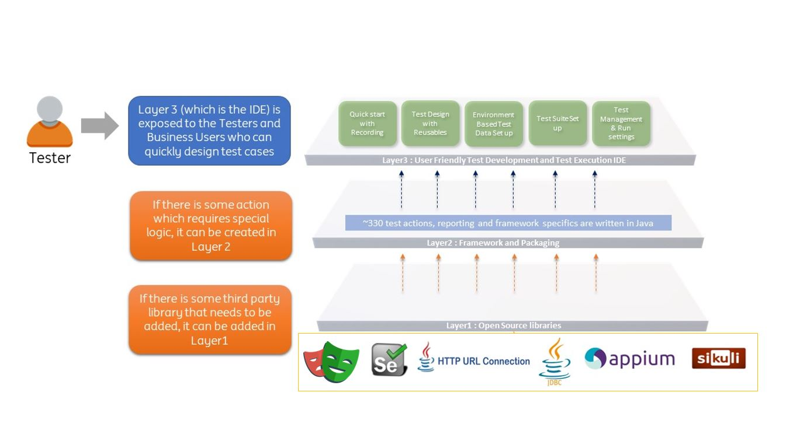

# **INGenious Playwright Studio**

**INGenious** enables test automation for **everyone.**

!!! abstract

    It provides an easy and simple way to create highly reliable automated tests. It leverages the power of Playwright-Java and combines it with a user-friendly IDE which makes it a highly effective solution.

    The idea behind INGenious is to enable engineers, business analysts and even non-technical stakeholders to design high quality automated tests which focus on the business goals, without them having to worry about coding.

## At a Glance
-----------------------

-   :material-clock-fast:{ .lg .middle .getstarted} __Get Started in 5 minutes__

    ---

    Install [`mkdocs-material`](#) with [`pip`](#) and get up
    and running in minutes

    [:octicons-arrow-right-24: Getting started](#)

-   :fontawesome-brands-codepen:{ .lg .middle .ing} __No Code/Low Code__

    ---

    Focus on your content and generate a responsive and searchable static site

    [:octicons-arrow-right-24: Reference](#)

-   :fontawesome-brands-chrome:{ .lg .middle .azure} __Browser and API automation__

    ---

    Change the colors, fonts, language, icons, logo and more with a few lines

    [:octicons-arrow-right-24: Customization](#)

-   :material-scale-balance:{ .lg .middle } __Open Source, MIT__

    ---

    Material for MkDocs is licensed under MIT and available on [GitHub]

    [:octicons-arrow-right-24: License](#)

-   :material-code-json:{ .lg .middle .customization } __Full customization__

    ---

    Install [`mkdocs-material`](#) with [`pip`](#) and get up
    and running in minutes

    [:octicons-arrow-right-24: Getting started](#)

-   :simple-cucumber:{ .lg .middle .cucumber} __Integrated BDD__

    ---

    Focus on your content and generate a responsive and searchable static site

    [:octicons-arrow-right-24: Reference](#)

-   :material-microsoft-azure-devops:{ .lg .middle .azure } __Seamless Azure DevOps Integration__

    ---

    Change the colors, fonts, language, icons, logo and more with a few lines

    [:octicons-arrow-right-24: Customization](#)

-   :material-rocket-launch:{ .lg .middle .cicd} __Seamless integration with any CI tool__

    ---

    Material for MkDocs is licensed under MIT and available on [GitHub]

    [:octicons-arrow-right-24: License](#)

!!! danger
    Mobile Testing and Database Testing coming soon

##  Integrated Development Environment (IDE)
-----------------------
* Easy to get started with build-in `record`, `spy` and `heal` features

* Quick creation of test flow scaffoldings and boilerplate reusables

* Reusable components block for **reusing scripts**

* Intuitive **Test-data parameterisation**  

* Environment-based test-data set up and execution (Example: `DEV`, `TEST`, `ACCEPTANCE`) 

* Built-in Dynamic Data creation actions

* Platform independent - Can be used in any operating system supporting java, like **Windows**, **MAC**, **Linux**

##  Integrated BDD 
-----------------------
* Built-in `Gherkin` editor for writing **feature files**

* Imports **feature files** to generate the corresponding Test scenarios, `Step Definition` scaffoldings and Test Data

* Generates BDD style reporting afetr execution

##  Azure DevOps  
-----------------------

* Rich **command line interface** to run test cases and pass propeties and variables at run time

* Easy to add `cli` execution commands to Azure DevOps YAML files 

* Generates **Nunit** report which shows the test results (including `execution logs`, `screenshots`, `request payloads`, `response payloads` directly in Azure DevOps)

* Seamless integration into **Azure DevOps Test Plans** to report back the execution status in the Test Plan

* Execute failed testcases in a test set automatically after a run

##  Customization  
-----------------------

* Addition of new methods for project specific requirements is possible through the `Engine` project

* Enhancing an built-in method is also possible through the same way

* Incorporation of external libraries is also possible

## Architecture
-----------------------

[Getting Started](gettingstarted.md){ .md-button }

## Inspiration
-----------------------
INGenious is inspired from an open source test automation framework [CITS](https://github.com/CognizantQAHub/Cognizant-Intelligent-Test-Scripter). INGenious is having additional features tailored for ING and it's Way of Working.
