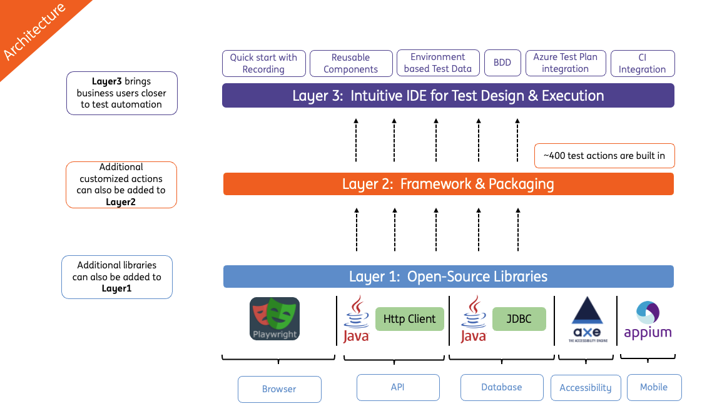

# **INGenious Playwright Studio**

 **INGenious** enables easy and effective test automation for **everyone.** 

Developed and perfected by **ING Bank** for over 4 years of real-world usage, **INGenious** is now open-source and available to everyone. Designed to simplify and streamline test automation, this robust solution empowers teams of all sizes to achieve efficient, high-quality testing. By joining the global testing community, ING aims to collaborate, innovate, and elevate automated testing together.

!!! abstract "About" 

    It provides an easy and simple way to create highly reliable automated tests. It leverages the power of __Playwright-Java__ and __Appium-Java__ and combines them with a user-friendly IDE which makes it a highly effective solution.

    The idea behind INGenious is to enable engineers, business analysts and even non-technical stakeholders to design high quality automated tests which focus on the business goals, without them having to worry about coding.

## At a Glance
-----------------------

-   :material-clock-fast:{ .lg .middle .getstarted} __Get Started in 5 minutes__

    ---

    Download INGenious and get up and running in minutes. Create and execute your test cases in no time. 

    [:octicons-arrow-right-24: Getting started](gettingstarted.md)

-   :fontawesome-brands-codepen:{ .lg .middle .ing-indigo} __No Code/Low Code__

    ---

    INGenious comes with an intuitive IDE which makes test designing simple, easy and fun.

    [:octicons-arrow-right-24: IDE](knowyourframework.md)

-   :fontawesome-brands-chrome:{ .lg .middle .ing-sky} __Browser Automation__

    ---

    INGenious leverages the power of **Playwright** to create robust and stable browser tests. 

    [:octicons-arrow-right-24: Browser Testing](browsertesting/)

-   :mobile_phone:{ .lg .middle .ing-sky} __Mobile App Automation__

    ---

    INGenious leverages the power of **Appium** to interact with and test Mobile Applications. 

    [:octicons-arrow-right-24: Mobile App Testing](mobileTesting/)    

-   :material-api:{ .lg .middle .cicd} __API Automation__

    ---

    INGenious leverages **Java HTTP Client** to create API tests.

    [:octicons-arrow-right-24: API Testing](api/)

-   :material-text-box-multiple:{ .lg .middle .cicd} __Message/File Based Testing__

    ---

    INGenious is capable of performing validation of messages over `JMS` and `Kafka` . 

    [:octicons-arrow-right-24: Message based Testing](messageTesting/)    

-   :simple-databricks:{ .lg .middle .cicd} __Synthetic Data Generation__

    ---

    INGenious leverages the power of **Java Faker** to create Synthetic Test Data at run time. 

    [:octicons-arrow-right-24: Synthetic Data Generation](syntheticData/)    

-   :octicons-database-16:{ .lg .middle .cicd} __Database Testing__

    ---

    INGenious leverages **JDBC** to connect and test Databases.

    [:octicons-arrow-right-24: Database Testing](databaseTesting/)

-   :material-code-json:{ .lg .middle .customization } __Full Customization__

    ---

    INGenious comes with a full blown `maven` project which can be easily customized based on project needs.

    [:octicons-arrow-right-24: Customizations](customizations/)

-   :simple-cucumber:{ .lg .middle .cucumber} __Integrated BDD__

    ---

    INGenious supports BDD way of working and comes with a built-in feature file editor.

    [:octicons-arrow-right-24: BDD Support](bdd/)

-   :material-microsoft-azure-devops:{ .lg .middle .azure } __Seamless Azure Test Plan Integration__

    ---

    Test Case and Defect Management via Azure DevOps Test Plan can be done with INGenious very easily

    [:octicons-arrow-right-24: Test Plan](testplan/)

-   :material-rocket-launch:{ .lg .middle .cicd} __Seamless Integration with any CI Tool__

    ---

    INGenious is built in Java and has a strong command line interface. This makes integration with any CI tool, very easy.

    [:octicons-arrow-right-24: Integration](ci.md)

-   :material-scale-balance:{ .lg .middle .grey  } __Open Source, MIT__

    ---

    INGenious  is licensed under MIT and available on **GitHub**

    [:octicons-arrow-right-24: License](https://github.com/ing-bank/INGenious)

--------

## Architecture
-----------------------

[Getting Started](gettingstarted.md){ .md-button }

---------
