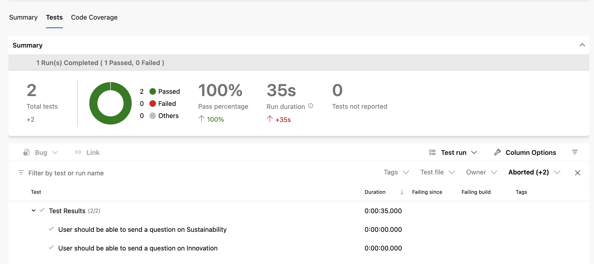
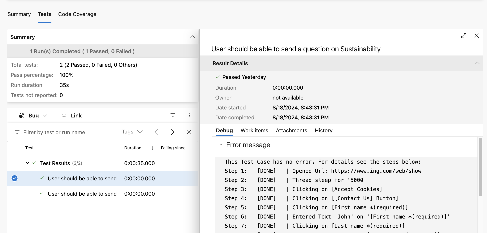
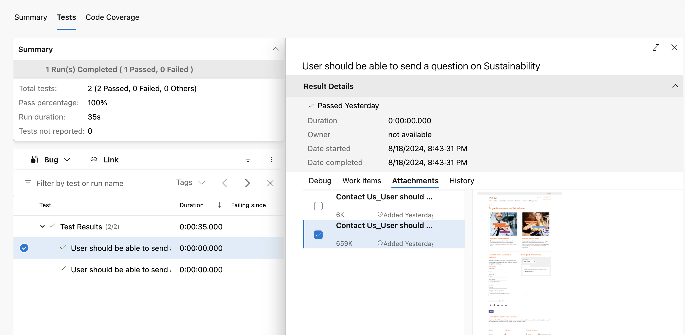

{ .center width="100" }

-------


# Integration of INGenious with Azure DevOps 

## **Pipeline yaml**

```{.yaml .copy}

trigger:
- main

pool:
  vmImage: ubuntu-latest

steps:

- script: |  # (1)!
    echo "##vso[task.setvariable variable=JAVA_HOME]$(JAVA_HOME_11_X64)"
    echo "##vso[task.setvariable variable=PATH]$(JAVA_HOME_11_X64)/bin:$(PATH)"
  displayName: "Set java version to 11" 
  
- script: mvn initialize --file Engine/pom.xml  # (2)!
  displayName: 'Maven Initialize'

- script: mvn install --file Engine/pom.xml  # (3)!
  displayName: 'Maven Install'

- script: chmod -R 755 ./ # (4)!
  displayName: 'Set Permissions'

- script: ./Run.command -run -project_location "Projects/ING-Public-Web" -release "Release1" -testset "Set1" -setEnv "run.AzureReport=true"
  displayName: 'Run tests' # (5)!

- task: PublishTestResults@2 # (6)!
  inputs:
    testResultsFormat: 'NUnit'
    testResultsFiles: 'azure.xml'
    searchFolder: '$(System.DefaultWorkingDirectory)/Projects/ING-Public-Web/Results/TestExecution/Release1/Set1/Latest'
    testRunTitle: 'Test Results'
```
 
 1. This is to set up the Java version. In this case this is set as 11. But you can set it to 11 or above 
 2. This is to perform `mvn initialize` which makes the ingenious specific jar files, known to the **`.m2`** of the agent
 3. This is to install maven dependencies of your project
 4. This sets the permission to the working directory. A `chmod 755` for a folder gives the owner full permissions, group members and others read and access permissions
 5. This executes the INGenious tests. You need to specify the `project_location`, the name of the `release` and `testset`. Additionally the **`-setEnv "run.AzureReport=true"`** will make sure that the Azure DevOps compatible reports (nunit xml) are generated which shows the test results, screenshots and videos as attachments.
 6. This is to publish the test results in Azure DevOps **`Tests`** tab

-----

## **Test Reporting**

* [x] After the execution is over, the test reports immediately appear on the **Tests** tab of the pipeline

 

* [x] If we click on any of the tests, a detailed log will be available in the **Debug** tab 
  
  

* [x] If we click on the **Attachments** tab, we will find the **log.txt**, **screenshots**, **execution videos**, and **API requests** and **responses** (for API tests)   

 

-----

## **Pipeline Analytics** 

If we click on the `Pipeline Name` and navigate to the **`Analytics`** tab of the Azure DevOps Pipeline, we will see the report like this :

  

We can use this feature to determine the health of the pipeline and analysis of historical test reports.

 -------------------------------------
