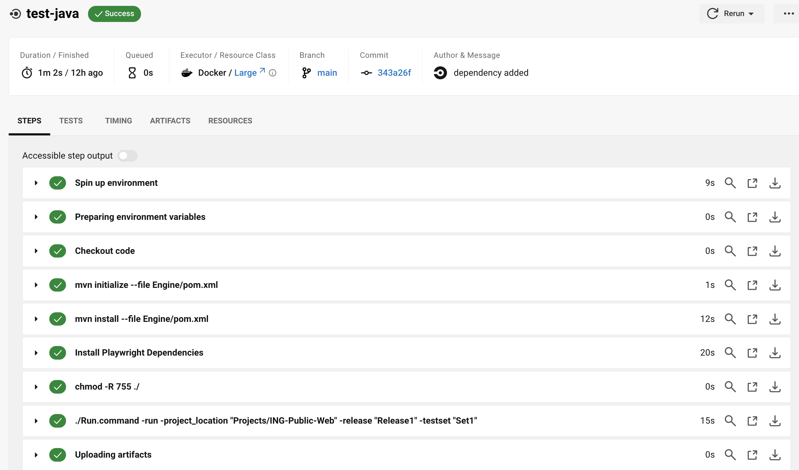
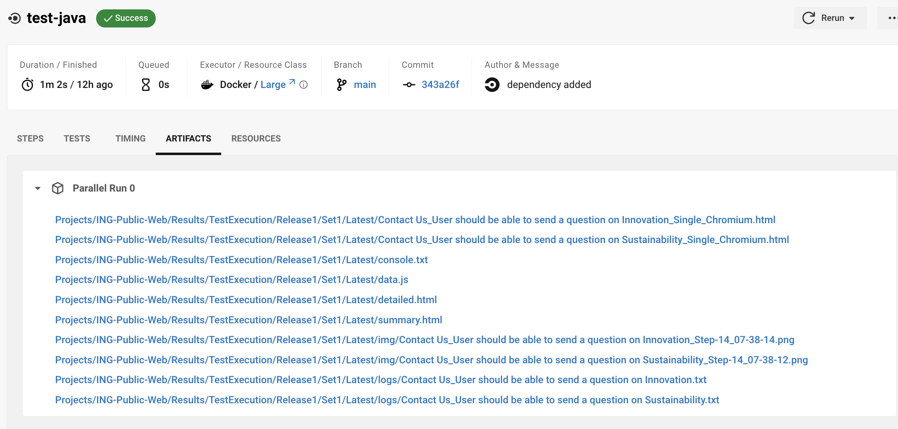

{ .center width="100" }

-----

# Integration of INGenious with Circle CI

## **Pipeline yaml**

```{.yaml .copy}

version: 2.1
jobs:
  test-java:
    docker:
      - image: cimg/openjdk:17.0                         # (1)!
    #working_directory: ~/project/Engine
    steps:
      - checkout:
          path: ~/project
      - run:                                              
          command: mvn initialize --file Engine/pom.xml   # (2)!
      - run:
          command: mvn install --file Engine/pom.xml      # (3)!
      - run:
          name: Install Playwright Dependencies           # (7)!
          command: mvn exec:java -e -D exec.mainClass=com.microsoft.playwright.CLI -D exec.args="install-deps"  --file Engine/pom.xml  
      - run:    
          command: chmod -R 755 ./                        # (4)!
      - run:                                              # (5)!
          command: ./Run.command -run -project_location "Projects/ING-Public-Web" -release "Release1" -testset "Set1" 
      - store_artifacts:                                  # (6)!
          path: Projects/ING-Public-Web/Results/TestExecution/Release1/Set1/Latest/
workflows:
  build-and-test:
    jobs:
      - test-java
```
 
 1. This is to set up the Java version. In this case this is set as 17. But you can set it to 11 or above 
 2. This is to perform `mvn initialize` which makes the ingenious specific jar files, known to the **`.m2`** of the agent
 3. This is to install maven dependencies of your project
 4. This sets the permission to the working directory. A `chmod 755` for a folder gives the owner full permissions, group members and others read and access permissions
 5. This executes the INGenious tests. You need to specify the `project_location`, the name of the `release` and `testset`. Additionally the **`-setEnv "run.AzureReport=true"`** will make sure that the Azure DevOps compatible reports (nunit xml) are generated which shows the test results, screenshots and videos as attachments.
 6. This is to upload the test results as a build artifact
 7. If the agents are not capable to run playwright browser tests, its important to download and install the dependencies

----

## **Pipeline Analysis**

 * [x] Once the execution is over, the logs will appera in the pipeline console

  

 * [x] You can download the **Test Execution Reports** (as Build Artifacts) from the overview page

   