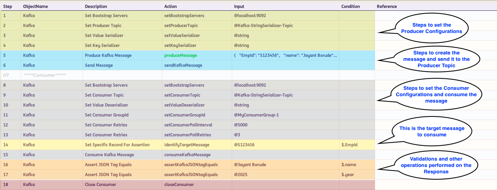
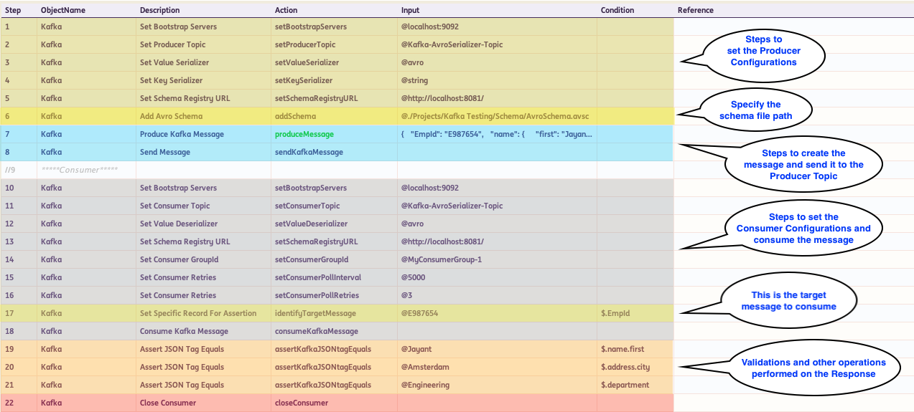
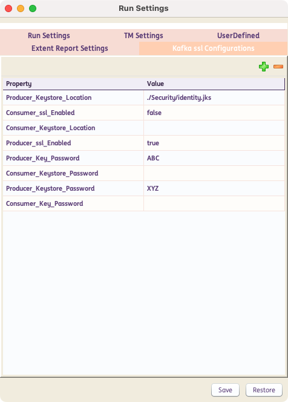

# **Working with Kafka**

## How to create a Kafka - based Test Case?

* At the beginning, there should be steps to set up the configurations for the **`Kafka Producer`**. 
  For instance setting the **`server`, `producerTopic`, `keySerializer`, `valueSerializer`, `partition`, `headers`** etc. are required.

* Then there should be steps to create the **`message`**. You can leverage built-in capabilities in INGenious like `Synthetic Data Generation` to create `UUID`s and other data to be fed into the message.

* The **`produceMessage`** action comes with an editor which makes parameterization of data in the paylod very easy. This action is always marked in <span style="color:Green">**Green.**</span>. [See the section below]

* Then there should be the **`sendKafkaMessage`** action to push the message to the producer topic.

* Then there should be steps to configure the **`Kafka Consumer`**. 
  For instance setting the **`consumerGroupId`, `consumerTopic`, `valueDeserializer`, `pollIntervals`** etc. are required.

* To consume a specific target message, use the **`identifyTargetMessage`** action and provide a unique value along with its corresponding JSON Path or X-Path.

* Eventually there should be steps to consume the message and validate/store message **details**, **specific tags** or even the **entire message body.**


=== "String Serializer Example"

    For String Serializer, the following are required: **`server`, `producerTopic`, `valueSerializer`, `keySerializer`**

    

=== "Avro Serializer Example"

    For Avro Serializer, the following are required: **`server`, `producerTopic`, `valueSerializer`, `keySerializer`, `setSchemaRegistryURL`, `addSchema`**

    


-------------------------------------


## Setup SSL certificates

If Key Store Certificates are required, you may set it up by clicking on the **gear icon** :gear: to open up the **Run Settings** :material-arrow-right: **Kakfa ssl Configurations**

=== "With SSL certificate configuration example"

    For this example, **`Producer_ssl_Enabled` is set to `true`** then the following are required: **`Producer_Keystore_Location`, `Producer_Key_Password`, `Producer_Keystore_Password`**

    

=== "Without SSL certificate configuration example"

    For this example, **`Producer_ssl_Enabled` is set to `false`**

    

-------------------------------------


## Payload Data Parameterization


 Data Parameterization can be done using the built-in **editor.** If you mouse-hover on the **Input** column, corresponding to the **`produceMessage`** step, an option to open up the Editor comes up.

 Inside this editor, we can paste the entire Payload and then parameterize the specific JSON/XML tags based on our needs.

 If we press ++ctrl+space++ the list of all available **DataSheets : ColumnNames** along with all **user-defined variables** show up. We can then select the appropriate item from where we want to parameterize.

 We need to press ++escape++ to close the editor

 
 

 -------------------------------------

## Assert/Store Response Tags

 We can access the Response Tags using **`xpath`** for XMLs and **`jsonPath`** for JSONs.

 The corresponding **`xpath`** or **`jsonPath`** for the tag, should be entered in the **Condition** column like as shown below :

 

??? note "Example for writing Xpath"

    ```xml
    <root xmlns:foo="http://www.foo.org/" xmlns:bar="http://www.bar.org">
        <actors>
            <actor id="1">Christian Bale</actor>
            <actor id="2">Liam Neeson</actor>
            <actor id="3">Michael Caine</actor>
        </actors>
    </root>
    ```

    XPath for retrieving **Liam Neeson** is `/root/actors/actor[2]/text()` or simply `//actor[2]/text()`

??? note "Example for writing JSONPath"

    **Example 1 :**

    ```json
    { 
    "name":"TestName",
    "salary":"12300",
    "age":"29"
    }
    ```

    JSON Path for retrieving **TestName** is `$.name` 

    **Example 2 :**

    ```json
    {
        "page": 2,
        "per_page": 6,
        "total": 12,
        "total_pages": 2,
        "data": [
            {
                "id": 7,
                "email": "michael.lawson@xyz.com",
                "first_name": "Michael",
                "last_name": "Lawson"
            },
            {
                "id": 8,
                "email": "lindsay.ferguson@xyz.com",
                "first_name": "Lindsay",
                "last_name": "Ferguson"
            },
            {
                "id": 9,
                "email": "tobias.funke@xyz.com",
                "first_name": "Tobias",
                "last_name": "Funke"
            },
            {
                "id": 10,
                "email": "byron.fields@xyz.com",
                "first_name": "Byron",
                "last_name": "Fields"
            },
            {
                "id": 11,
                "email": "george.edwards@xyz.com",
                "first_name": "George",
                "last_name": "Edwards"
            },
            {
                "id": 12,
                "email": "rachel.howell@xyz.com",
                "first_name": "Rachel",
                "last_name": "Howell"
            }
        ],
        "additional": {
            "url": "https://xyz.com",
            "text": "Happy Testing!"
        }
    }
    ```

    JSON Path for retrieving **byron.fields@ing.com** is `$.data[3].email` [Index starts with 0]

>To learn more about JSONPath visit this [GitHub](https://github.com/json-path/JsonPath) page.

-------------------------------------


[Actions](../kafka/kafkaActions.md){ .md-button }