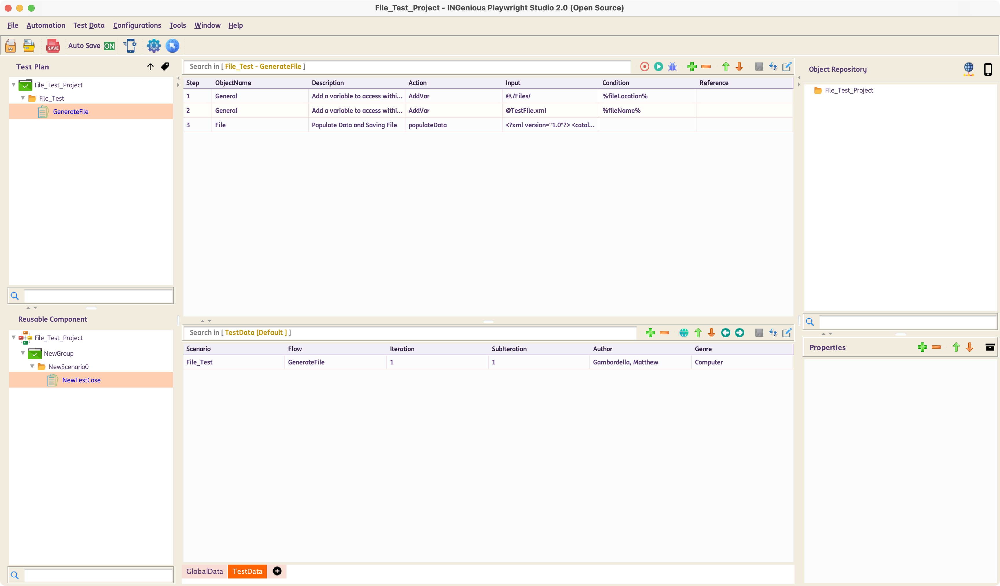
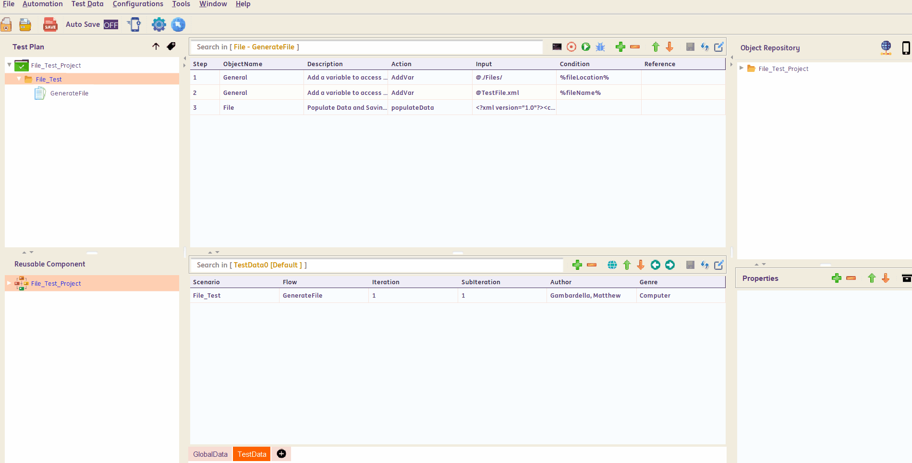

# **Working with Flat Files**

!!! abstract "Significance of flat files for Testing"
    In various banking or other industries, one would need to produce inputs in the form of flat files. These flats files are consumed (via `XFB`s or other protocols) by systems (**Application Under Test**) to generate outputs.
    For example in a Payment processing system a flat file like the one below, is an input and then the system generates bookings based on the data in the files.
    ```xml
    <?xml version="1.0" encoding="UTF-8"?>
    <PaymentFile>
        <Payment>
            <PaymentID>12345</PaymentID>
            <Payer>
                <Name>John Doe</Name>
                <AccountNumber>987654321</AccountNumber>
                <Bank>ABC Bank</Bank>
            </Payer>
            <Payee>
                <Name>Jane Smith</Name>
                <AccountNumber>123456789</AccountNumber>
                <Bank>XYZ Bank</Bank>
            </Payee>
            <Amount>1500.00</Amount>
            <Currency>USD</Currency>
            <PaymentDate>2025-02-02</PaymentDate>
            <Description>Invoice Payment</Description>
        </Payment>
    </PaymentFile>
    ```

    For automated testing, it becomes crucial to be able to generate multiple such test files (by making these driven by data) and then eventually validate whether the system (**Application Under Test**) has processed them in the expected way or not.


## How to generate data-driven flat files using INGenious?

* At the beginning, there should be a step to set the **`file location`**. 
  This needs to be done by creating a variable called `%fileLocation%` and feeding a **relative/absolute** path to it, where you want to save the output file.

* Then, there should be a step to set the **`file name`**. 
  This needs to be done by creating another variable called `%fileName%` and feeding the actual file name (with extension) to it. You can leverage built-in capabilities in INGenious like `Synthetic Data Generation` to create `file name`s to be fed to the variable.

* Then there should be the **`populateData`** action to generate the file. The **`populateData`** action comes with an editor which makes parameterization of data in   the paylod very easy. This action is always marked in <span style="color:Green">**Green.**</span>. [See the section below]


 

 The above is an example of a File Generation Testcase.


-------------------------------------


## Payload Data Parameterization


 Data Parameterization can be done using the built-in **editor.** If you mouse-hover on the **Input** column, corresponding to the **`populateData`** step, an option to open up the Editor comes up.

 Inside this editor, we can paste the entire Payload and then parameterize the specific JSON/XML tags based on our needs.

 If we press ++ctrl+space++ the list of all available **DataSheets : ColumnNames** along with all **user-defined variables** show up. We can then select the appropriate item from where we want to parameterize.

 We need to press ++escape++ to close the editor

 
 

 -------------------------------------