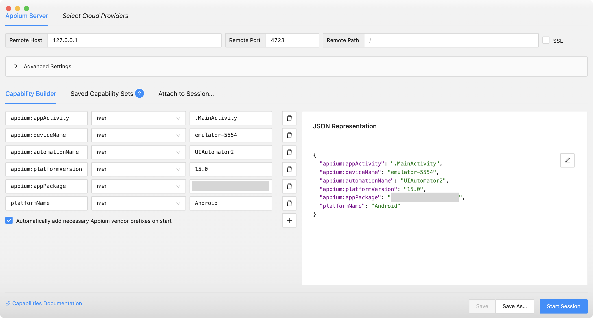
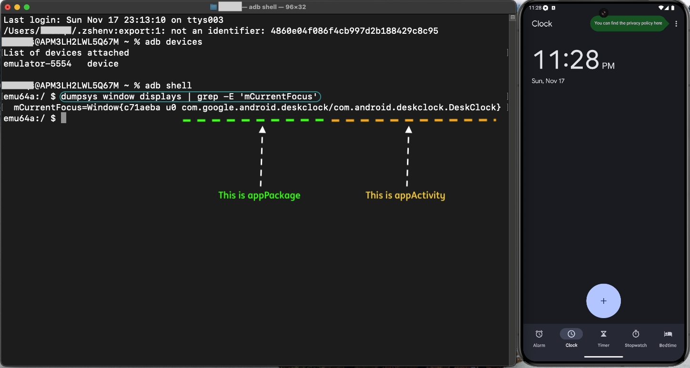
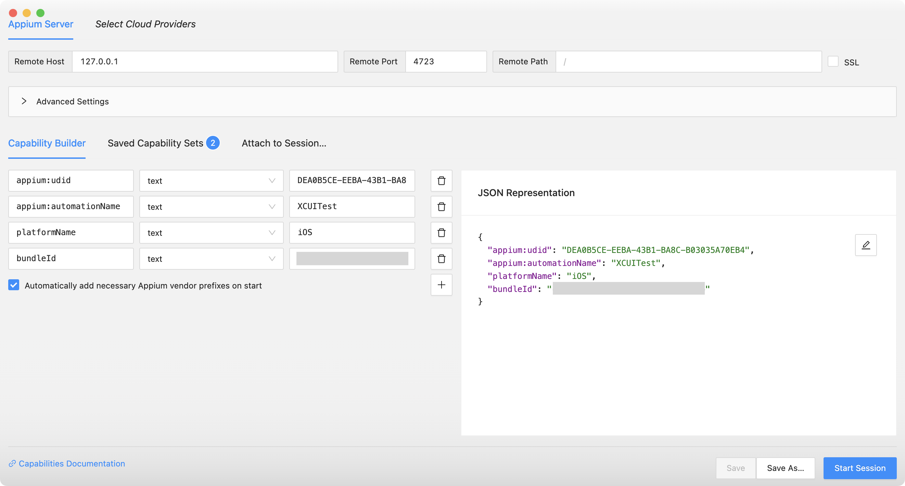

# **Appium Inspector**

## **Installation**
-------

* Download and install **Appium Inspector** from [this GitHub location](https://github.com/appium/appium-inspector)

* Start the **Appium Inspector**

* Start Appium server by running the following command in a terminal :
   `appium`

* Add the Desired Capabilities as per the device/simulator connected to the system and start session


## **Desired Capabilities for Android**
-----------------------



* To get **deviceName** execute the command `adb devices` from a terminal and choose the correct device name from the list
* **automationName** is `UIAutomator2`
* **platformName** is `Android`
* You can get the **platformVersion** from the settings of the device
* To get the **appPackage** and **appActivity** perform the following steps :

    - Open the application (under test) in the device such that it is currently on focus
    - On a terminal, run `adb shell`
    - Then execute the following command `dumpsys window displays | grep -E 'mCurrentFocus'`

In the example below, the **Clock** application is open in the device.




## **Desired Capabilities for iOS**
-----------------------



* To get **udid** execute the command `xcrun simctl list | egrep '(Booted)'` from a terminal
* **automationName** is `XCUITest`
* **platformName** is `iOS`
* To get the **bundleId** you can run the following command from a terminal : 

  ```{ .shell .copy }
  osascript -e 'id of app "<path of the .app file>"'
  ```
