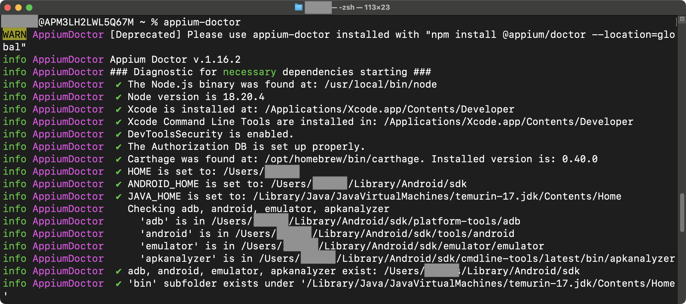
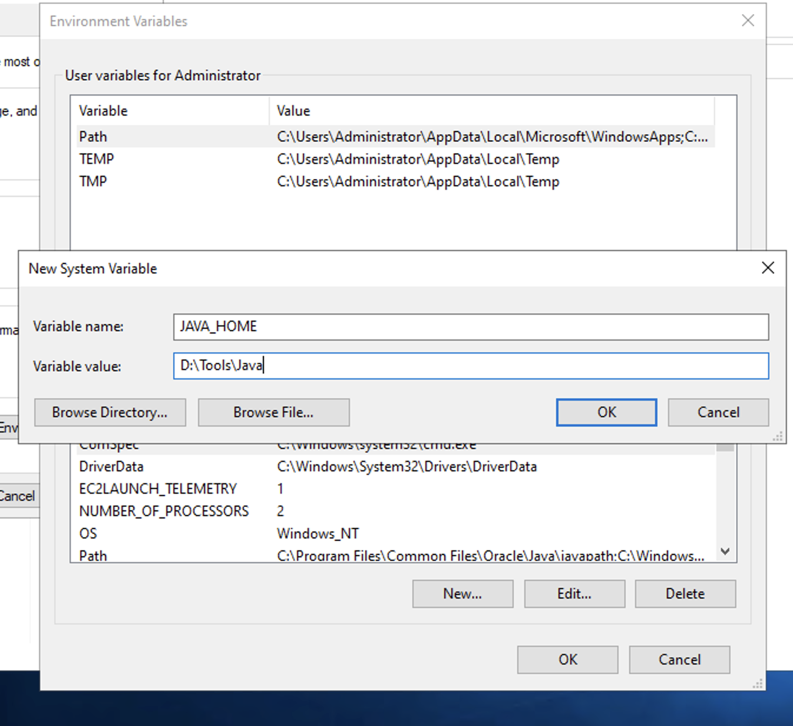
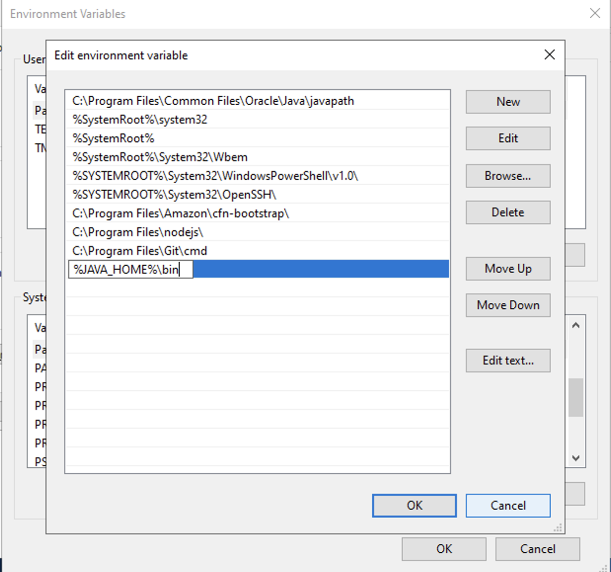

# **Let's Get Rolling**

## **Prerequisites**
-------
#### Node

 * `Node.js` should be installed and properly set up.
 * If not, download & install `Node.js` from [here](https://nodejs.org/en/download/)

!!! info

    We will use `node` for download and usage of `Appium`


## **Installation of Appium and Appium Doctor**
-----------------------
* **Step 1** : Install Appium via `npm`

    ```{ .shell .copy }
    npm install -g appium@latest
    ```  

!!! note

    Installing Appium 2.0 only installs the Appium server, not the drivers. All drivers have been isolated from the Appium server app   

* **Step 2** : Install drivers

=== "For testing on Android devices"


    ```{ .shell .copy }
    appium driver install uiautomator2 

    ```

=== "For testing on iOS devices"


    ```{ .shell .copy }
    appium driver install xcuitest

    ```


* **Step 3** : Check the list of drivers installed

    ```{ .shell .copy }
    appium driver list
    ```  

* **Step 4** : Install appium-doctor (optional)

    ```{ .shell .copy }
    npm install -g appium-doctor
    ```  

!!! note

    Appium Doctor is a handy tool from Appium team that serves as a pre-flight check for Appium test environment
    Attempts to diagnose and fix common Node, iOS and Android configuration issues  

* **Step 5** : Run appium-doctor to check the status of dependencies (optional)

    ```{ .shell .copy }
    appium-doctor
    ```  
    
    A proper set up would look like this :

    


## **Setting of Java Home**


??? info "Windows"

    * Create a system variable `JAVA_HOME` with the value as the path where your **Java** is installed. This should be the root location of your **Java** installation

        


    <br>

    * Add the **Java** bin path to the `PATH` variable

        


??? info "Mac OS"

    Add the `JAVA_HOME` in `.bash_profile` (for old MACs) or in `.zshrc` or `.zprofile` (for new MACs)

    ```{ .shell .copy }
    export JAVA_HOME="/Library/Java/JavaVirtualMachines/temurin-17.jdk/Contents/Home"
    export PATH=$PATH:$JAVA_HOME/bin

    ```


[Android Setup](androidsetup.md){ .md-button } 
[iOS Setup](iOSsetup.md){ .md-button }    