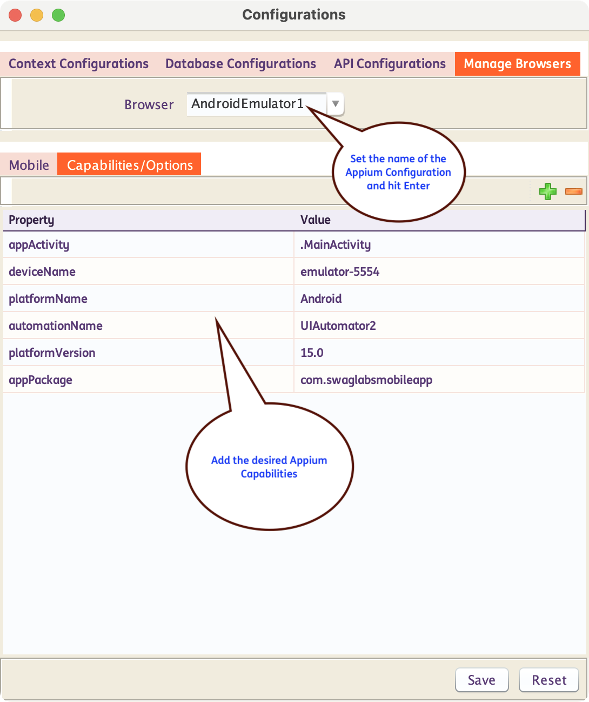
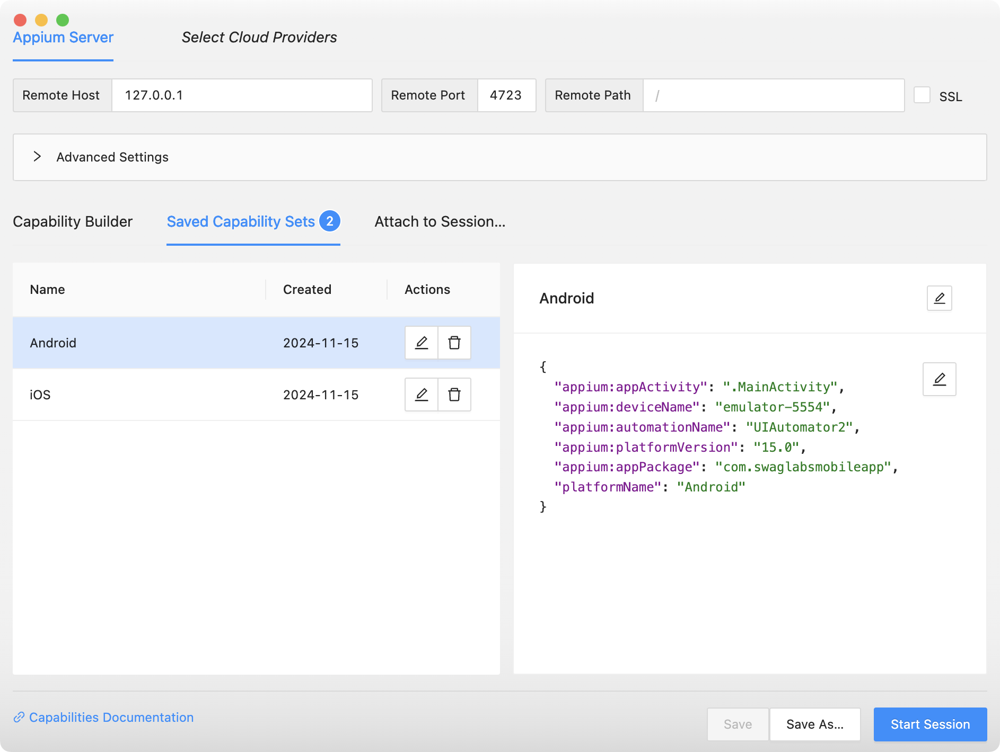
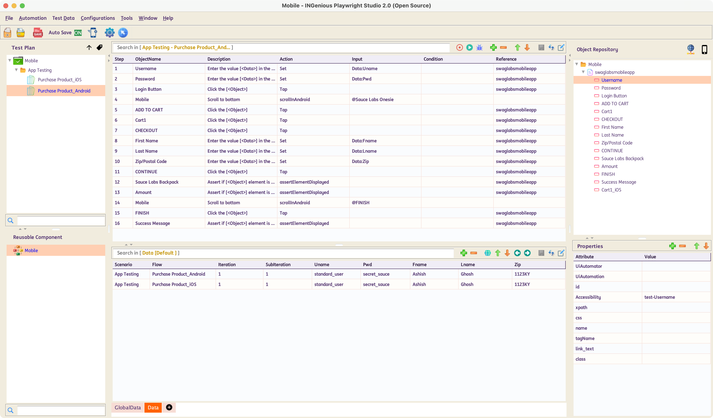

# **Creating Mobile App Tests**

## Set up an Appium Configuration

Follow the steps below to create an Appium configuration in INGenious.

* Click on the Configuration icon 

* Inside the **Manage Browser** tab, Enter the name of the **Appium Configuation** you want to create, in the `Browser` textbox and hit ++enter++ 

* By default, `automationName`, `deviceName`, `platformName` and `platformVersion` are the required key-value pairs for **Appium configuration** when creating new emulators. Additional Appium configurations can be included as needed.

     

* Make sure you have already tested your configurations from Appium Inspector

       

---------------------------     

## Write Tests

* Head over to the **Design Pane** of INGenious

* Create **Objects** in the Object Repository with appropriate selectors like `xpath`, `AccessibilityId` etc. These can easily be captured from **Appium Inspector**

* Drag and drop the objects into the test case canvas

* Select appropriate **actions** like **`Tap`, `Scroll`** or **`Set`** for each relevant step

  

---------------------------     

## Test Execution - Design Pane

While running the test from the Design Pane, make sure to select the appropriate **Appium Configuration** that was created for the test. You can do that by right clicking on the Run Button and selecting the Configuration.

  

---------------------------     

## Test Execution - Execution Pane

While running the test from the Execution Pane, make sure to select the appropriate **Appium Configuration** that was created for the test. You can do that by selecting the Configuration in the `Browser` Column.

  