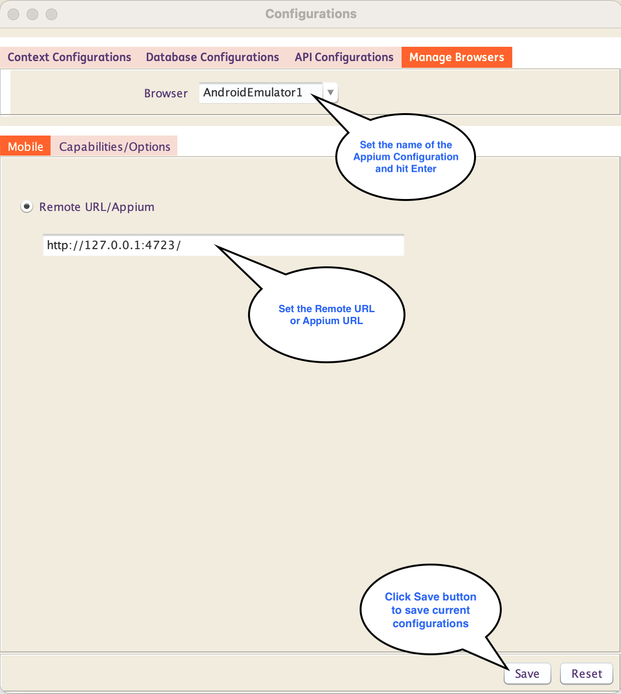
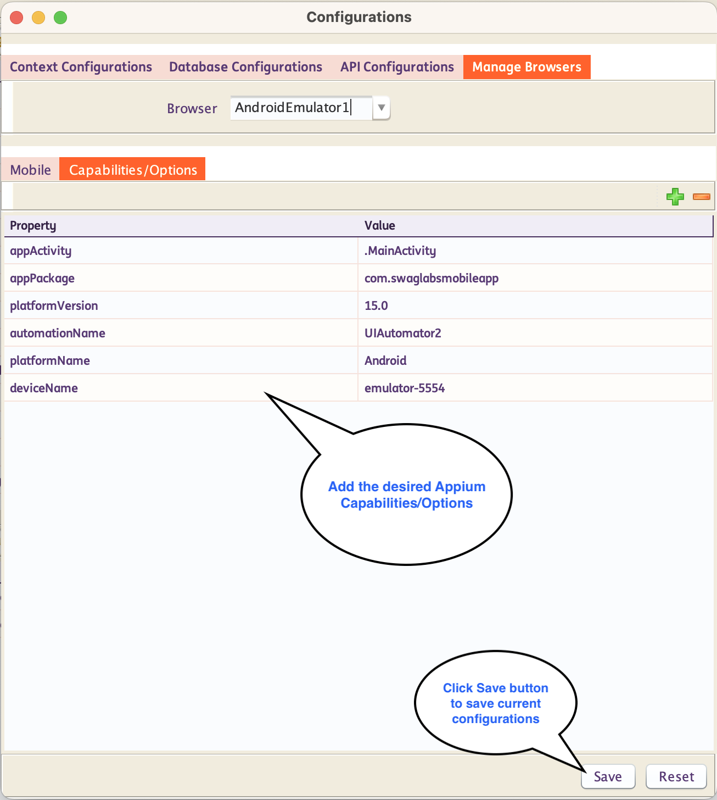
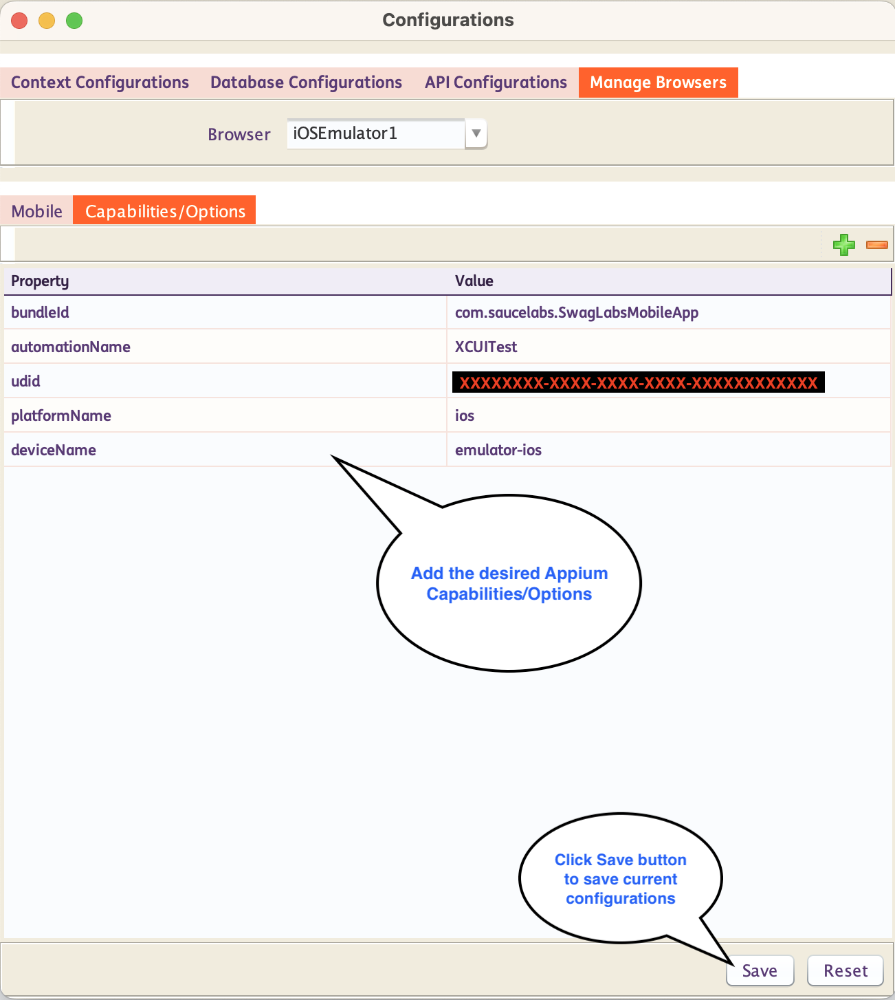

# **Creating Mobile App Tests**

## Set up an Appium Configuration

Follow the steps below to create an Appium configuration in INGenious.

* Click on the Configuration icon 

* Inside the **Manage Browser** tab, Enter the name of the **Appium Configuation** you want to create, in the `Browser` textbox and hit ++enter++ 

* Inside the **Mobile Tab**, you can set yout **Remote URL/Appium** from the textbox 

* Inside the **Capabilities/Options Tab**, you can set your **Appium Capabilities/Options**

* By default, `automationName`, `deviceName`, `platformName` and `platformVersion` are the required key-value pairs for **Appium configurations** when creating new emulators. Additional Appium configurations can be included as needed.

=== "Sample Android Emulator Configurations"

    For this example, we have setup Android Emulator, Appium Inspector and `UIAutomator2` automation driver to run the Mobile sample test case.

    **Sample Android Emulator Ingenious IDE Configurations**

    Remote URL:

    { width=50% }
    
    Appium Capabilities/Options:

    { width=50% }
   
    **Sample Android Appium Capabilities Set**

    ```json
          {
               "appium:deviceName": "emulator-5554",
               "appium:automationName": "UIAutomator2",
               "appium:platformVersion": "15.0",
               "platformName": "Android",
               "appium:appActivity": ".MainActivity",
               "appium:appPackage": "com.swaglabsmobileapp"
          }
    ```

=== "Sample iOS Emulator Configurations"

    For this example, we have setup iOS Emulator, Appium Inspector, and `XCUITest` automation driver to run the Mobile sample test case.

    **Sample Ingenious iOS Emulator IDE Configurations**

    Remote URL:

    { width=50% }

    Appium Capabilities/Options:

    { width=50% }

    **Sample iOS Appium Capabilities Set**

    ```json
          {
               "appium:udui": "XXXXXXXX-XXXX-XXXX-XXXX-XXXXXXXXXXXX",
               "appium:bundleId": "com.saucelabs.SwagLabsMobileApp",
               "appium:automationName": "XCUITest",
               "platformName": "iOS",
               "appium:deviceName": "iPhone 13 Pro Max",
               "appium:platformVersion": "18.6"
          }
    ```

> **Note:** Make sure you have already tested your configurations from Appium Inspector. See section [Appium Inspector](appiuminspector.md) for more details.  

---------------------------     

## Write Tests

* Head over to the **Design Pane** of INGenious

* Create **Objects** in the Object Repository with appropriate selectors like `xpath`, `AccessibilityId` etc. These can easily be captured from **Appium Inspector**

* Drag and drop the objects into the test case canvas

* Select appropriate **actions** like **`Tap`, `Scroll`** or **`Set`** for each relevant step

=== "Sample Android Test Case"

    For this sample, we are testing in **Android Platform**.

      

=== "Sample iOS Test Case"

    For this sample, we are testing in **iOS Platform**.

      

---------------------------     

## Test Execution - Design Pane

While running the test from the Design Pane, make sure to select the appropriate **Appium Configuration** that was created for the test. You can do that by right clicking on the Run Button and selecting the Configuration.

  

---------------------------     

## Test Execution - Execution Pane

While running the test from the Execution Pane, make sure to select the appropriate **Appium Configuration** that was created for the test. You can do that by selecting the Configuration in the `Browser` Column.

  