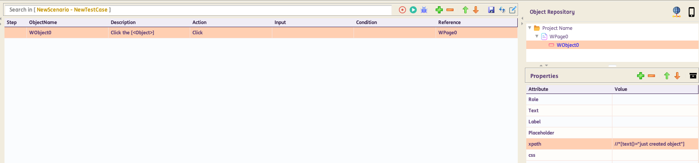
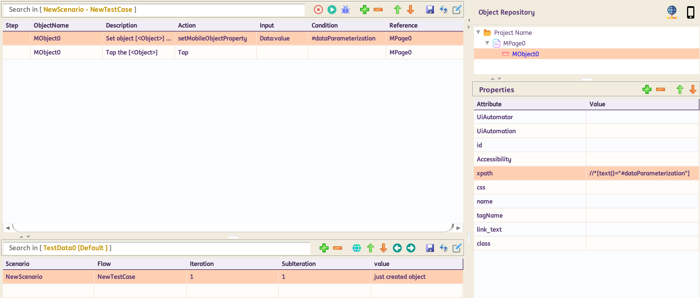

# **Dynamic Object** 

## **setMobileObjectProperty**

**Description**: This function will set object property to given data in input column at runtime

=== "Usage"

    | ObjectName | Action            | Input        | Condition |Reference|  |
    |------------|-------------------|--------------|-----------|---------|--|
    | mobileObject     |:green_circle: [`setMobileObjectProperty`](#)   | @Data       | #var | PageName |<span style="color:Green"><< *Hardcoded Input*</span> 
    | mobileObject     |:green_circle: [`setMobileObjectProperty`](#)   | DatasheetName:ColumnName | #var  | PageName |<span style="color:Blue"><< *Input from Datasheet*</span>
    | mobileObject     |:green_circle: [`setMobileObjectProperty`](#)   | %variableName% | #var  | PageName |<span style="color:Brown"><<*Input from variable*</span>

=== "Corresponding Code"

    ```java
    @Action(object = ObjectType.APP, desc = "Set object [<Object>] property  as [<Data>] at runtime", input = InputType.YES, condition = InputType.YES)
    public void setMobileObjectProperty() {
        if (!Data.isEmpty()) {
            if (Condition.isEmpty()) {
                String[] groups = Data.split(",");
                for (String group : groups) {
                    String[] vals = group.split("=", 2);
                    setProperty(vals[0], vals[1]);
                }
            } else {
                setProperty(Condition, Data);
            }
            String text = String.format("Setting Object Property for %s with %s for Object [%s - %s]",
                    Condition, Data, Reference, ObjectName);
            Report.updateTestLog(Action, text, Status.DONE);
        } else {
            Report.updateTestLog(Action, "Input should not be empty", Status.FAILNS);
        }
    }

    ```

=== "Example"

    For **standard usage**:

    

    For **parameterized usage**:

    

    In the example above, part of the locator can be parameterized in the format `#variableName`. *Note: This can also be done for all locators.* In the test steps, use `setMobileObjectProperty`. Input column will have the `datasheet:column` reference or variable reference from where to take the data. Condition column will have the parameterized part `#variableName`. Next test step would be a tap or any other action on that object.
----------------------

## **setMobileglobalObjectProperty**

**Description**: This function will set all objects property to data in input column  at runtime

=== "Usage"

    | ObjectName | Action            | Input        | Condition |Reference|  |
    |------------|-------------------|--------------|-----------|---------|--|
    | mobileObject     |:green_circle: [`setMobileglobalObjectProperty`](#)   | @Data       | #var | PageName |<span style="color:Green"><< *Hardcoded Input*</span> 
    | mobileObject     |:green_circle: [`setMobileglobalObjectProperty`](#)   | DatasheetName:ColumnName | #var  | PageName |<span style="color:Blue"><< *Input from Datasheet*</span>
    | mobileObject     |:green_circle: [`setMobileglobalObjectProperty`](#)   | %variableName% | #var  | PageName |<span style="color:Brown"><<*Input from variable*</span>

=== "Corresponding Code"

    ```java
    @Action(object = ObjectType.MOBILE, desc = "Set  all objects property to [<Data>] at runtime.", input = InputType.YES, condition = InputType.YES)
    public void setMobileglobalObjectProperty() {
        if (!Data.isEmpty()) {
            if (Condition.isEmpty()) {
                String[] groups = Data.split(",");
                for (String group : groups) {
                    String[] vals = group.split("=", 2);
                    MobileObject.globalDynamicValue.put(vals[0], vals[1]);
                }
            } else {
                MobileObject.globalDynamicValue.put(Condition, Data);
            }
            String text = String.format("Setting Global Object Property for %s with %s", Condition, Data);
            Report.updateTestLog(Action, text, Status.DONE);
        } else {
            Report.updateTestLog(Action, "Input should not be empty", Status.FAILNS);
        }
    }
    ```
----------------------
