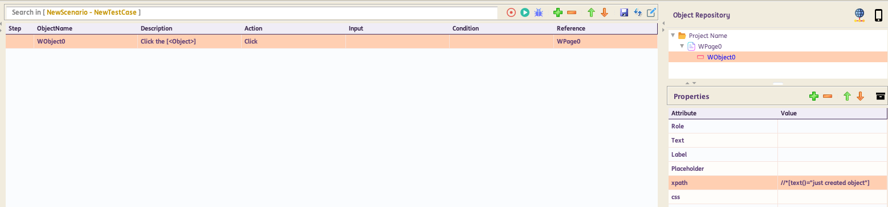
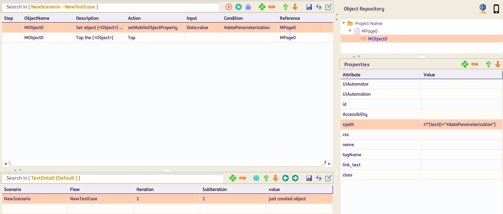

# **Dynamic Object** 

## **setMobileglobalObjectProperty**

**Description**: This function will set all objects property to data in input column  at runtime

=== "Usage"

    | ObjectName | Action            | Input        | Condition |Reference|  |
    |------------|-------------------|--------------|-----------|---------|--|
    | Mobile     |:green_circle: [`setMobileglobalObjectProperty`](#)   | @value       | #var | PageName |<span style="color:#349651">:arrow_left:   *Hardcoded Input*</span> 
    | Mobile     |:green_circle: [`setMobileglobalObjectProperty`](#)   | Sheet:Column | #var  | PageName |<span style="color:#559BD1">:arrow_left:   *Input from Datasheet*</span>
    | Mobile     |:green_circle: [`setMobileglobalObjectProperty`](#)   | %dynamicVar% | #var  | PageName |<span style="color:#AB0066">:arrow_left:   *Input from variable*</span>

=== "Corresponding Code"

    ```java
    @Action(object = ObjectType.MOBILE, desc = "Set  all objects property to [<Data>] at runtime.", input = InputType.YES, condition = InputType.YES)
    public void setMobileglobalObjectProperty() {
        if (!Data.isEmpty()) {
            if (Condition.isEmpty()) {
                String[] groups = Data.split(",");
                for (String group : groups) {
                    String[] vals = group.split("=", 2);
                    MobileObject.globalDynamicValue.put(vals[0], vals[1]);
                }
            } else {
                MobileObject.globalDynamicValue.put(Condition, Data);
            }
            String text = String.format("Setting Global Object Property for %s with %s", Condition, Data);
            Report.updateTestLog(Action, text, Status.DONE);
        } else {
            Report.updateTestLog(Action, "Input should not be empty", Status.FAILNS);
        }
    }
    ```
----------------------
## **setMobileObjectProperty**

**Description**: This function will set object property to given data in input column at runtime

=== "Usage"

    | ObjectName | Action            | Input        | Condition |Reference|  |
    |------------|-------------------|--------------|-----------|---------|--|
    | mobileObject     |:green_circle: [`setMobileObjectProperty`](#)   | @value       | #var | PageName |<span style="color:#349651">:arrow_left:   *Hardcoded Input*</span> 
    | mobileObject     |:green_circle: [`setMobileObjectProperty`](#)   | Sheet:Column | #var  | PageName |<span style="color:#559BD1">:arrow_left:   *Input from Datasheet*</span>
    | mobileObject     |:green_circle: [`setMobileObjectProperty`](#)   | %dynamicVar% | #var  | PageName |<span style="color:#AB0066">:arrow_left:   *Input from variable*</span>

    ### Inline Object Property Override

    Instead of adding a separate `setMobileObjectProperty` step, the override can be supplied **inline** in the **Condition** column of the locator-based step itself (`Tap`, `Set`, an assertion, etc.). The engine resolves and applies the override just *before* the element is located, so the placeholders in the locator are substituted for that step only.

    **Syntax**

    ```
    setProp: #token=value[; #token2=value2 ...]
    setGlobalProp: #token=value[; #token2=value2 ...]
    ```

    | Marker | Scope |
    |--------|-------|
    | `setProp:` | Object-scoped — applies only to the element used in that step. Requires an Object Repository element (ObjectName + Reference). |
    | `setGlobalProp:` | Global — applies the token to every object that uses it, like `setMobileglobalObjectProperty`. |

    **Rules**

    - Tokens are the `#variableName` placeholders defined in the object's locator.
    - Multiple pairs are separated by `;`.
    - Each pair splits on the **first** `=` only, so the value itself may contain `=`.
    - Values accept the same formats as the Input column: a hardcoded literal, `Sheet:Column`, `%runtimeVar%` or `#globalDataId`. They are resolved through the normal data pipeline.
    - An optional `|subiter=N` suffix on a value picks a specific datasheet sub-iteration for that token, overriding the step's own sub-iteration.
    - Markers are case-insensitive (`setProp:`, `SETPROP:`, `setprop:` all work).
    - Malformed pairs are ignored; if no valid pair remains the override is skipped and logged as `DEBUG`.

    **Usage**

    | ObjectName | Action | Input        | Condition | Reference |  |
    |------------|--------|--------------|-----------|-----------|--|
    | mobileObject |:green_circle: [`Tap`](#) |  | `setProp: #id=@submitBtn` | PageName |<span style="color:#349651">:arrow_left:   *Hardcoded value*</span>
    | mobileObject |:green_circle: [`Tap`](#) |  | `setProp: #id=Products:SKU` | PageName |<span style="color:#559BD1">:arrow_left:   *Value from Datasheet*</span>
    | mobileObject |:green_circle: [`Tap`](#) |  | `setProp: #id=%dynamicVar%` | PageName |<span style="color:#AB0066">:arrow_left:   *Value from variable*</span>
    | mobileObject |:green_circle: [`Set`](#) | Sheet:Column | `setProp: #row=%currentRow%; #status=Data:State` | PageName |<span style="color:#9C27B0">:arrow_left:   *Multiple tokens*</span>
    | mobileObject |:green_circle: [`Tap`](#) |  | `setProp: #id=Products:SKU\|subiter=3` | PageName |<span style="color:#9C27B0">:arrow_left:   *Specific sub-iteration*</span>
    | mobileObject |:green_circle: [`Tap`](#) |  | `setGlobalProp: #env=Prod` | PageName |<span style="color:#9C27B0">:arrow_left:   *Global scope*</span>

    !!! tip "Building the expression in the IDE"
        While editing the **Condition** cell of an eligible step, type `*` to open the inline-property builder instead of typing the expression by hand. In the dialog you pick the **scope** (*Object (this element)* or *Global (all elements)*), choose a **token** from the dropdown (populated from the selected object's locator attributes in the Mobile Object Repository), supply the **value** (with suggestions for `Sheet:Column` references and `%variables%`), and optionally set the **sub-iteration**. An existing expression is loaded back into the dialog for editing.

        A step is eligible when it references an Object Repository element (both ObjectName and Reference are filled) and its action does not already use the Condition column for its own semantics.

    !!! note
        The applied override is reported as a separate `setObjectProperty` (or `setGlobalObjectProperty`) log entry so the report does not repeat the real action name for the property-setting sub-step.

=== "Corresponding Code"

    ```java
    @Action(object = ObjectType.APP, desc = "Set object [<Object>] property  as [<Data>] at runtime", input = InputType.YES, condition = InputType.YES)
    public void setMobileObjectProperty() {
        if (!Data.isEmpty()) {
            if (Condition.isEmpty()) {
                String[] groups = Data.split(",");
                for (String group : groups) {
                    String[] vals = group.split("=", 2);
                    setProperty(vals[0], vals[1]);
                }
            } else {
                setProperty(Condition, Data);
            }
            String text = String.format("Setting Object Property for %s with %s for Object [%s - %s]",
                    Condition, Data, Reference, ObjectName);
            Report.updateTestLog(Action, text, Status.DONE);
        } else {
            Report.updateTestLog(Action, "Input should not be empty", Status.FAILNS);
        }
    }

    ```

=== "Example"

    For **standard usage**:

    

    For **parameterized usage**:

    

    In the example above, part of the locator can be parameterized in the format `#variableName`. *Note: This can also be done for all locators.* In the test steps, use `setMobileObjectProperty`. Input column will have the `datasheet:column` reference or variable reference from where to take the data. Condition column will have the parameterized part `#variableName`. Next test step would be a tap or any other action on that object.
----------------------

