# **Mobile Objects Repository**

!!! info 
    The Mobile Object Repository (Mobile OR) in INGenious provides a centralized and reusable location for storing mobile UI elements used in automated tests. Instead of manually defining mobile element locators in test steps, the repository allows teams to store, manage, and maintain selectors in one place for Android and iOS applications.

!!! abstract "Key Benefits:"
    * **Centralized element management** – All mobile objects live in one organized repository.
    * **Cross‑platform support** – Store Android and iOS locators in the same or separate pages.
    * **Maintainability** – Update a selector once and apply the change everywhere.
    * **Consistent naming and structure** – Standardized element definitions promote cleaner automation design.

## Object Repository Structure
    
Mobile OR follows a structure identical to Web OR:

    ```
    ├── ProjectName
    │   ├── PageName1
    │   │   └── ObjectName1
    │   └── PageName2
    │       ├── ObjectName1
    │       └── ObjectName2
    ```

* A project may contain multiple Pages, and each Page can hold multiple Objects, each representing a mobile screen or UI section.
* Page names must be unique within the project.
* Object names must be unique within their respective page. 
* A Mobile Object consists of a set of attributes that define how it can be uniquely identified on a device:

    | **Attribute**      | **Description** | **Example Value** |
    |--------------------|------------------|--------------------|
    | **UiAutomator**    | **Android‑only** locator using UiSelector expressions. Useful for complex queries when id/accessibility aren’t available. Prefer concise selectors for stability and performance. | new UiSelector().resourceId("com.app:id/loginButton") |
    | **UiAutomation**   | **iOS‑specific** (historically iOS UIAutomation; modern iOS uses XCUITest with predicate string and class chain). Use this attribute only if you keep legacy references; otherwise prefer iOS Predicate String / Class Chain equivalents. | -ios predicate string: label == "Back" |
    | **id**             | Native element ID. Maps to Android resource-id and (for iOS/XCUITest) commonly overlaps with the element’s identifier/name. Fast and stable—use when available. | Android: com.app:id/usernameField <br> iOS: id = "usernameField" |
    | **Accessibility**  | Accessibility ID (preferred). Maps to Android content-desc and iOS accessibility identifier/name. Cross‑platform, fast, and stable; recommended before XPath. | Android: accessibility id = "login_button" (content‑desc) <br> iOS: accessibility id = "login_button" |
    | **xpath**          | XML path through the UI hierarchy. Powerful but slow & brittle—use only when no stable ID/Accessibility exists. Prefer short, relative XPath rather than absolute paths. | Android: //android.widget.Button[@text='Sign In'] <br> iOS: //XCUIElementTypeButton[@name='Sign In'] |
    | **css**            | CSS selector (only for webviews—not native context). Use after switching to the WEBVIEW context. In native apps, CSS is not supported. | #login-form button[type='submit'] (inside WEBVIEW) |
    | **name**           | iOS/XCUITest often treats name similarly to accessibility identifier; on Android this is not the primary strategy. Prefer Accessibility or id; keep name for compatibility where needed. | iOS: name = "Sign In" |
    | **tagName**        | Webview element tag (e.g., input, button)—not applicable to native Android/iOS elements. Use in WEBVIEW context only. | input (inside WEBVIEW) |
    | **link_text**      | Webview anchor text strategy. Not available for native elements. Use for HTML links once you’ve switched to WEBVIEW. | link text = "Forgot your password?" (inside WEBVIEW) |
    | **class**          | Element class name. On Android: e.g., android.widget.EditText. On iOS: XCUIElementType.... Less precise than ID/Accessibility; combine with other filters when needed. | Android: android.widget.ImageView <br> iOS: XCUIElementTypeButton|

## Project and Shared Mobile OR

INGenious supports the same two‑repository model for Mobile OR as it does for Web OR:

* **Project Mobile OR**

    Contains mobile objects that **can be used within the project** and managed from the `Project` tab within the OR panel.

    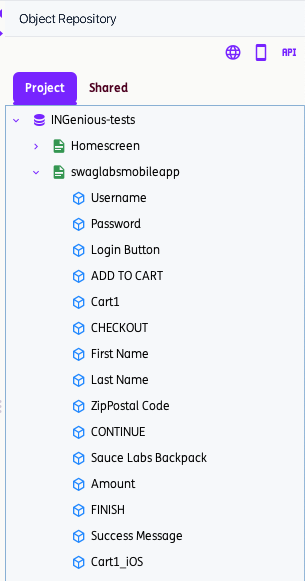

    **For projects created before version 3.0**, an `MOR.object` file is automatically generated whenever a project containing Objects is saved. It stores the Page and Object attributes in XML format and is located inside the respective project directory.

    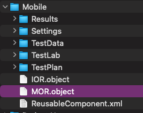

    **For projects created in version 3.0**, a YAML file is automatically generated for each page at the time of page creation. This file contains the objects within the page along with their corresponding attributes and is stored in the project’s directory `<ProjectName>\ObjectRepository\Mobile\`

    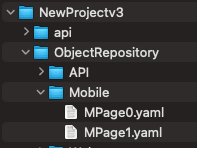

    **For projects loaded in version 3.0**, legacy `.object` files are automatically converted to YAML and reorganized into the new folder structure. The original `.object` files are preserved as `.bak` files under `<ProjectName>\ProjectXMLOR\.`

    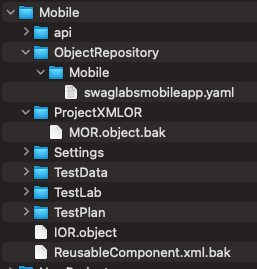

    When a Project Mobile Object (PMO) is used in a test step, the identifier **[Project] PageName** will show as its reference.

    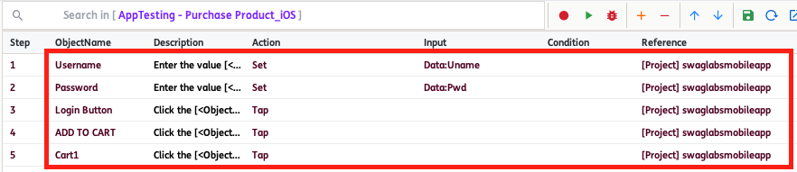

* **Shared Mobile OR**

    Contains mobile objects that **can be used across different projects** and are managed from the `Shared` tab within the OR panel.

    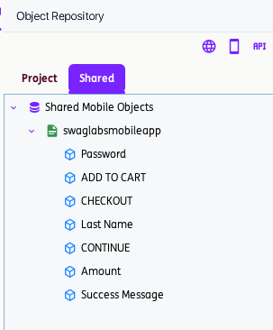
    
    Similar to Project MobileOR, **for projects created before version 3.0**, a`SharedMobileOR.object` file is automatically generated whenever a project saves Objects created under `Shared` or when Objects are copied from `Project` to `Shared`. Like `MobileOR.object`, it stores Page and Object attributes in XML format and is located in the `Shared\SharedMobileObjects\` directory.

    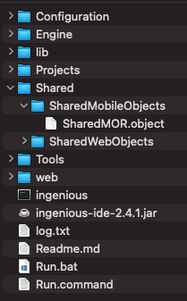

    **For projects created in version 3.0**, a YAML file is automatically generated for each page—either upon page creation under `Shared` or when pages or objects are moved from `Project` to `Shared`. This file contains the page’s objects and their corresponding attributes and is stored in the `Shared\SharedObjectRepository\Mobile` directory. The `mobileor-projectsdata.yaml` file maintains the list of projects that use the Shared Web Objects.

    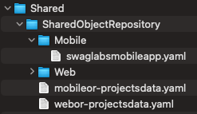

    **For projects loaded in version 3.0**, legacy `.object` files are automatically converted to YAML and reorganized into the new folder structure. The original `.object` files are preserved as `.bak` files under `Shared\SharedXMLOR\.`

    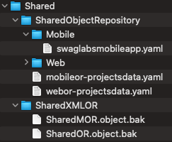

    When a Shared Mobile Object (SMO) is used in a test step, the identifier **[Shared] PageName** will show as its reference.

    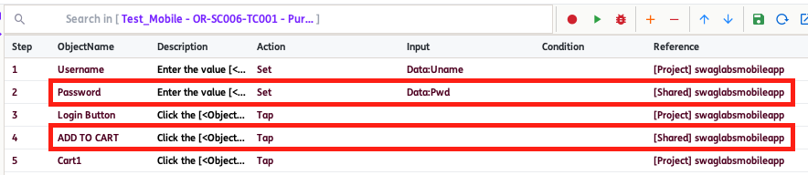


## How to use Project and Shared Mobile OR

* Pages and Objects can be added directly within the Project and Shared repositories using the `Add Page` or `Add Object` options.

* Objects from Project and Shared Mobile OR can be used in a single Test Scenario.

    For example:
    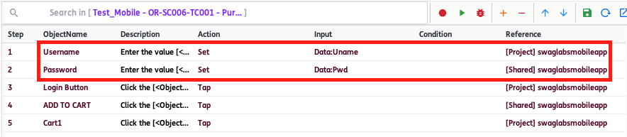

* **For versions 2.4 and 2.4.1**, Pages and Objects created under the `Project` tab can be copied to the `Shared` section by using the `Copy to Shared` option. When an entire Page is copied, all Objects under that Page—including their attributes—are copied. When copying a single Object, only that Object and its corresponding Page are copied. *Note that existing test steps using the Project‑level Mobile Object (PMO) will not be automatically updated to use the Shared Mobiles Object (SMO).*

    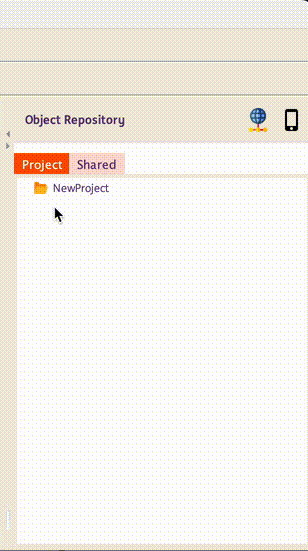

* **For version 3.0**, `Copy to Shared` option is replaced by `Move to Shared` option. When an entire Page is moved, all Objects under that Page—including their attributes—are moved. When moving a single Object, only that Object and its corresponding Page are moved. *Note that existing test steps using the Project‑level Mobile Object (PMO) will not be automatically updated to use the Shared Mobile Object (SMO).*

    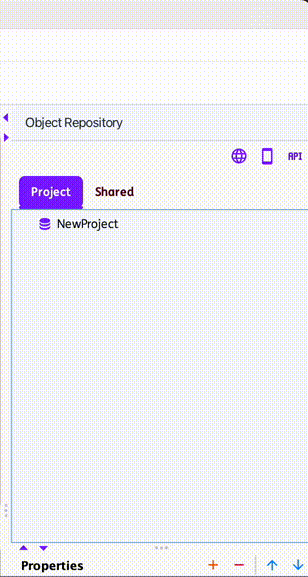

* Pages and Objects may share the same names across the Project and Shared repositories. However, names must remain unique within each individual repository.

    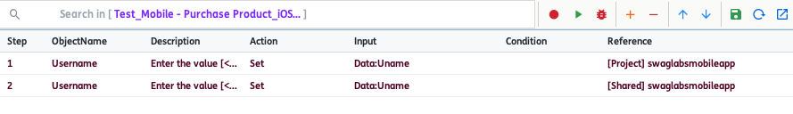

* Pages and Objects in both the Project and Shared repositories can be renamed using the `Rename Page` or `Rename Object` options. However, after renaming, any existing test steps that previously referenced an SMO will continue to use its old name, which may result in errors during test execution.

* Pages and Objects in both the Project and Shared repositories can be deleted using the `Delete Page` or `Delete Object` options. However, once deleted, any existing test steps that previously referenced an SMO or PMO will still attempt to use the removed Page or Object, which may result in errors during test execution.

* To view all test cases that reference an Object within the project, use the `Get Impacted Cases` option. This feature is available for both Project and Shared repositories.

    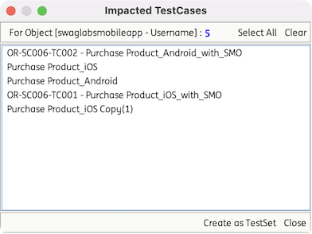

    *Suggestion: Before renaming or deleting an object, please use the `Get Impacted Cases` option for checking.*