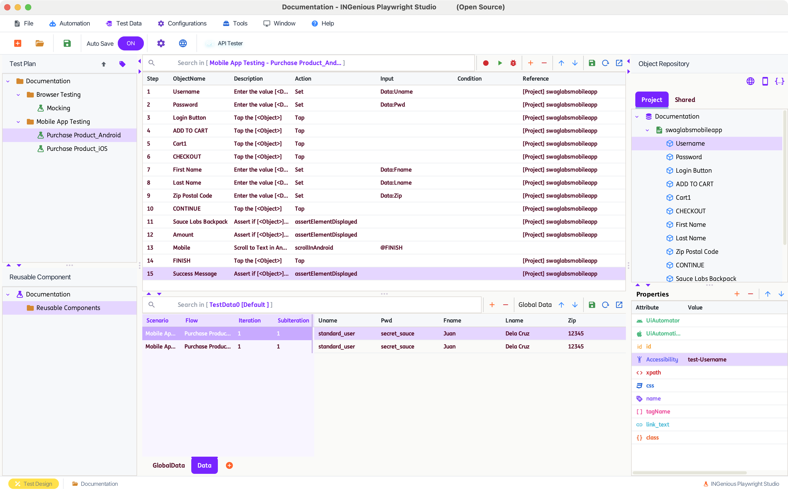
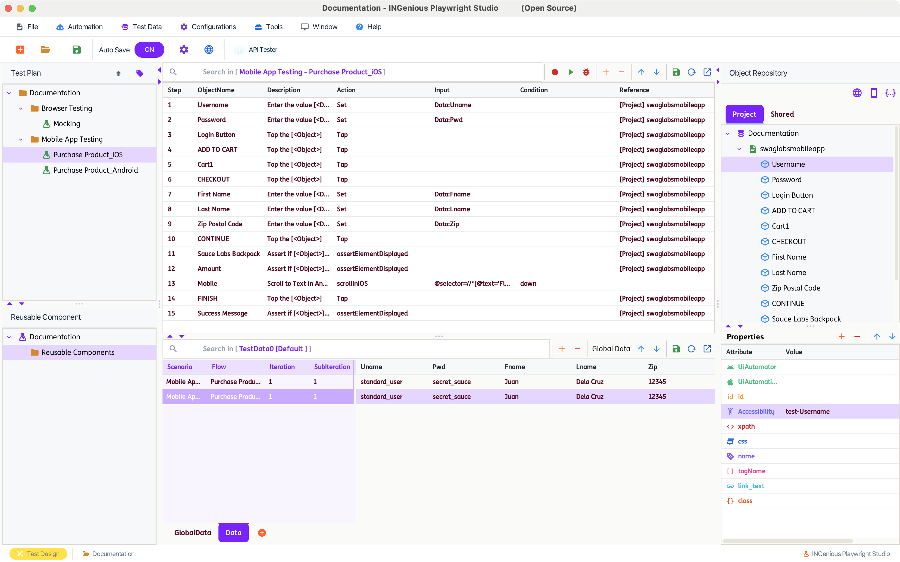
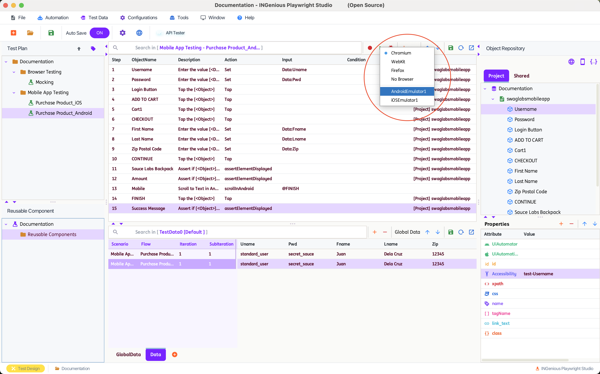
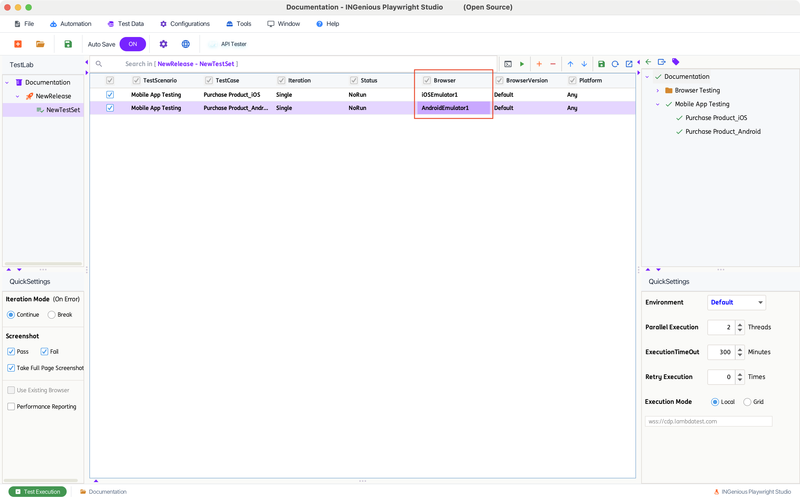
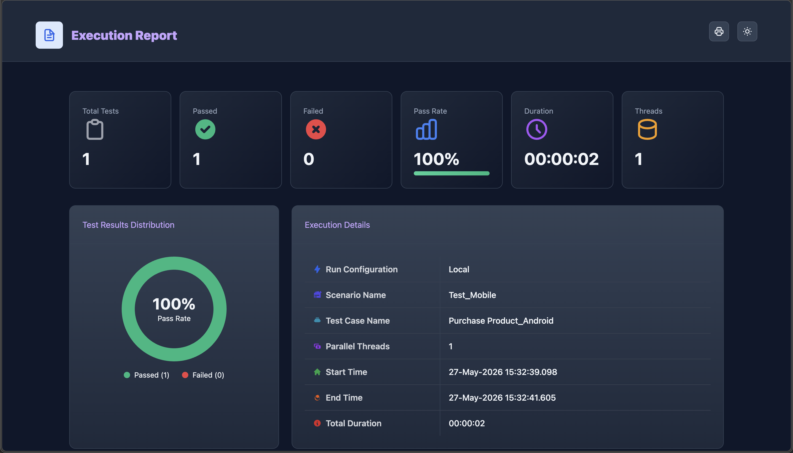
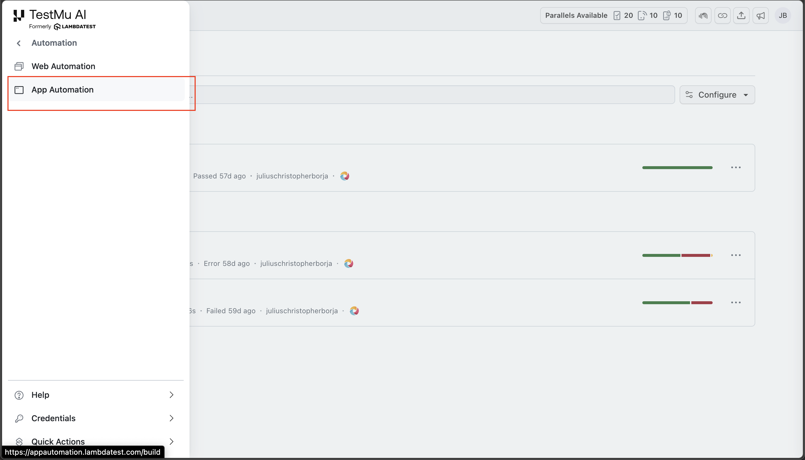
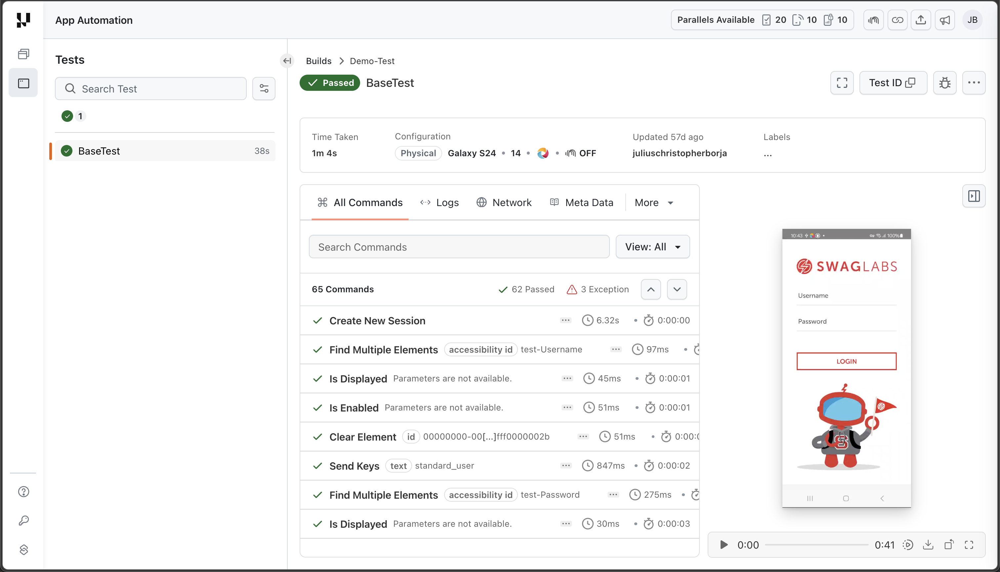

# **Creating Mobile App Tests**

## Write Tests

* Head over to the **Design Pane** of INGenious

* Create **Objects** in the Object Repository with appropriate selectors like `xpath`, `AccessibilityId` etc. These can easily be captured from **Appium Inspector**

* Drag and drop the objects into the test case canvas

* Select appropriate **actions** like **`Tap`, `Scroll`** or **`Set`** for each relevant step

=== "Sample Android Test Case"

      

=== "Sample iOS Test Case"

    

=== "Sample LambdaTest Test Case"

    > Any Android and iOS Test Case can be used as a LambdaTest. 
    Setup a LambdaTest configuration by following the steps in [Sample Lambda Configurations](../emulatorsetup/#__tabbed_1_3)

    

---------------------------     

## Test Execution - Design Pane

While running the test from the Design Pane, make sure to select the appropriate **Appium Configuration** that was created for the test. You can do that by right clicking on the Run Button and selecting the Configuration.

  

---------------------------     

## Test Execution - Execution Pane

While running the test from the Execution Pane, make sure to select the appropriate **Appium Configuration** that was created for the test. You can do that by selecting the Configuration in the `Browser` Column.

---------------------------  

## Test Results

Results of tests are automatically opened in a test browser after execution.

### Test Results for LambdaTest Test Cases

In addtion to test results from the IDE, results can also be found under **App Automation** in the LambdaTest web application.

The results come with a video recording of the executed test steps as well as logs and network information during the run.

