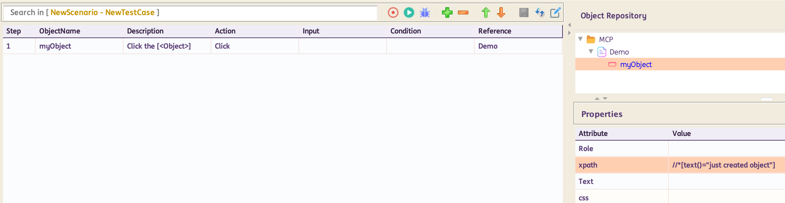
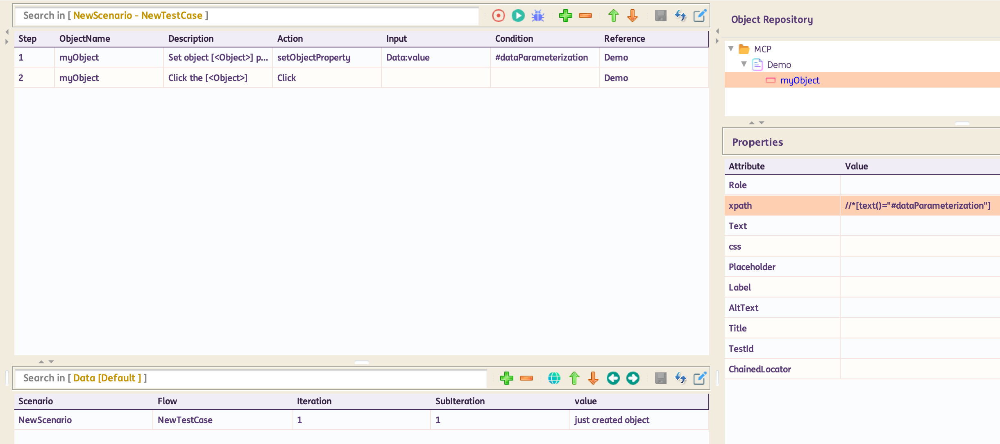

# Dynamic Object

----------------------------------

## **setObjectProperty**

**Description**:  This function will **set object property as data** at runtime

**Input Format** :   @Expected Text

=== "Usage"

    | ObjectName | Action                     | Input         | Condition |Reference|  |
    |------------|----------------------------|---------------|-----------|---------|--|
    | Object     |:green_circle: [`setObjectProperty`](#)   | @value       |#var       |PageName |<span style="color:#349651">:arrow_left:   *Hardcoded Input*</span> 
    | Object     |:green_circle: [`setObjectProperty`](#)   | Sheet:Column |#var       |PageName |<span style="color:#559BD1">:arrow_left:   *Input from Datasheet*</span>
    | Object     |:green_circle: [`setObjectProperty`](#)   | %dynamicVar% |#var       |PageName |<span style="color:#AB0066">:arrow_left:   *Input from variable*</span>

    Inputs in the Input column can be either `hardcoded` (in this case the data is preceded by a "**@**"), passed from the data sheet (`datasheet name : column name`) or passed from a variable value (`%variable name%`), as given in the above example.

=== "Corresponding Code"

    ```java
    @Action(object = ObjectType.PLAYWRIGHT, desc = "Set object [<Object>] property  as [<Data>] at runtime", input = InputType.YES, condition = InputType.YES)
        public void setObjectProperty() {
            if (!Data.isEmpty()) {
                if (Condition.isEmpty()) {
                    String[] groups = Data.split(",");
                    for (String group : groups) {
                        String[] vals = group.split("=", 2);
                        setProperty(vals[0], vals[1]);
                    }
                } else {
                    setProperty(Condition, Data);
                }
                String text = String.format("Setting Object Property for %s with %s for Object [%s - %s]",
                        Condition, Data, Reference, ObjectName);
                Report.updateTestLog(Action, text, Status.DONE);
            } else {
                Report.updateTestLog(Action, "Input should not be empty", Status.FAILNS);
            }
        }
    ```

=== "Example"

    For **standard usage**:

    

    For **parameterized usage**:

    

    In the example above, part of the locator can be parameterized in the format `#variableName`. *Note: This can also be done for all locators.* In the test steps, use `setObjectProperty`. Input column will have the `datasheet:column` reference or variable reference from where to take the data. Condition column will have the parameterized part `#variableName`. Next test step would be a click or any other action on that object.

----------------------------------

## **setglobalObjectProperty**

**Description**:  This function will **set all objects property as data** at runtime

**Input Format** :   @Expected Text

=== "Usage"

    | ObjectName | Action                     | Input         | Condition |Reference|  |
    |------------|----------------------------|---------------|-----------|---------|--|
    | Object     |:green_circle: [`setglobalObjectProperty`](#)   | @value       |#var       |PageName |<span style="color:#349651">:arrow_left:   *Hardcoded Input*</span> 
    | Object     |:green_circle: [`setglobalObjectProperty`](#)   | Sheet:Column |#var       |PageName |<span style="color:#559BD1">:arrow_left:   *Input from Datasheet*</span>
    | Object     |:green_circle: [`setglobalObjectProperty`](#)   | %dynamicVar% |#var       |PageName |<span style="color:#AB0066">:arrow_left:   *Input from variable*</span>

    Inputs in the Input column can be either `hardcoded` (in this case the data is preceded by a "**@**"), passed from the data sheet (`datasheet name : column name`) or passed from a variable value (`%variable name%`), as given in the above example.

=== "Corresponding Code"

    ```java
    @Action(object = ObjectType.BROWSER, desc = "Set  all objects property to [<Data>] at runtime.", input = InputType.YES, condition = InputType.YES)
        public void setglobalObjectProperty() {
            if (!Data.isEmpty()) {
                if (Condition.isEmpty()) {
                    String[] groups = Data.split(",");
                    for (String group : groups) {
                        String[] vals = group.split("=", 2);
                        AutomationObject.globalDynamicValue.put(vals[0], vals[1]);
                    }
                } else {
                    AutomationObject.globalDynamicValue.put(Condition, Data);
                }
                String text = String.format("Setting Global Object Property for %s with %s", Condition, Data);
                Report.updateTestLog(Action, text, Status.DONE);
            } else {
                Report.updateTestLog(Action, "Input should not be empty", Status.FAILNS);
            }
        }
    ```
----------------------------------