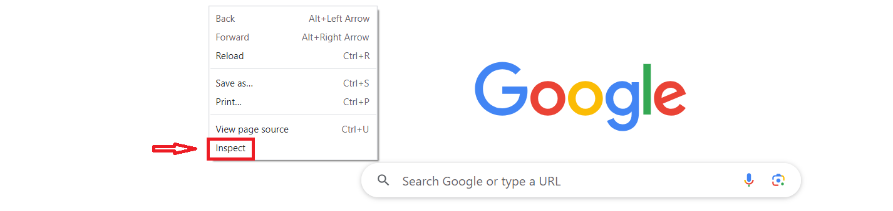
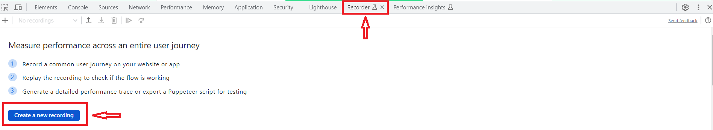
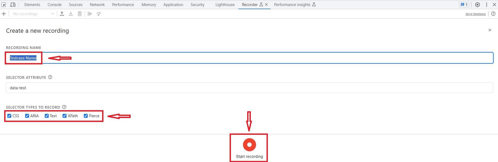
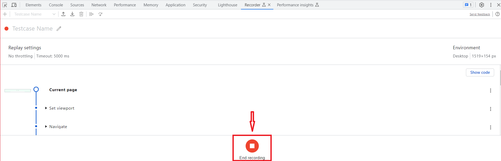
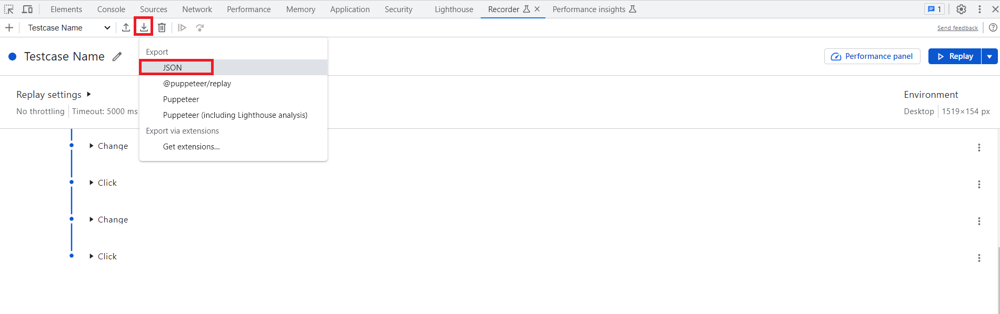

# Google Chrome Recording
--------------------------------------

## Steps for recording test flow using Chrome Recorder :

 

 * Open Chrome Browser and launch your Application URL.

 * Right click anywhere on the webpage and select **inspect** or simply press **F12**. This will open up `Chrome Developer Tool` at the bottom.

 

   

 

 * Click on the **Recorder** option from Developer Tool.

 * Click on **Create a new recording**.

 

   

 

 * Give an appropriate **Recording Name** and check the appropriate **Selector Types**.

 * Click on **Start recording**.

 

   

 

 * Start recording the flow by navigating through application.

 * After completion of the flow, click on **End recording**.

 

   

 

 * Select **Export** > **JSON** to save the recording as a json file.

 

   

 

 ### Import JSON To Create Automation Test Case Scaffolding :

 * From the framework UI, navigate to **Tools** > **Import Chrome Recording** > **Import JSON**.

 * Locate **JSON file** and click [OK].

 * The JSON file is immediately rendered as **Scenario** and **Test Case**. All the relevant **test steps** with all the **web objects** and **test data** are imported.

   

   

 