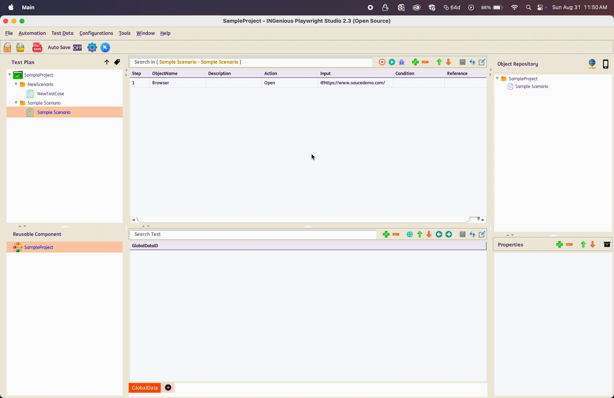

# Playwright Recording
----------------------------------

## Steps for Recording :

 * Launch **INGenious Playwright Studio**

 * Click on the **Recorder** icon

   
 
 * A loader will show up while the playwright-recorder is being loaded

!!! warning 
    
    For **first time usage**, Playwright will download its required binaries. If network connection is slow, this may cause the recorder to time out.
    Several dialog boxes might appear during setup, **just click 'OK' to proceed**. Once the recorder opens, **close it and start a new recording**.

 * The **Playwright Inspector** will launch along with **Chromium** browser

 * Enter the URL of the Application Under Test (AUT) in the **Chromium** browser and perform the actions you want to perform on the application

 * You will see the steps getting recorded in the **Playwright Inspector**. Make sure to select the **Java Library** as the Target.

 * After recording, use the **Copy button in the Playwright Inspector** to manually copy the recorded steps. This action will save the recorded steps as `recording.txt` file under `Projects/ProjectName/Recording`.
 
 * A notification will appear upon successful copy of the recorded steps.

#### Import recording from Playwright Recorder

 * Once the recorded steps have been succesfully copied, close the Playwright Recorder.

 * A prompt will appear asking whether to proceed with the import. Select Yes.

 * Specify a **Test Scenario Name** or use the default **NewScenario**. The provided name will be used to rename the `recording.txt` file.

 * Once completed, the recording will be imported and displayed as a **Scenario** and **Test Case** . All relevant **test steps**, along with associated **web objects** and **test data**, will be included. The objects will be loaded into the **Object Repository**.

 

 ---

#### Import from `.txt` file

 * After recording, use the **Copy button in the Playwright Inspector** to manually copy the recorded steps. This action will save the recorded steps as `recording.txt` file under `Projects/ProjectName/Recording`.

 * Once the recorded steps have been succesfully copied, close the Playwright Recorder.

 * A prompt will appear asking whether to proceed with the import. Select No.

 * From **INGenious Playwright Studio**, navigate to **Tools** :material-arrow-right: **Import Playwright Recording** :material-arrow-right: **Import Playwright Recording**.

 * Locate the **recording.txt file** under `Projects/ProjectName/Recording` and click [OK].

 * The file is immediately rendered as **Scenario** and **Test Case**. All the relevant **test steps** with all the **web objects** and **test data** are imported.

 * All the objects are loaded in the **Object Repository**.

 

 