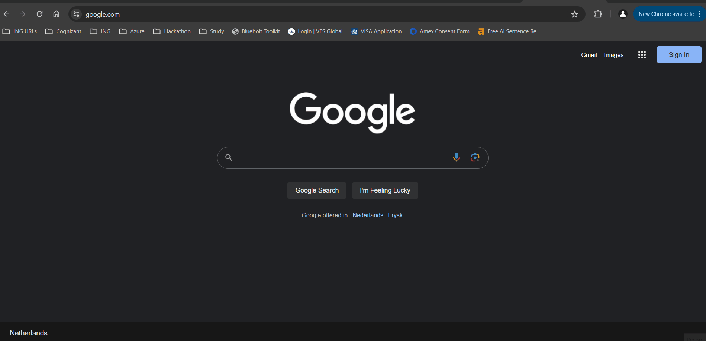

# INGenious Recorder Plugin
--------------------------------------

## Steps for using INGenious recorder plugin to record the flow:

 

 * Open Chrome Browser and go to extension --> Manage Extensions.

 * Enable the Developer mode 

 * Click on Load Unpacked

 * Drag and drop the extension folder from Extensions folder

 * You will be able to view the INGenious extension for record and playback.
 
 
    

 
