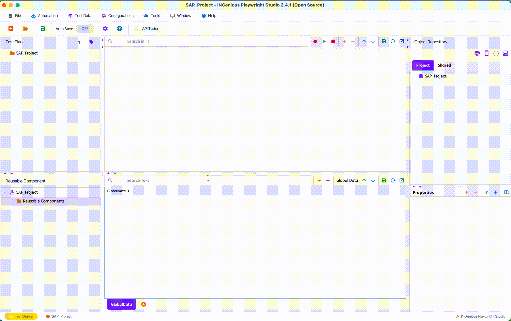

# Import Java Shell SAP Recording
------------------------

#### Import from `.jsh` or `.java` file

 * After recording your SAP session using the SAP GUI Scripting tool, save the script as a `.jsh` or `.java` file.

 * Once the recording has been successfully saved, close the SAP GUI Scripting tool.

 * To import manually, from **INGenious Playwright Studio**, navigate to **Tools** :material-arrow-right: **Import SAP Recording** :material-arrow-right: **Java**.

 * Locate the SAP recording file (e.g., `saprecording.jsh` or `saprecording.java`) and click [OK].

 * The file is immediately rendered as a **Scenario** and **Test Case**. All relevant **test steps** and **SAP objects** are imported.

 * Imported objects are displayed in the **SAP Object Repository**.

 
