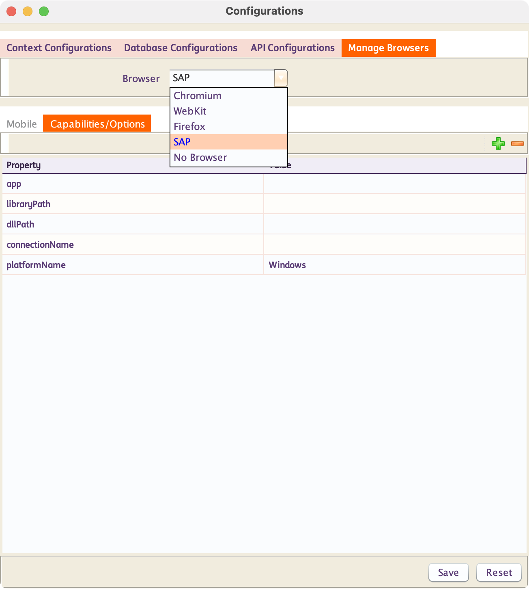
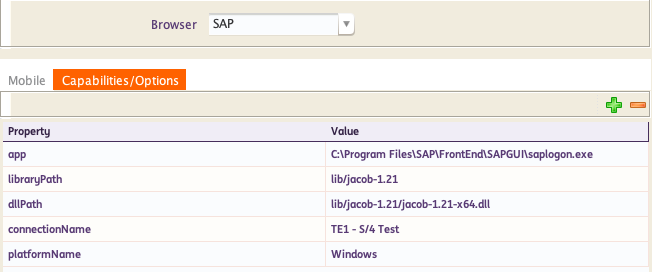

# **SAP Testing**
-----------------------------

!!! info "What is SAP Testing?"

    SAP Testing refers to the automated validation of SAP GUI processes to ensure they work correctly and meet business requirements. This is done by simulating user actions like logging in, navigating transactions, and entering data within the SAP GUI.

!!! abstract "How does INGenious perform SAP Testing?"

    INGenious uses the `JACOB` library (Java COM Bridge) to automate tasks in SAP GUI from Java. `JACOB` acts as a connector between Java and Windows-based applications that use COM (Component Object Model), like SAP GUI. This allows INGenious to control SAP GUI screens—such as clicking buttons, entering data, or navigating menus—directly through Java code. It helps automate repetitive tasks and supports testing by simulating user actions in SAP.

-----------------------------------

## Set up SAP connection

> **Note:** By default, **JACOB** library is already included under the `/lib` folder.

* To configure a SAP connection from INGenious, follow the steps below:

    - Click on the Configuration icon 
    - Under **Manage Browsers** select **SAP** from the Browser drop-down options.

        

    - Set the property values using the details below:
        1. **app** - This should be the full path to the `saplogin.exe` file on your machine.
        1. **libraryPath** - The path to the `JACOB` library, which is located in the `\lib` folder.
        1. **dllPath** - The path of the `JACOB DLL` located in `lib\jacob-1.21`. Specify either the x86 or x64 version depending on your system architecture.
        1. **connectionName** - The name of the SAP GUI connection you want to use.
        1. **platformName** - The platform where testing is performed. The default and supported value is `Windows`.

            Example:

            
        

-----------------------------------             

Make sure to check out the following topics :

[SAP Actions](sapActions.md){ .md-button } 

