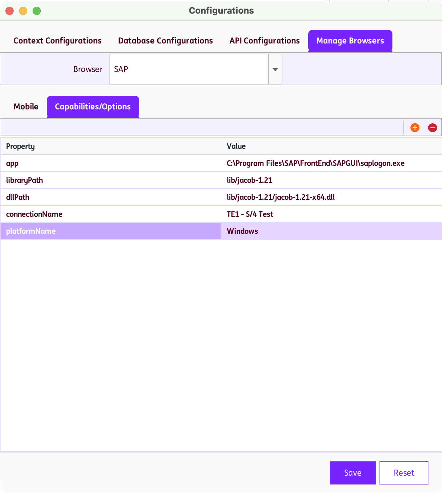
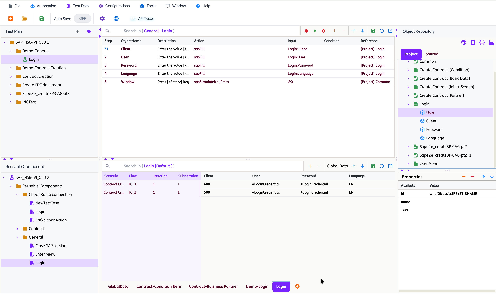
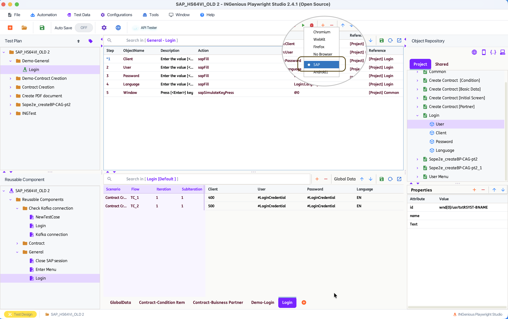
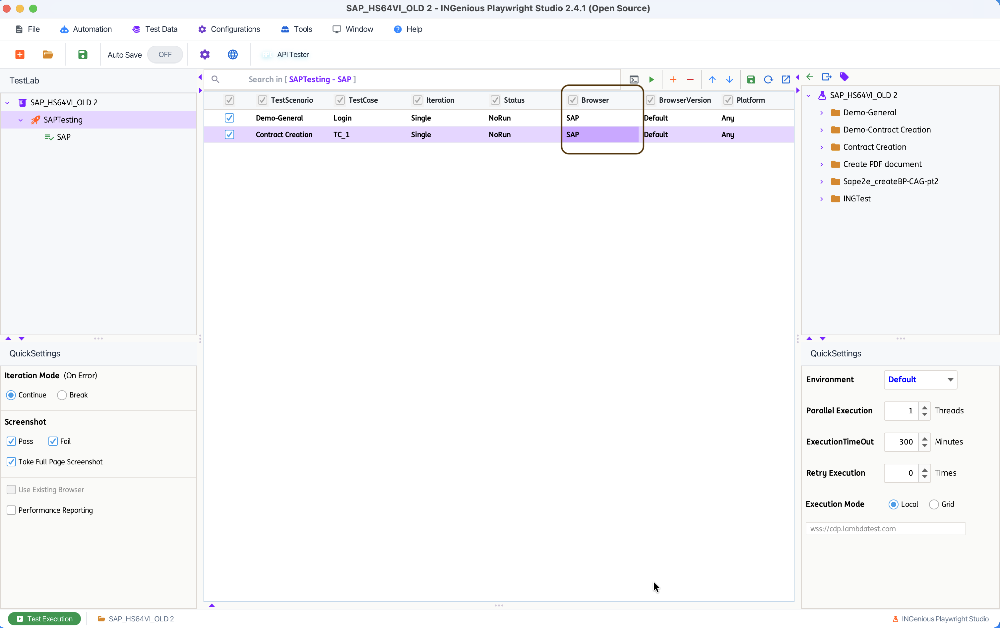

# **Working with SAP**
--------------------------------

## Create your first SAP Test

Follow the steps below to create an SAP-based test case in INGenious.

* Click on the Configuration icon 

* Inside the **Manage Browser** tab, enter the name of the **SAP Configuration** you want to create, in the `Browser` textbox and hit ++enter++

* Inside the new browser configuration, set your SAP connection details:
	 * **`app`** - full path to your SAP GUI logon executable  
		 e.g. `C:/<YourPath>/SAP/FrontEnd/SAPgui/saplogon.exe`
	 * **`libraryPath`** - path to your Java COM Bridge (JACOB) library  
		 e.g. `C:/<YourPath>/libs/jacob-1.20-x64.dll`
	 * **`dllPath`** - full path to your JACOB DLL file  
		 e.g. `C:/<YourPath>/libs/jacob-1.20-x64.dll`
	 * **`connectionName`** - connection name for your SAP GUI connection  
		 e.g. `SAP_GUI_DEV`, `SAP_GUI_UAT`
	 * **`platformName`** - operating system platform for SAP GUI  
		 e.g: `Windows`

{ width=35% }

* Click on **Save** button to save your SAP Configuration.

> **Note:**   
 - Make sure you have the correct SAP connection details from your SAP GUI.   
 - SAP Testing in INGenious is integrated using the [JACOB (Java COM Bridge)](https://sourceforge.net/projects/jacob-project/) library. This is why you must provide the correct path to the JACOB DLL and library files in your configuration. JACOB enables Java to communicate with the SAP GUI via COM automation.

---------------------------     

## Write Tests

* Head over to the **Design Pane** of INGenious

* Click SAP Object Repository icon 

* Create **Objects** with appropriate attributes like `id`, `name` and `Text`. These can easily be captured using **SAP Sripting Tracker Tool**

* Drag and drop the objects into the test case canvas

* Select appropriate **actions** for each relevant step like **`sapFill`, `sapClick`**, etc. 

{ width=85% }

---------------------------     

## Test Execution - Design Pane

While running the test from the Design Pane, make sure to select the appropriate **SAP Configuration** that was created for the test. You can do that by right clicking on the Run Button and selecting the Configuration.

{ width=85% }

---------------------------     

## Test Execution - Execution Pane

While running the test from the Execution Pane, make sure to select the appropriate **SAP Configuration** that was created for the test. You can do that by selecting the Configuration in the `Browser` Column.

{ width=85% }