# **SAP Objects Repository**

!!! info 
    The SAP Object Repository (SAP OR) in INGenious provides a centralized and reusable location for storing SAP UI elements used in automated tests. Instead of manually defining SAP element locators in test steps, the repository allows teams to store, manage, and maintain selectors in one place for SAP testing.

!!! abstract "Key Benefits:"
    * **Centralized element management** – All SAP objects live in one organized repository.
    * **Reduced duplication** – Reuse element definitions across test suites and frameworks.
    * **Maintainability** – Update a selector once and apply the change everywhere.
    * **Consistent naming and structure** – Standardized element definitions promote cleaner automation design.

## Object Repository Structure
    
SAP OR follows a structure identical to Web OR:

    ```
    ├── ProjectName
    │   ├── PageName1
    │   │   └── ObjectName1
    │   └── PageName2
    │       ├── ObjectName1
    │       └── ObjectName2
    ```

* A project may contain multiple Pages, and each Page can hold multiple Objects, each representing a SAP screen or UI section.
* Page names must be unique within the project.
* Object names must be unique within their respective page. 
* A SAP Object consists of a set of attributes that define how it can be uniquely identified on a device:

    | **Attribute**      | **Description** | **Example Value** |
    |--------------------|------------------|--------------------|
    | **id**    | Element id of the SAP Object in SAP GUI | wnd[0]/tbar[0]/btn[3] |
    | **name**   | Element name of the SAP Object in SAP GUI | ctxtVDARL_BUKRS |
    | **Text**             | Element text value of the SAP Object in SAP GUI | Some text value |

## Project and Shared SAP OR

INGenious supports the same two‑repository model for SAP OR as it does for Web OR:

* **Project SAP OR**

    Contains SAP objects that **can be used within the project** and managed from the `Project` tab within the OR panel.

    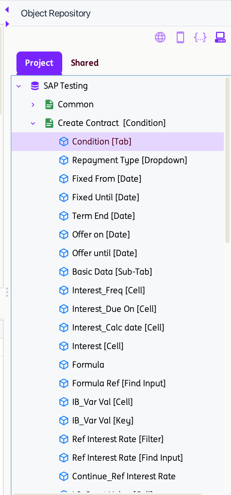{ width=20% }

    **For projects created before version 3.0**, an `SapOR.object` file is automatically generated whenever a project containing Objects is saved. It stores the Page and Object attributes in XML format and is located inside the respective project directory.

    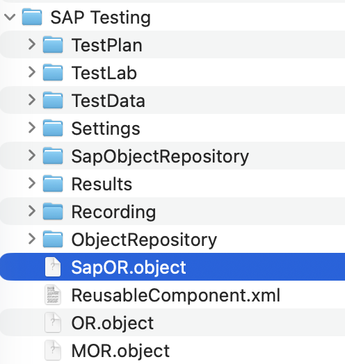{ width=20% }

    **For projects created in version 3.0**, a YAML file is automatically generated for each page at the time of page creation. This file contains the objects within the page along with their corresponding attributes and is stored in the project’s directory `<ProjectName>\ObjectRepository\SAP\`

    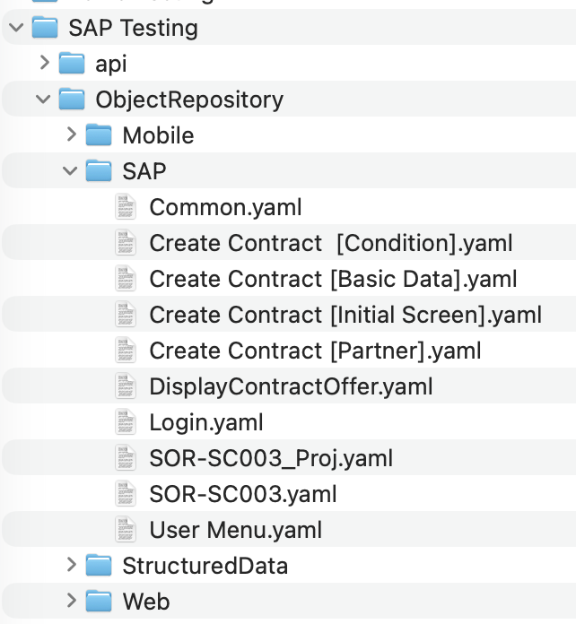{ width=20% }

    **For projects loaded in version 3.0**, legacy `.object` files are automatically converted to YAML and reorganized into the new folder structure. The original `.object` files are preserved as `.bak` files under `<ProjectName>\ProjectXMLOR\.`

    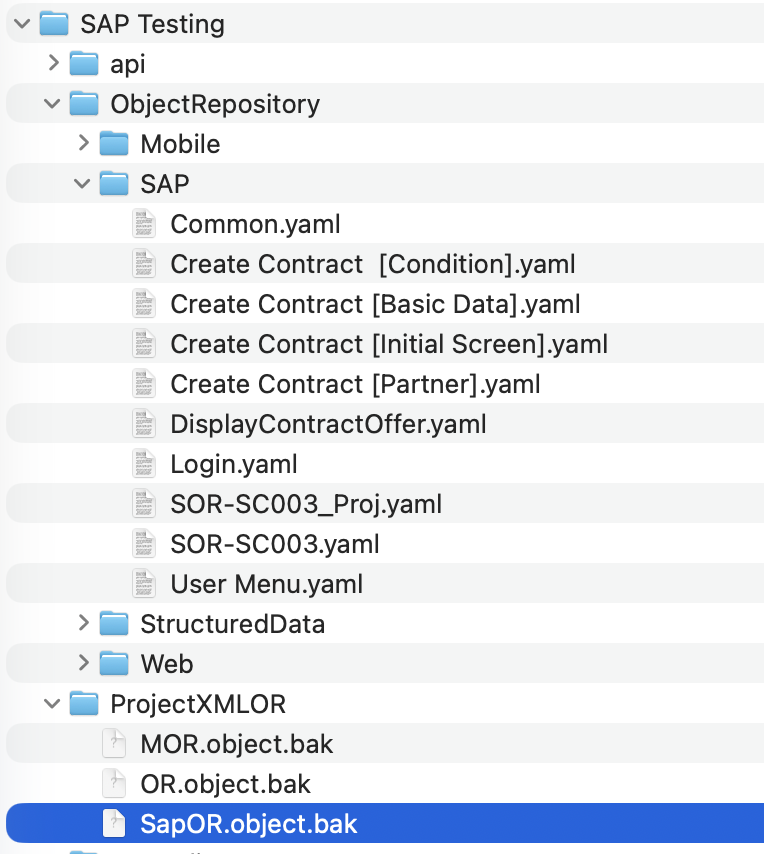{ width=25% }

    When a Project SAP Object (PSPO) is used in a test step, the identifier **[Project] PageName** will show as its reference.

    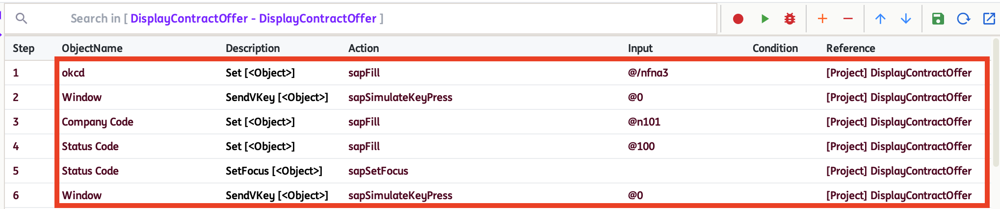

* **Shared SAP OR**

    Contains SAP objects that **can be used across different projects** and are managed from the `Shared` tab within the OR panel.

    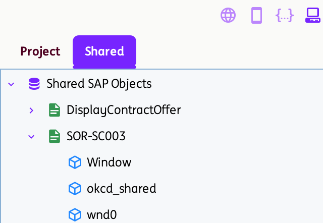{ width=25% }

    **For projects created in version 3.0**, a YAML file is automatically generated for each page—either upon page creation under `Shared` or when pages or objects are moved from `Project` to `Shared`. This file contains the page’s objects and their corresponding attributes and is stored in the `Shared\SharedObjectRepository\SAP` directory. The `sapor-projectsdata.yaml` file maintains the list of projects that use the Shared SAP Objects.

    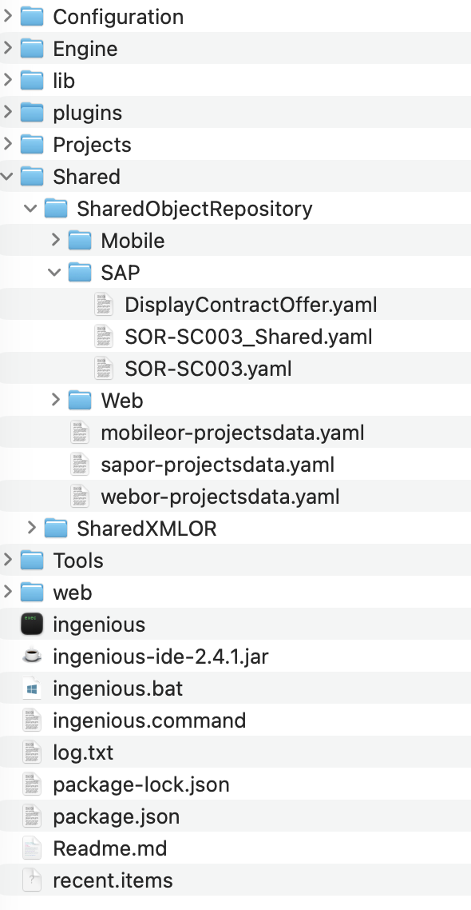{ width=20% }

    When a Shared SAP Object (SSPO) is used in a test step, the identifier **[Shared] PageName** will show as its reference.

    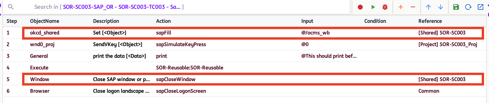

## How to use Project and Shared SAP OR

* Pages and Objects can be added directly within the Project and Shared repositories using the `Add Page` or `Add Object` options.

* Objects from Project and Shared SAP OR can be used in a single Test Scenario.

    For example:
    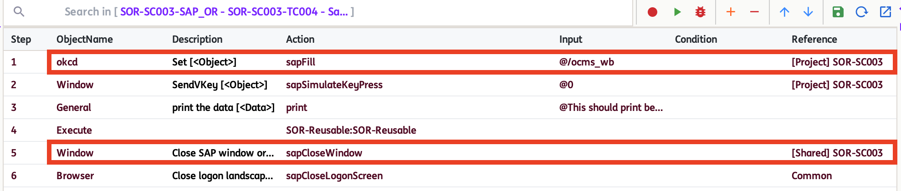

* **For version 3.0**, the `Move to Shared` option is introduced as a new feature for SAP. This allows you to move an entire Page (along with all its Objects and attributes) or a single Object (and its corresponding Page) from the Project repository to the Shared repository. *Note: Existing test steps that reference a Project-level SAP Object (PSPO) will be automatically updated to use the Shared SAP Object (SSPO) after moving within the opened project.*

    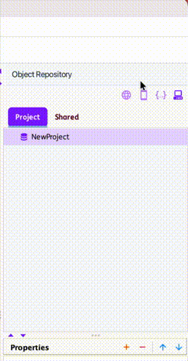

* Pages and Objects may share the same names across the Project and Shared repositories. However, names must remain unique within each individual repository.

    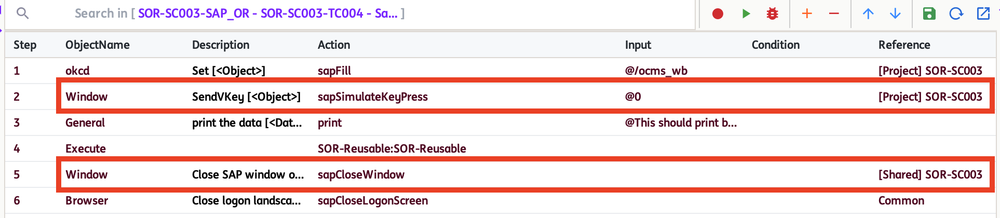


* Pages and Objects in both the Project and Shared repositories can be renamed using the `Rename Page` or `Rename Object` options. However, after renaming, any existing test steps that previously referenced an SSPO will continue to use its old name, which may result in errors during test execution.

* Pages and Objects in both the Project and Shared repositories can be deleted using the `Delete Page` or `Delete Object` options. However, once deleted, any existing test steps that previously referenced an SSO or PSPO will still attempt to use the removed Page or Object, which may result in errors during test execution.

* To view all test cases that reference an Object within the project, use the `Get Impacted Cases` option. This feature is available for both Project and Shared repositories.

    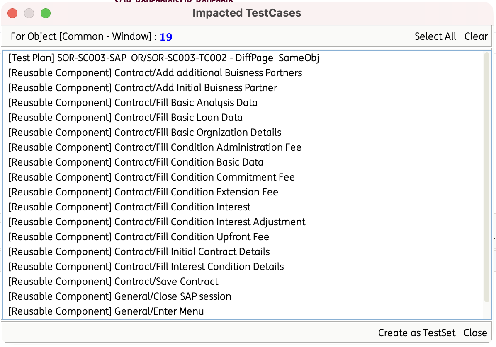{ width=45% }

    *Suggestion: Before renaming or deleting an object, please use the `Get Impacted Cases` option for checking.*