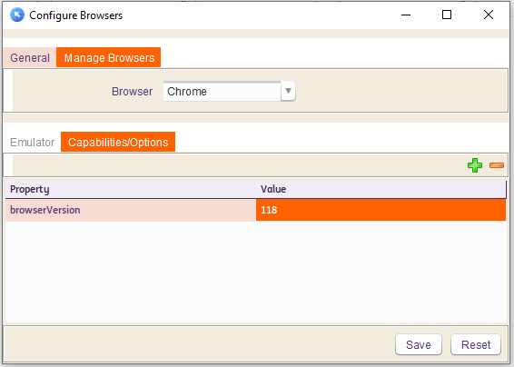

# **Selenium Manager and Selenium 4.16.1**  
-----------------------------------
 

Selenium `4.21.0` is widely regarded as the most important Selenium release in years. It includes enhanced Chrome support, automatic browser downloads, and advanced Selenium Manager functionalities for optimized web browser automation. One of the biggest features in Selenium `4.16.1` is its robust support for **Chrome for Testing**. In the past, testers had to manually download the browser version they wanted to test and the corresponding Chrome driver. However, Selenium `4.16.1` simplifies this process significantly.

--------------------------------------------

## Lets see this in details :

**Scenario 1: Use Existing Chrome**

Run test cases from INGenious with Chrome which is **already installed** on user system.

 * No need to Specify any version in INGenious. Directly click on **Run** > **Chrome** to execute.

 * `Selenium Manager` will check the installed browser version and will download the corresponding driver. If the driver is already present, the execution will immediately start.

 
**Scenario 2: Use Chrome For Testing**

Run test cases from INGenious with Chrome browser Version which is **not installed** on user system.

 * From the framework UI, navigate to **INGenious** > **Configuration** > **Browser Configuration**. It will open the browser configuration window.

 * On the new window, navigate to **Manage Browsers** > **Select Browser** > **Capabilities/Options**.

 * Click on '+' button. It will add a new row.

 * Under Property column, add property as **browserVersion** and set the value of your choice. For example :

   

 * Click on [Save] and [Close] the window.

 * Now if we click on **Run** > **Chrome** to execute, it will :
   - Try to see if the specified version is installed or not. In our case, it is not installed.
   - Then it will download the Chrome Binary which is [**Chrome For Testing**](https://developer.chrome.com/blog/chrome-for-testing/) and the corresponding driver automatically
   - The execution will start immediately afterwards.

More details about Chrome for Testing versions can be found in the [**CFT Availability Dashboard**](https://googlechromelabs.github.io/chrome-for-testing/)