# **String Operations**

-------------------------------------

!!! info "String Operations"

    Below are actions you may use to perform several string manipulations. 
    
    The result will be stored to dynamic variable *`%variableName%`* provided from the *Condition* column.

-----------------------------------

!!! abstract "Different *Input* formats for String Operations"

    | Input Type | Format |
    |-----------|-------------|
    |  **Hardcoded String** | *`"String value"`* |
    |  **Input from Datasheet** | *`{SheetName:ColumnName}`* |
    |  **Input from Dynamic Variable** | *`%DynamicVariableName%`* |

### **Concat**

**Description** : This function appends the strings provided from the *Input* column.

**Input Format** : Comma separated strings, (i.e. *`"string_value 1"`,`"string_value 2"`,`"string_value 3"`,`"string_value 4"`,`"string_value 5"`*)

**Parameter** : 

`string_value` - set of strings to be concatenated to a new string, max number of `string_value` is `5`

=== "Usage"

    | ObjectName | Action | Input        | Condition |Reference|  |
    |------------|--------|--------------|-----------|---------|--|
    | String Operations | *Concat* | "Hello,"," World","!","!","!" | %variableName% | |<< *Hardcoded Input* 
    | String Operations | *Concat* | {Sheet:Column}," World","!","!","!" | %variableName%  | |<< *Input from Datasheet* 
    | String Operations | *Concat* | %dynamicVar%," World","!","!","!" | %variableName% | |<< *Input from variable* 
    
=== "Examples"

    Below are sample Test Case and generated report on how to use String Operations *Concat*

    **Sample Test Case:**

    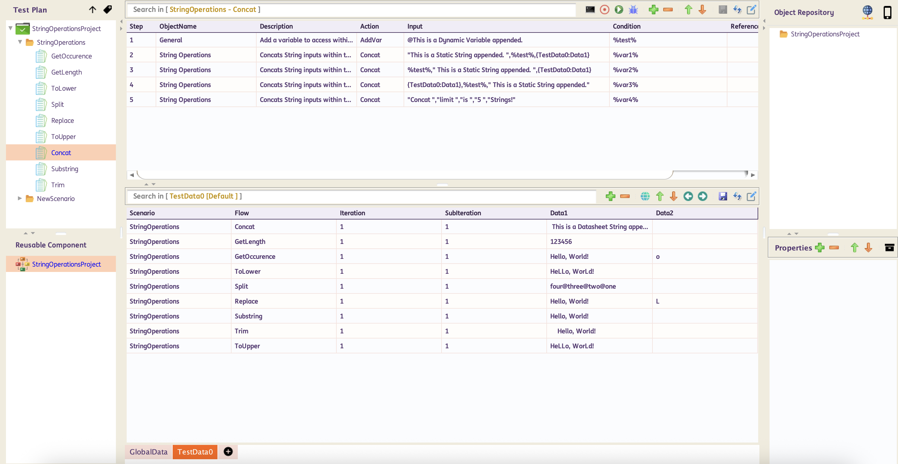

    **Sample Report:**

    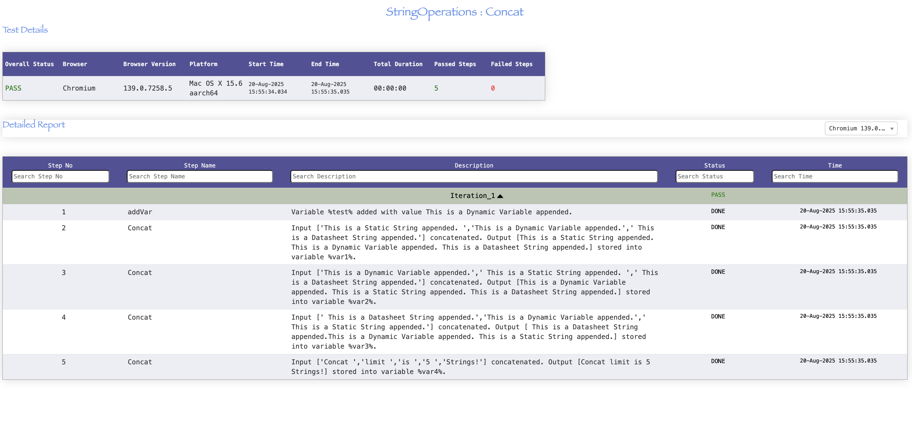

-----------------------------------------------------

### **GetLength**

**Description** : This function returns the length of the string.

**Input Format** : Single string value, (i.e. *`"string_value"`*)

**Parameter** : 

`string_value` - string value to get length
       
=== "Usage"

    | ObjectName | Action | Input        | Condition |Reference|  |
    |------------|--------|--------------|-----------|---------|--|
    | String Operations | *GetLength* | "Hello, World!" | %variableName% | |<< *Hardcoded Input* 
    | String Operations | *GetLength* | {Sheet:Column} | %variableName% | |<< *Input from Datasheet*
    | String Operations | *GetLength* | %dynamicVar% | %variableName% | |<< *Input from variable*
    
=== "Examples"

    Below are sample Test Case and generated report on how to use String Operations *GetLength*

    **Sample Test Case:**

    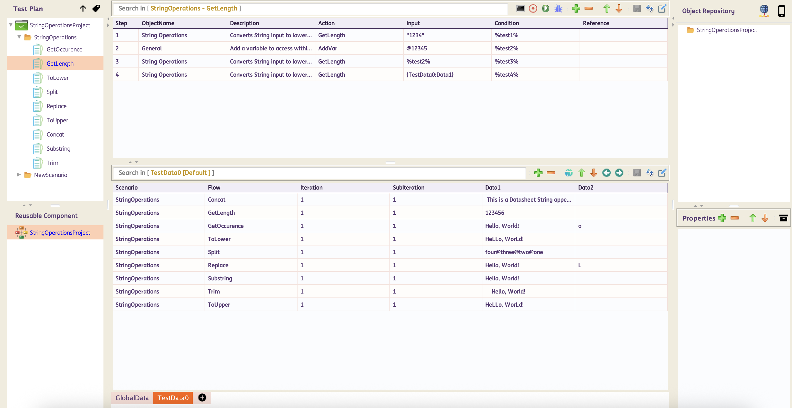

    **Sample Report:**

    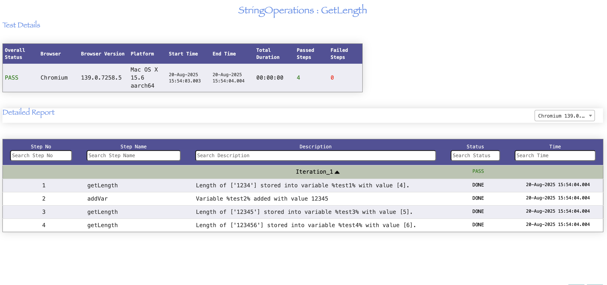

-----------------------------------------------------

### **GetOccurence**

**Description** : This function returns the number of occurrences of the searched character.

**Input Format** : Comma separated string, (i.e. *`"target_string"`,`"search_character"`*)

**Parameter** : 

`target_string` - target string value to search
                
`search_character` - character value to search from the target string

=== "Usage"

    | ObjectName | Action | Input        | Condition |Reference|  |
    |------------|--------|--------------|-----------|---------|--|
    | String Operations | *GetOccurence* | "Hello, World!","e" | %variableName% | |<< *Hardcoded Input* 
    | String Operations | *GetOccurence* | {Sheet:Column},"e" | %variableName% | |<< *Input from Datasheet*
    | String Operations | *GetOccurence* | %dynamicVar%,"e" | %variableName% | |<< *Input from variable*

=== "Examples"

    Below are sample Test Case and generated report on how to use String Operations *GetOccurence*

    **Sample Test Case:**

    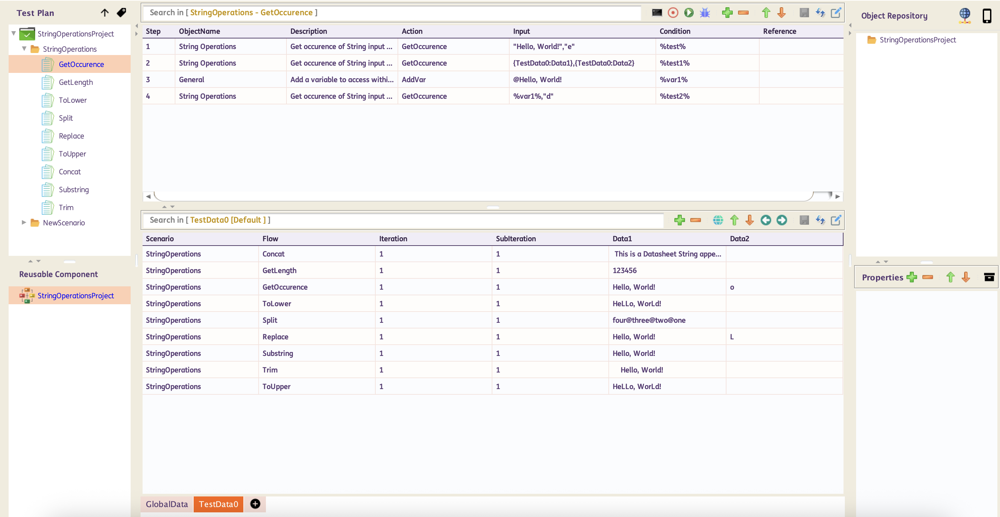

    **Sample Report:**

    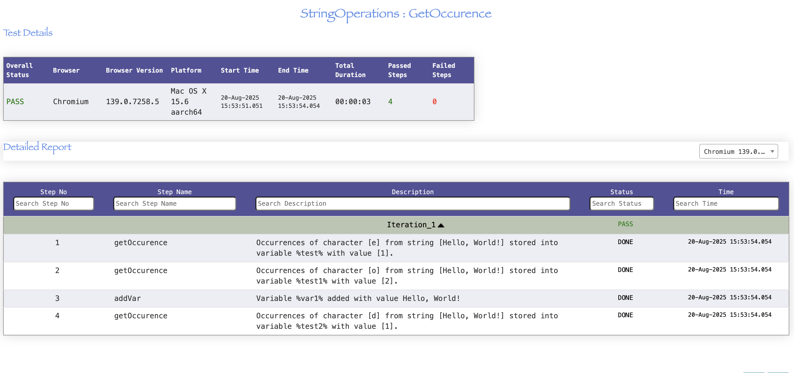

-----------------------------------------------------

### **Replace**

**Description** : This function replaces the first or all occurrences of a character or substring within a string.

**Input Format** : Comma separated string, (i.e. *`"string_value"`,`"target_string"`,`"replacement_string"`,`"first/all"`*)

**Parameter** :

`string_value` - original string value to replace 

`target_string` - target string value or substring value to be replaced 

`replacement_string` - string value or substring value to replace the `target_string` in the original `string_value`

`first/all` - type of string replacement if `first` instance only or `all` instance in the original `string_value`   

=== "Usage"

    | ObjectName | Action | Input        | Condition |Reference|  |
    |------------|--------|--------------|-----------|---------|--|
    | String Operations | *Replace* | "Hello, World!","o","a","first" | %variableName% | |<< *Hardcoded Input, Single character replace first instance only* 
    | String Operations | *Replace* | {Sheet:Column},"o","a","first" | %variableName% | |<< *Input from Datasheet, Single character replace first instance only*
    | String Operations | *Replace* | %dynamicVar%,"o","a","first" | %variableName% | |<< *Input from variable, Single character replace first instance only*
    | String Operations | *Replace* | "Hello, World!","o","a","all" | %variableName% | |<< *Hardcoded Input, Single character replace all instance* 
    | String Operations | *Replace* | {Sheet:Column},"o","a","all" | %variableName% | |<< *Input from Datasheet, Single character replace all instance*
    | String Operations | *Replace* | %dynamicVar%,"o","a","all" | %variableName% | |<< *Input from variable, Single character replace all instance*
    | String Operations | *Replace* | "apple pie pie","pie","cake","first" | %variableName% | |<< *Hardcoded Input, Multi-character replace first instance only*
    | String Operations | *Replace* | {Sheet:Column},"pie","cake","first" | %variableName% | |<< *Input from Datasheet, Multi-character replace first instance only*
    | String Operations | *Replace* | %dynamicVar%,"pie","cake","first" | %variableName% | |<< *Input from variable, Multi-character replace first instance only*
    | String Operations | *Replace* | "apple pie pie","pie","cake","all" | %variableName% | |<< *Hardcoded Input, Multi-character replace all instance*
    | String Operations | *Replace* | {Sheet:Column},"pie","cake","all" | %variableName% | |<< *Input from Datasheet, Multi-character replace all instance*
    | String Operations | *Replace* | %dynamicVar%,"pie","cake","all" | %variableName% | |<< *Input from variable, Multi-character replace all instance*
    
=== "Examples"

    Below are sample Test Case and generated report on how to use String Operations *Replace*

    **Sample Test Case:**

    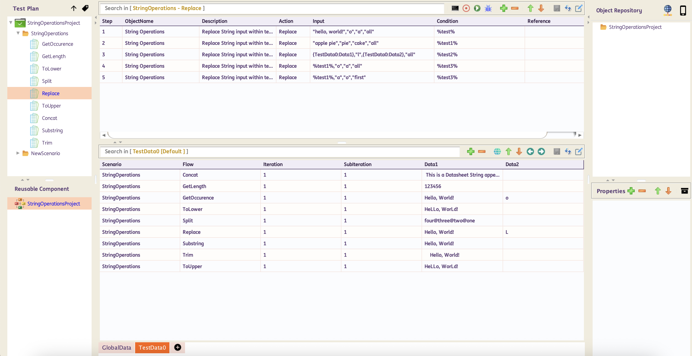

    **Sample Report:**

    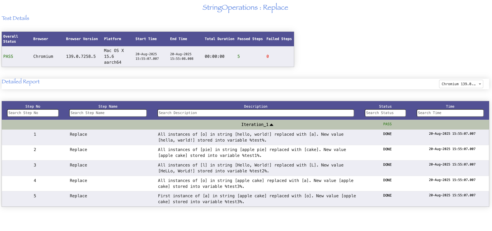

-----------------------------------------------------

### **Split**

**Description** : The function splits the string using the specified delimeter and returns a substring based on the provided index or number of limit the string will be splitted.

**Input Format** : Comma separated string, (i.e. *`"string_value"`,`"delimeter"`,`"index"`,`"limit"`*)

**Parameter** :

`string_value` - string value to split

`delimeter` - separator to split the string

`index` - key index value to return in the action where base index is `0`

`limit` - number of times the string will be splitted

=== "Usage"

    | ObjectName | Action | Input        | Condition |Reference|  |
    |------------|--------|--------------|-----------|---------|--|
    | String Operations | *Split* | "one@two@three@four","@","1" | %variableName% | |<< *Hardcoded Input* 
    | String Operations | *Split* | {Sheet:Column},"@","1" | %variableName% | |<< *Input from Datasheet*
    | String Operations | *Split* | %dynamicVar%,"@","1" | %variableName% | |<< *Input from variable*
    | String Operations | *Split* | "one@two@three@four","@","1","2" | %variableName% | |<< *Hardcoded Input, with limited no. of split* 
    | String Operations | *Split* | {Sheet:Column},"@","1","2" | %variableName% | |<< *Input from Datasheet, with limited no. of split*
    | String Operations | *Split* | %dynamicVar%,"@","1","2"| %variableName% | |<< *Input from variable, with limited no. of split*
    
=== "Examples"

    Below are sample Test Case and generated report on how to use String Operations *Split*

    **Sample Test Case:**

    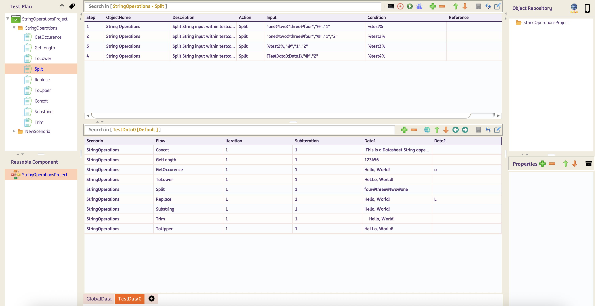

    **Sample Report:**

    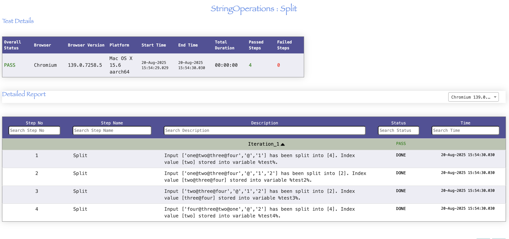

-----------------------------------------------------
    
### **Substring**

**Description** : This function returns a new string that is a substring of the original string.

**Input Format** : Comma separated string, (i.e. *`"string_value"`,`"begin_index"`,`"end_index(optional)"`*)

**Parameter** :

`string_value` - string value to get a substring value

`begin_index` - starting index of the substring

`end_index`(`optional`) - ending index of the substring 

=== "Usage"

    | ObjectName | Action | Input        | Condition |Reference|  |
    |------------|--------|--------------|-----------|---------|--|
    | String Operations | *Substring* | "Hello, World!","7" | %variableName% | |<< *Hardcoded Input* 
    | String Operations | *Substring* | {Sheet:Column},"7" | %variableName% | |<< *Input from Datasheet*
    | String Operations | *Substring* | %dynamicVar%,"7" | %variableName% | |<< *Input from variable*
    | String Operations | *Substring* | "Hello, World!","1","7" | %variableName% | |<< *Hardcoded Input, with end index* 
    | String Operations | *Substring* | {Sheet:Column},"1","7" | %variableName% | |<< *Input from Datasheet, with end index*
    | String Operations | *Substring* | %dynamicVar%,"1","7"| %variableName% | |<< *Input from variable, with end index*
    
=== "Examples"

    Below are sample Test Case and generated report on how to use String Operations *Substring*

    **Sample Test Case:**

    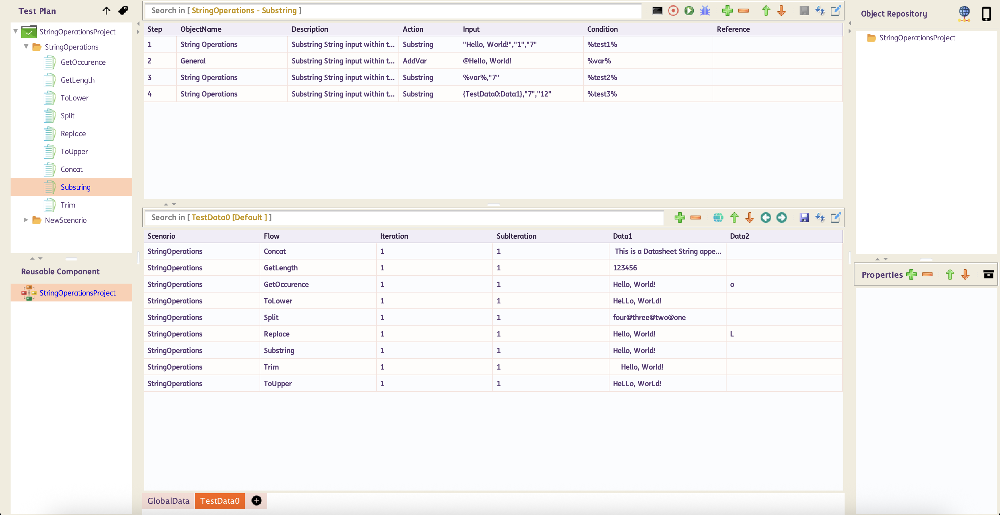

    **Sample Report:**

    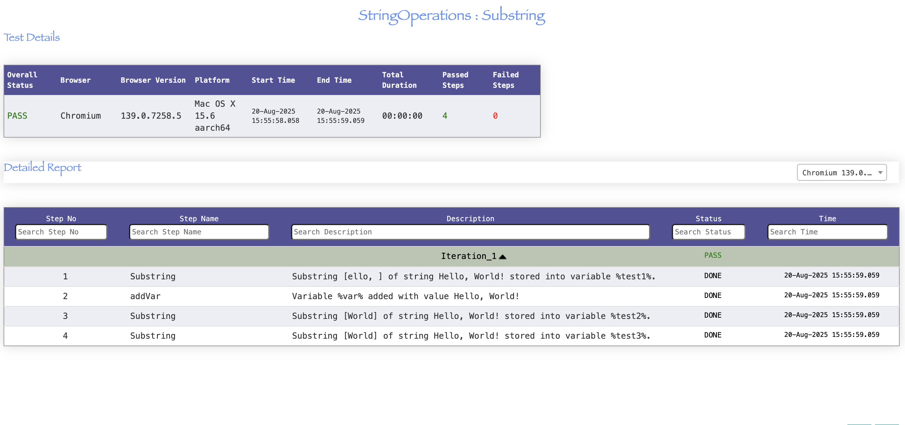

-----------------------------------------------------

### **ToLower**

**Description** : This function converts a String to lowercase.

**Input Format** : Single string value, (i.e. *`"string_value 1"`*)

**Parameter** :

`string_value` - string value to be converted to lowercase

=== "Usage"

    | ObjectName | Action | Input        | Condition |Reference|  |
    |------------|--------|--------------|-----------|---------|--|
    | String Operations | *ToLower* | "Hello, World!" | %variableName% | |<< *Hardcoded Input* 
    | String Operations | *ToLower* | {Sheet:Column} | %variableName% | |<< *Input from Datasheet*
    | String Operations | *ToLower* | %dynamicVar% | %variableName% | |<< *Input from variable*
    
=== "Examples"

    Below are sample Test Case and generated report on how to use String Operations *ToLower*

    **Sample Test Case:**

    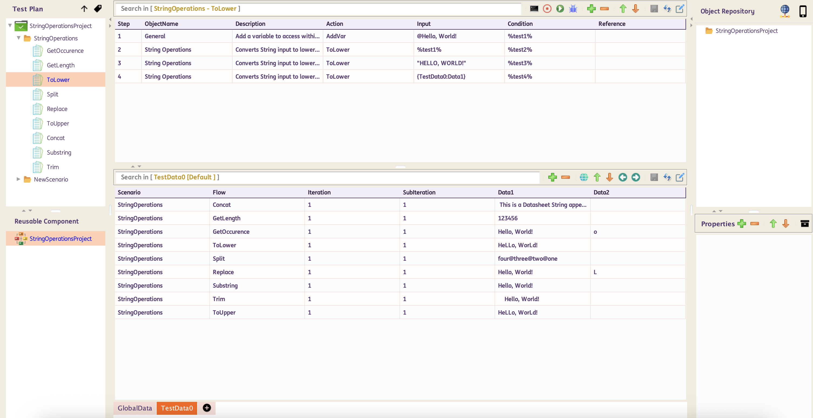

    **Sample Report:**

    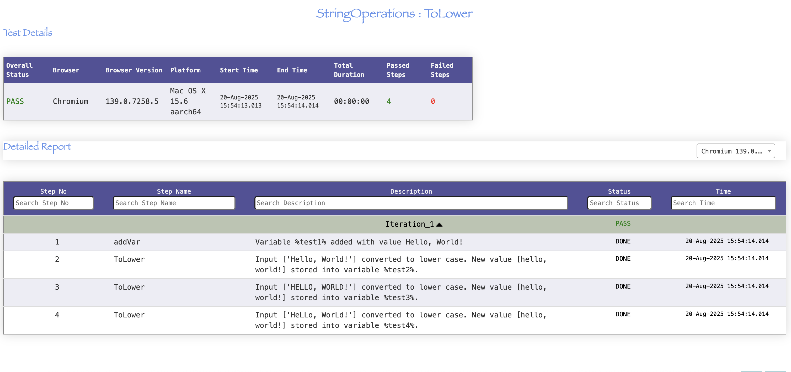

-----------------------------------------------------
    
### **ToUpper**

**Description** : This function converts a String to uppercase.

**Input Format** : Single string value, (i.e. *`"string_value 1"`*)

**Parameter** :

`string_value` - string value to be converted to uppercase

=== "Usage"
        
    | ObjectName | Action | Input        | Condition |Reference|  |
    |------------|--------|--------------|-----------|---------|--|
    | String Operations | *ToUpper* | "Hello, World!" | %variableName% | |<< *Hardcoded Input* 
    | String Operations | *ToUpper* | {Sheet:Column} | %variableName% | |<< *Input from Datasheet*
    | String Operations | *ToUpper* | %dynamicVar% | %variableName% | |<< *Input from variable*
    
=== "Examples"

    Below are sample Test Case and generated report on how to use String Operations *ToUpper*

    **Sample Test Case:**

    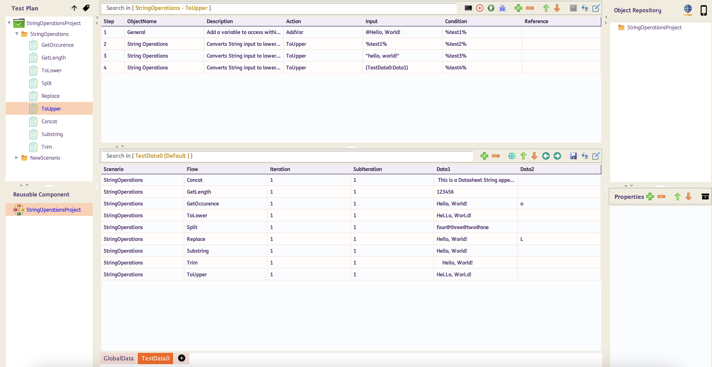

    **Sample Report:**

    

-----------------------------------------------------
    
### **Trim**

**Description** : This function removes any leading or trailing whitespace characters (including spaces, tabs and newline characters).

**Input Format** : Single string value, (i.e. *`"string_value 1"`*)

**Parameter** : 

`string_value` - string value to be trimmed

=== "Usage"

    | ObjectName | Action | Input        | Condition |Reference|  |
    |------------|--------|--------------|-----------|---------|--|
    | String Operations | *Trim* | " Hello, World! " | %variableName% | |<< *Hardcoded Input* 
    | String Operations | *Trim* | {Sheet:Column} | %variableName% | |<< *Input from Datasheet*
    | String Operations | *Trim* | %dynamicVar% | %variableName% | |<< *Input from variable*
    
=== "Examples"

    Below are sample Test Case and generated report on how to use String Operations *Trim*

    **Sample Test Case:**

    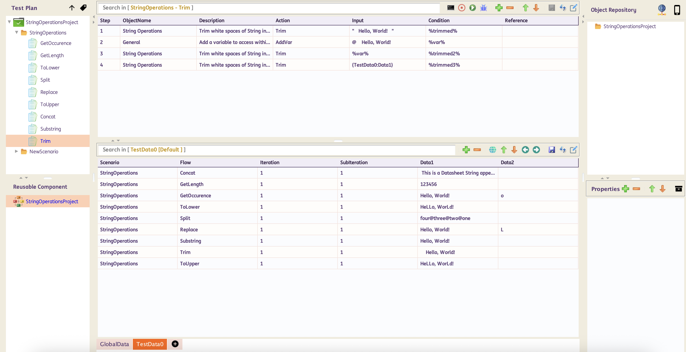

    **Sample Report:**

    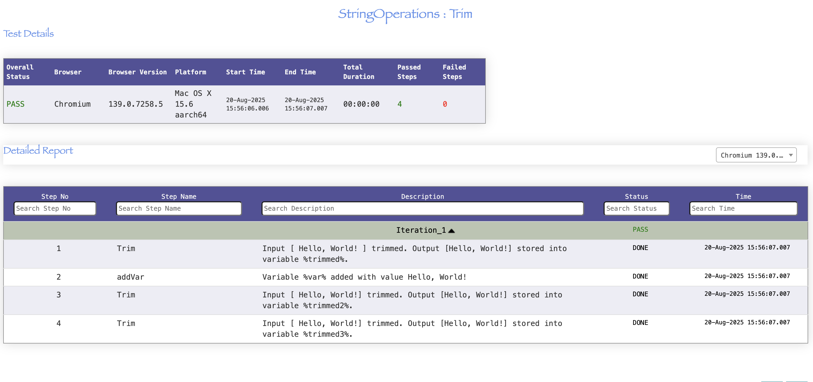

-------------------------