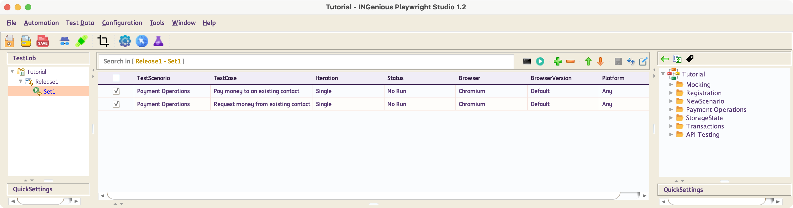
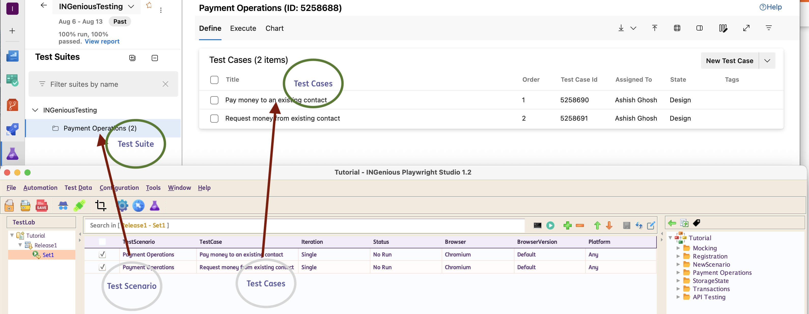
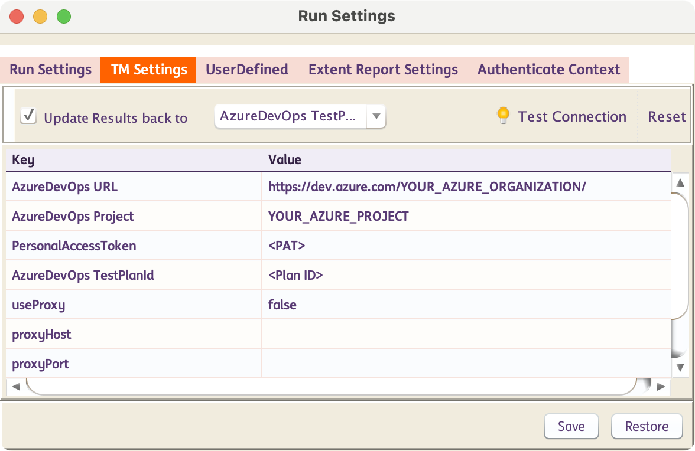
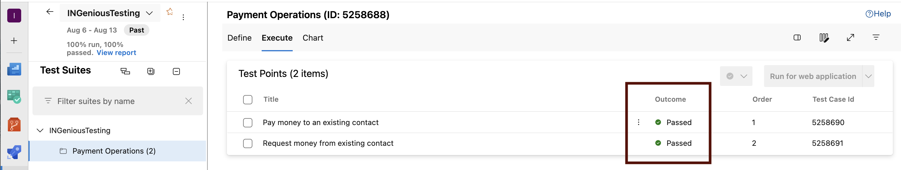
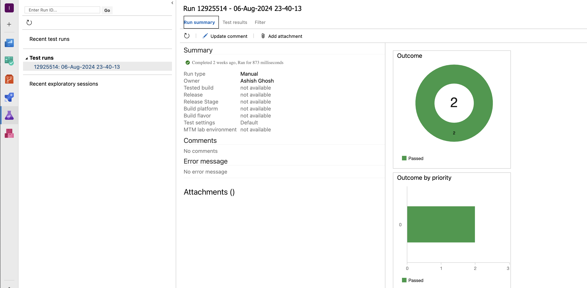

# Azure DevOps Test Plans

INGenious provides a seamless integration with Azure DevOps Test Plans for Test Case and Defect Management

To configure this follow the following steps :

- [x] Create **Scenarios** and **Test Cases** in INGenious for automated execution

  

- [x] In Azure DevOps Test Plan, create a **Test Suite** and then **Test Cases** inside the suite. While creating these, keep in mind the following :
  
    :one: **Test Scenario** in INGenious should have the same name as **Test Suite** in Azure DevOps
    
    :two: Test Case names in INGenious should be the same in Azure DevOps

  

- [x] Then the final thing to do, is to configure the TM Settings in the **Run Settings** :material-arrow-right: **TM Settings**

  

- [x] Make sure the **Update Results back to Azure DevOps Tesplan** check box is ticked

- [x] Enter the [**Organization**](https://learn.microsoft.com/en-us/azure/devops/organizations/accounts/organization-management?view=azure-devops), [**Project**](https://learn.microsoft.com/en-us/azure/devops/organizations/projects/about-projects?view=azure-devops), [**Plan ID**](https://learn.microsoft.com/en-us/azure/devops/test/create-a-test-plan?view=azure-devops) and [**PAT**](https://learn.microsoft.com/en-us/azure/devops/organizations/accounts/use-personal-access-tokens-to-authenticate?view=azure-devops&tabs=Windows) are filled in

- [x] Verify the connection using the **Test Connection** option. The :bulb: light bulb should turn green :green_circle:

- [x] Now execute your tests via any pipeline or from your work station

- [x] At the end of the execution, the status of test cases are automatically updated in Azure DevOps

  

- [x] Additionally an **Azure DevOps Test Run** is created which is automatically updated with test results, attachments and logs

  