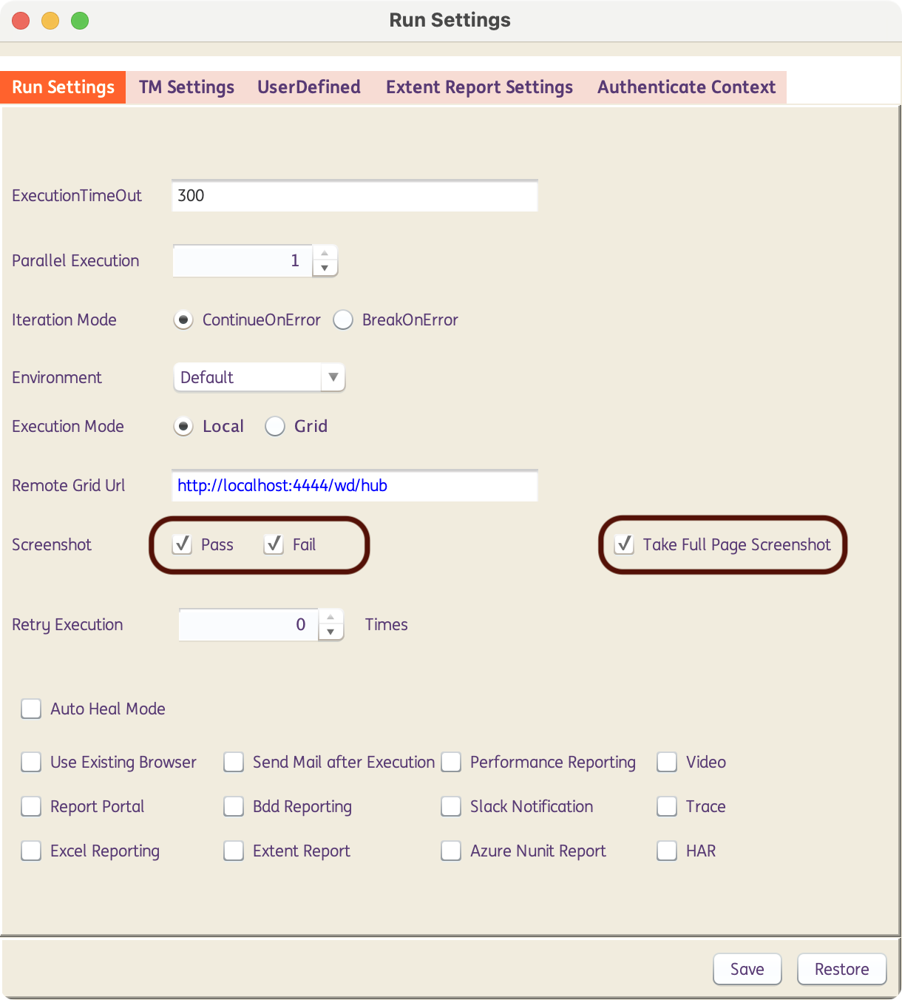
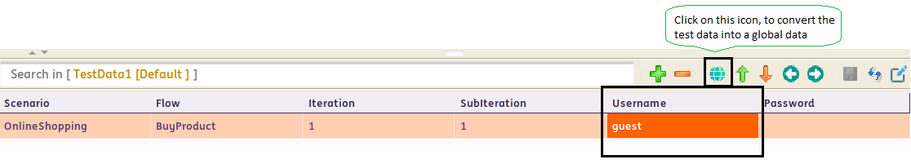

# **Some Tips and Tricks**

----------------------------------

??? example "Execution Timeout"

    ## Execution TimeOut

    INGenious provides an option to set the **Execution timeout** of the test sets run from the execution panel. The default execution timeout is 300minutes (5 hours).

    **When is it useful?**

    Suppose, you have a test set containing 100 test cases and it takes 7 hours to execute all the test cases. As the default execution timeout is 5 hours, the test set will run for the 5 hours and remaining test cases yet to run will be marked as **NoRun**. Increasing the timeout will help in executing the full set.

    **How to set it?**

      To set the execution timeout, go to **Configuration** :material-arrow-right: **Run settings**.

      * Click the **Run settings** tab and set the execution timeout to the desired value.

      > **Note**: The execution timeout must be given in **minutes**.

      * Click **Save**.

      > **Note**: To save the settings for the individual test sets, click on the test set and open the Run settings to save or use the **Quick settings** option in the execution panel.

      

      * To check if the settings have been saved, go to 

      **Projects** :material-arrow-right: **Project name** :material-arrow-right: **Settings** :material-arrow-right: **TestExecution** :material-arrow-right: **Release name** :material-arrow-right: **Testset name** and open the **RunSettings** file to view the settings.

      * If there are multiple test sets, the execution timeout must be set individually for each set. 

---------------------------------------

??? example "Full Page Screenshots"

    ## Full Page Screenshots

    **Why The Browser Scrolls Up And Down At Certain Steps In The Application?**

    While executing the test scripts, you might have observed that sometimes the browser scrolls up and down in a particular page in the application under test.

    This might eventually increase the execution time of your scripts as well. The browser scrolls up and down in order to take full page screen shots of the current application page.

    **How to stop the browser from scrolling while execution?**

    If it is not required to take full page screen shots, you can disable full page screenshots by following the steps –

    * Navigate to **Configurations** :material-arrow-right: **Run Settings**.

    * Uncheck the check box for “Take full page screen shots”, under **Run settings** tab.

    * You can also enable/disable the screenshots for the Pass or Fail steps by checking/unchecking the **Pass** or **Fail** checkboxes respectively.

    

-------------------------------------

??? example "Global Data Sheet"

    ## Global Data Sheet

    **What is Global Data sheet?**

    Global Data sheet is used to contain data that can be used across multiple data sheets (for example application URL, API endpoints etc).

    **How To Use Global Data Sheet?**

    For every project that is created, a default global data sheet is generated.

    **Where to use the Global Data?**

    Identify the Data column name which is common across multiple data sheets.

    

    Select that data value and click on **global data** icon, as shown in the image above. Give the global data id, in the respective window, as shown below.

    

    You will get the global id in the global data sheet, as shown below.

    

-----------------------------------

??? example "Rename and Refactor"

    ## Rename and Refactor

    The tool comes with an option to rename and refactor the object, test case, data sheet and reusable component names.

    Consider the example, given below,

    * I want to refactor the object **billName**.

    

    * Go to the Object Repository section, select the object and perform a right click. Choose **Rename Object** or press **F2**.

    

    * The object gets refactored automatically in all the locations, wherever it is used.

    

    * The same procedure can be applied to test cases, test data sheets and reusable components as well.

----------------------------------

??? example "Report Sharing"

    ## Report Sharing

    **Not Able To View Reports Properly When Shared?**

    When you run any script from design or execution panel, the reports will be available in the location,**<installation location>\Projects\\Results**.

    If you just share the **.html** files, your report will open as shown below.

    

    This is because of the absence of the media folder found in the **<installationlocation>\Projects\<your project>\Results location**. The media folder contains all the necessary **js, css** and other files required to present the report file.

    So ensure that you share the entire results folder found in the location **<installationlocation>\Projects\<your project>\Results**. You can compress and share the zipped file.

    You can also create standalone reports for the test cases or test sets. Before execution, go to **Configurations** :material-arrow-right: **Options** and enable the **Create Standalone Report** checkbox. After execution, the reports created will be standalone and can be shared independently without the Results folder.

----------------------------------

??? example "User Defined Variables"

    ## User Defined Variables

    You can create a user defined variable and use the variable to access data in multiple test cases.

    **When Will It Be Useful?**

    This feature really comes in handy when you have to use the same data across multiple test cases.

    If you are using global data sheet to pass data which is common to various testcases, you will have to map the data in the global data sheet to test data sheets of the respective test cases, which is a bit cumbersome.

    If you are using the user defined variable, you can directly pass the variable value to the test case i.e. mapping the data to the test data sheets in respective test cases can be skipped.

    **How To Pass The Data To Your Test Case Using The User Defined Variable?**

    Suppose in all your test cases that you create, you first navigate to a particular URL and then perform your row, you can hard code the URL to all you test cases as shown below.

    **Please note** there might be some cases where the URL is environment dependent i.e. the URL is different for different environment. In that case you will have to go to each and every test case in your project and change the URL in all the test cases manually.

    

    These issues can be eliminated by using user defined variables to pass the common data (URL in this case).

    **To create a user defined variable?** 

    Go to **Configurations** :material-arrow-right: **Settings** :material-arrow-right: **UserDefined**.

    Add the variable and pass the value. 

    

    Now, you will be able to use the variable inside your test case as shown below.

    

    If you wish to run the test case in different environment now, you can simply change the value for the user defined variable and the change will be reflected in all your test cases where the variable is used.

