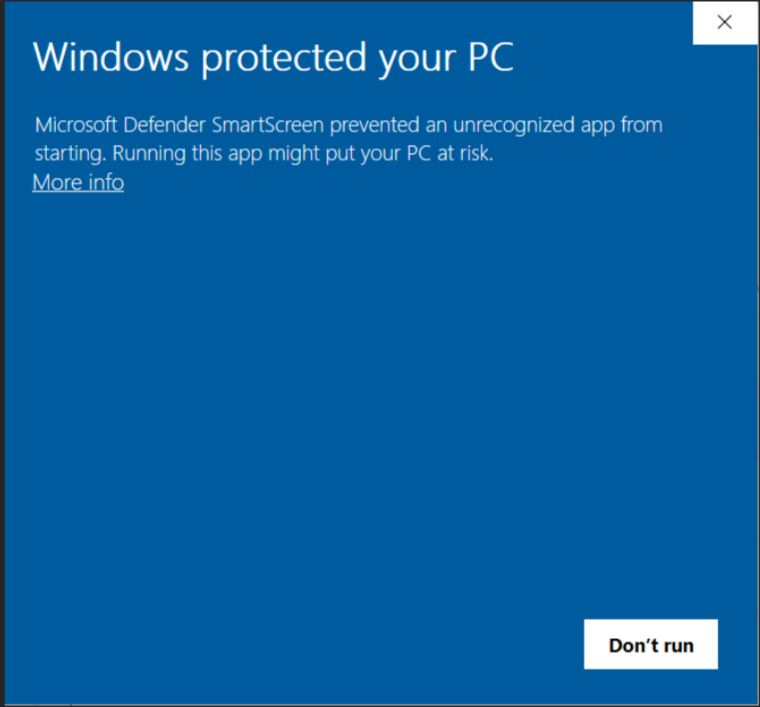
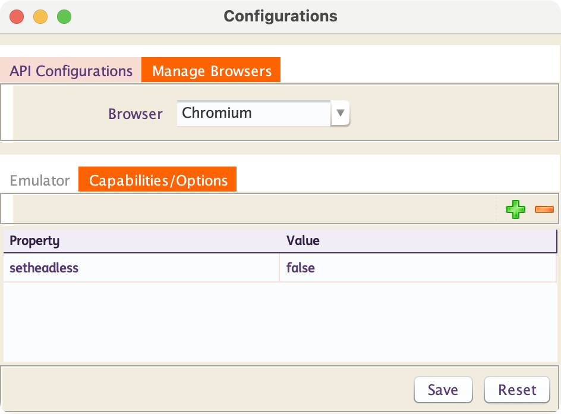
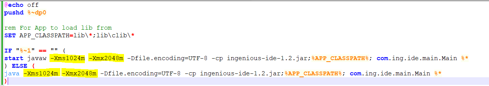
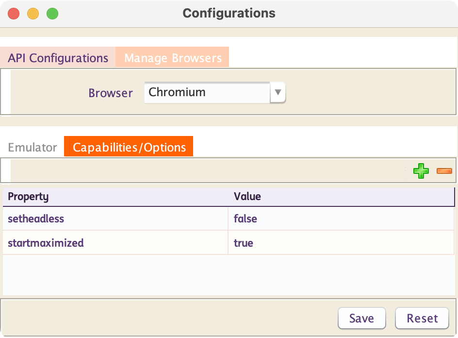
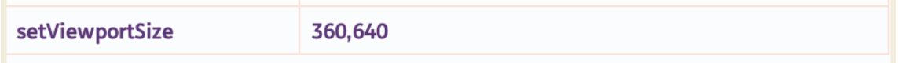

# **Troubleshooting**
-------------------------------

??? example "Unable To Open The Framework After Introducing Your Custom Method"

    ## Unable To Open The Framework After Introducing Your Custom Method

    This happens when the **ingenious-engine-<version_number>.jar** found in **INGenious
    installation_location/lib**, gets corrupted while exporting the **ingenious-engine-<version_number>.jar** back from **Engine** or while inject script is performed. You might get an exception stating that **main class not found**.

    To overcome this issue, always take a backup of the **ingenious-engine-<version_number>.jar** before you export the jar from **Engine**. So even when the jar is corrupt you can still replace the existing jar by the new one. Also do not change the name of the **ingenious-engine-<version_number>.jar** available inside the lib folder.

    Another alternative is to delete the **recent items** file present in the installation location when INGenious is closed and open again.

    > **Note:** Please do not take the back up in the same location or inside the lib folder. Place it in a different location.

    If you face this issue after performing inject script then delete the **.class file** of your custom method found in the **userdefined** folder of installation location and close and reopen.

    > **Note:** This could also be because the **.jar** files present in the **location\lib\commands** might have got corrupted. So you can simply remove those files to open INGenious.

---------------------

??? example "How To Set Java Path Variable For INGenious"

    ## How To Set Java Path Variable For INGenious

    > It is possible to set the java path in the **Run.bat** for Windows or the **Run.command** for Mac or Linux. Refer the section below on how it can be done.

    **Prerequisites**

    Following must be installed in your system:

    * INGenious setup

    * Java 11 and above

    **How to do it?**

    * Navigate to the location where **INGenious** is installed in your system.

    * Right-click the **Run** batch file.

    * Click the edit option in the context menu.

    * Give the path of the **jre** location under the **'SET PATH'** like this, **SET PATH="C:\Program Files\Java\jdk1.x.x_xx\jre\bin"**.

    * Save the file.

    * Double-click the **Run.bat** file and launch Application.

 -----------------------------------------------

??? example "PKIX path building failed"

    ##	PKIX path building failed

    If you get a certification path error like this :

    `PKIX path building failed: sun.security.provider.certpath.SunCertPathBuilderException: unable to find valid certification path to requested target` 

    You need to add the certificate of the application whose APIs you are trying to test. This error can also come if the certificates of Global Selenium Grid is not added (in case of Web Testing using Selenium Grid)

    To add the certificate follow the steps below :

    a.	Download the certificate. you can refer to [these](https://medium.com/@menakajain/export-download-ssl-certificate-from-server-site-url-bcfc41ea46a2) steps.

    b. Create a folder called `Security` in your INGenious root instance.

    c. Copy the existing Java `cacerts` file to this folder. Also copy the above downloaded certificate file to this location.

    e. Using command prompt, navigate to this `Security` folder

    d. Import the Trusted Root Certificate into your `cacerts` keystore, using following command :

    `<path/to/your>keytool -import -trustcacerts -keystore cacerts -storepass changeit -alias <logical_name_of_your_cert> -file your_certificate.crt`

    Example :

    `"C:\Program Files\Java\jdk-11.0.2\bin\keytool" -import -trustcacerts -keystore cacerts -storepass changeit -alias testApp -file testApp.crt`

    e. Make sure in your INGenious `Run.bat` or/and `Run.command file`, the reference of the above `cacerts` is present.

    **Run.bat**

    ```powershell

    @echo off
    pushd %~dp0

    rem For App to load lib from
    SET APP_CLASSPATH=lib\*;lib\clib\*

    IF "%~1" == "" (
    start javaw -Xms128m -Xmx1024m -Dfile.encoding=UTF-8 -Djavax.net.ssl.trustStore=Security\cacerts -Djavax.net.ssl.trustStorePassword=changeit -cp ingenious-ide-1.0.jar;%APP_CLASSPATH%; com.ing.ide.main.Main %*
    ) ELSE (
    java -Xms128m -Xmx1024m -Dfile.encoding=UTF-8 -cp ingenious-ide-1.0.jar;%APP_CLASSPATH%; com.ing.ide.main.Main %*
    )


    ```

---------------------------------------
??? example "Unable to launch INGenious, getting "Windows protected your PC" pop-up when clicking on Run.bat file in Windows"

    ## Unable to launch INGenious, getting "Windows protected your PC" pop-up when clicking on Run.bat file in Windows.

    **If you get the following pop-up when you click on Run.bat**

    

    **Right click on **Run.bat :material-arrow-right: Properties :material-arrow-right:Unblock :material-arrow-right: Apply**

---------------------------------------
??? example "Browser not launching while running tests"

    ## Unable to launch Browser while running the automated test cases.

    INGenious Playwright Studio, by default launches tests in headless mode. 
    Try adding the following browser option :

    **Navigate to Configuration** :material-arrow-right: **Select Browser Configuration** :material-arrow-right: **Manage Browsers** :material-arrow-right: **Capabilities/Options** :material-arrow-right: **Add 'setHeadless' property with its value as 'False'** :material-arrow-right: **Save**

     
    
--------------------------------------- 

??? example "java.lang.OutOfMemoryError: Java heap space"

    ## Handle `java.lang.OutOfMemoryError: Java heap space`


    While executing the test scripts, or while generating the BDD json reporter, sometimes the system throws `java.lang.OutOfMemoryError: Java heap space`. 
    
    This happens because of the large number of test steps with screenshots. In order to handle it, **modify the Run.bat and/or Run.command file to increase the Java contiguous memory allocation before startup.**

    So, here is an example of the corresponding Run.bat file.

    

-------------------------------------

??? example "Options to maximize the browser in Ingenious Playwright Studio"

    ## Different options to maximize the browser in Ingenious Playwright Studio


    There are 2 options to maximize the browser.

    * **Navigate to Configuration** :material-arrow-right: **Select Browser Configuration** :material-arrow-right: **Manage Browsers** :material-arrow-right: **Capabilities/Options** :material-arrow-right: **Add 'startMaximized' property with its value as 'true'** :material-arrow-right: **Save**

    

    * **Navigate to Configuration** :material-arrow-right: **Select Browser Configuration** :material-arrow-right: **Manage Browsers** :material-arrow-right: **Capabilities/Options** :material-arrow-right: **Add 'setViewportSize' property with its value as width,height** :material-arrow-right: **Save**

    

    > **NOTE:** startMaximized and setViewportSize should not be set together at the same time.
  
--------------------------------------- 

??? example "Alternative for @AfterTest (TestNG) in INGenious Playwright Studio" 

    ## Alternative for @AfterTest (TestNG) in INGenious Playwright Studio

    In the package **com.ing.engine.reporting** there is a class **SummaryReport**. In that class you have an empty method **afterReportComplete()**  where you can add any code of your choice. 
    
    For example, if you want to generate any standalone HTML report or perform data clean up, you can add your code there.
  
--------------------------------------- 

